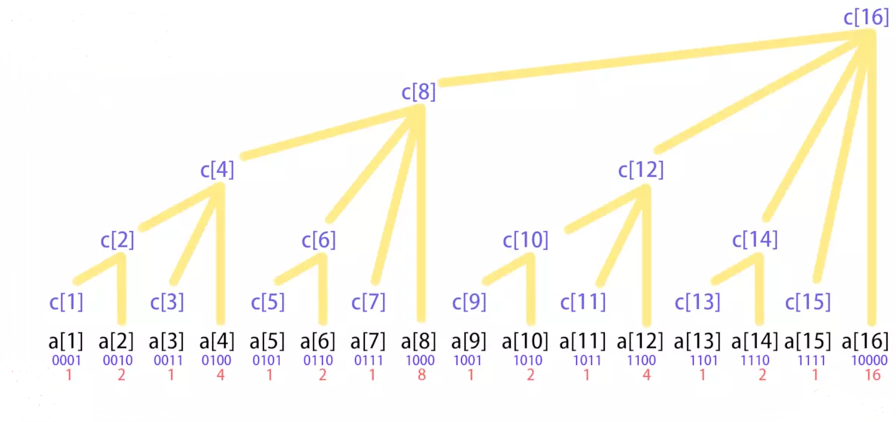

## 说明

+ **树状数组**（Fenwick Tree）也叫**二叉索引树**，适用于给定区间的求最值、求和、区间单点修改
+ 初始化时间复杂度为 O(nlog(n))，sum 的时间复杂度为 O(log(n))
+ 索引映射如下所示：



+ 因此，sum[1, 8] = c[8]，sum[1, 11] = c[11] + c[10] + c[8]

::: tip 说明：
+ 首先需要明白负数的二进制表示：正数取反后加 1，如 5（0101）和 -5（1011）
+ 索引映射的核心是 `i & -i`，即 `i & (~i + 1)`，它的返回值有以下可能：
  + i 为奇数：结果为 1，因为 `(~i + 1)` 不会进位
  + i 为偶数：
    + i 为 2 的整数次幂：结果为 i，因为 i 和 -i 除了符号位之外全部相同
    + 其他偶数：结果为最低位的 2 的整数次幂（如 28 = 16 + 8 + 4，结果为 4），因为 `(~i + 1)` 发生进位，导致最低位的 2 的整数次幂对应的二进制位变为 1
:::

## 树状数组

### 属性和方法

+ **属性**：
  + `arraySize`：源数组尺寸
  + `treeArray`：树状数组，尺寸比 `arraySize` 多一位（舍弃 0 索引）
+ **方法**：
  + `increase(position, vale)`：添加树节点
  + `query(position)`：查找最值，相当于 `queryRange(1, position)`
  + `queryRange(leftIndex, rightIndex)`：查找指定区间的最值

### 实现

```js
export default class FenwickTree {
  /**
   * @param  {number} arraySize
   */
  constructor(arraySize) {
    this.arraySize = arraySize
    this.treeArray = Array(this.arraySize + 1).fill(0)
  }

  /**
   * @param  {number} position
   * @param  {number} value
   * @return {FenwickTree}
   */
  increase(position, value) {
    if (position < 1 || position > this.arraySize) {
      throw new Error('Position is out of allowed range')
    }

    for (let i = position; i <= this.arraySize; i += (i & -i)) {
      this.treeArray[i] += value
    }

    return this
  }

  /**
   * @param  {number} position
   * @return {number}
   */
  query(position) {
    if (position < 1 || position > this.arraySize) {
      throw new Error('Position is out of allowed range')
    }

    let sum = 0

    for (let i = position; i > 0; i -= (i & -i)) {
      sum += this.treeArray[i]
    }

    return sum
  }

  /**
   * @param  {number} leftIndex
   * @param  {number} rightIndex
   * @return {number}
   */
  queryRange(leftIndex, rightIndex) {
    if (leftIndex > rightIndex) {
      throw new Error('Left index can not be greater than right one')
    }

    if (leftIndex === 1) {
      return this.query(rightIndex)
    }

    return this.query(rightIndex) - this.query(leftIndex - 1)
  }
}
```