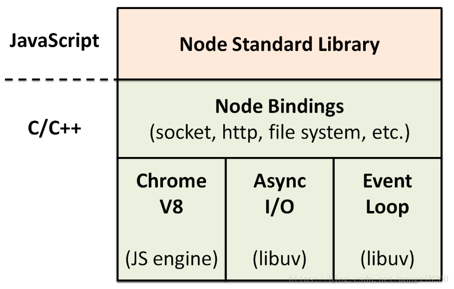

## 介绍

**架构图**:

**简介**:

+ 不是一门编程语言或一个应用，而是基于 Chrome V8 引擎的 Javascript 运行时环境
+ 使用 Node Bindings 层将 Chrome V8 引擎暴露的 C/C++ 接口转换成 Javascript API，在这些 API 的基础上编写 Node.js 标准库
+ 使用一个事件驱动、非阻塞 I/O 的模型
+ 使用 C/C++ 编写的 libuv 事件处理库来处理 I/O 操作，libuv 由事件循环和线程池组成
+ 使用 npm 作包管理器，拥有庞大的包管理生态

## 与 Javascript 的区别

|类型|Javascript|Node.js|
|-|-|-|
|全局对象|浏览器 window 对象|全局对象 global 和全局执行上下文对象 process|
|内置对象|可以使用|可以使用|
|模块系统|第三方库实现|内置 CommonJS 模块规范|
|事件处理方式|事件监听|基于 EventEmitter 的事件分发和回调函数||
|异步实现|XMLHttpRequest|EventLoop|
|数据存储|浏览器数据库或缓存|服务端数据库|
|二进制数据处理|无|全局的 Buffer 类|

## 特点

+ 简单：语法简单、并发编程容易、部署运维简单
+ 高性能：执行速度快、异步非阻塞 I/O 适合 I/O 密集型的网络应用开发
+ 可扩展性：npm 生态强大、使用 C/C++ 扩展实现 CPU 密集型任务
+ 适用于 Serverless

## 应用场景

+ 工具开发：前端工程化的各种工具、命令行工具、脚手架工具
+ 后端开发：构建网站、API 服务、RPC 服务