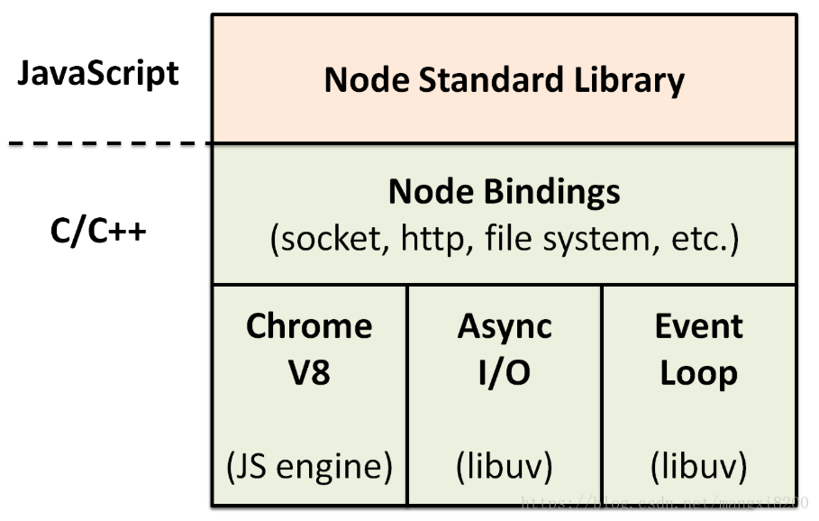

## 声明

文档记录了以下几个部分：
1. 介绍 Node.js 功能：包括 Node.js 的特性和内置模块简介，主要参考 [Node.js 中文网](http://nodejs.cn/api/)，如果你要阅读更详细、准确的文档，请参考官网。另外，我非常喜欢[《Node.js 硬实战-115个核心技巧》]()一书中的描述过程，我也在介绍中穿插了一些 Demo 以及说明这些功能的强大之处。
2. 如何在开发中使用 Node.js：包括框架、测试、部署等流程，也涉及数据库等第三方模块的接入
3. <Badge>TODO</Badge>：看一些 V8、Node.js 的源码，以及了解如何写 C++ 扩展

::: tip 书籍推荐
+ [了不起的Node.js]()，适合初级 Node.js 开发者，书中介绍了 Node.js 的基本功能，以及在开发中的实践。但是书中的模块的版本库有点老，阅读时要注意所用模块的版本库
+ [《Node.js 硬实战-115个核心技巧》]()，面向中高级的 Node.js 开发者，也适用于任何了解过 JavaScript 的开发者；对于没有后台开发经验的人，作者也在书中扩展了很多后台知识，非常建议阅读。
+ [Node.js 来一打C++扩展]()，面向高级 Node.js 开发者
:::

## Nodejs 简介

+ Node.js 不是一门编程语言或一个应用，而是**基于 Chrome V8 引擎的 Javascript 运行时环境**
+ 使用 Node Bindings 层将 Chrome V8 引擎暴露的 C/C++ 接口转换成 Javascript API，在这些 API 的基础上编写 Node.js 标准库
+ 使用一个事件驱动、非阻塞 I/O 的模型
+ 使用 C/C++ 编写的 libuv 事件处理库来处理 I/O 操作，libuv 由事件循环和线程池组成
+ 使用 npm 作包管理器，拥有庞大的包管理生态
+ 架构图:

## 对比 Javascript

|类型|Javascript|Node.js|
|-|-|-|
|全局对象|浏览器 window 对象|全局对象 global 和全局执行上下文对象 process|
|内置对象|可以使用|可以使用|
|模块系统|第三方库/ES6|内置 CommonJS 模块规范|
|事件处理方式|事件监听|基于 EventEmitter 的事件分发和回调函数||
|异步实现|XMLHttpRequest|EventLoop|
|数据存储|浏览器数据库或缓存|服务端数据库|
|二进制数据处理|无|全局的 Buffer 类|

## 特点

+ 简单：语法简单、并发编程容易、部署运维简单
+ 高性能：执行速度快、异步非阻塞 I/O 适合 I/O 密集型的网络应用开发
+ 可扩展性：npm 生态强大、使用 C/C++ 扩展实现 CPU 密集型任务
+ 适用于 Serverless

## 应用场景

+ 工具开发：前端工程化的各种工具、命令行工具、脚手架工具
+ 后端开发：构建网站、API 服务、RPC 服务