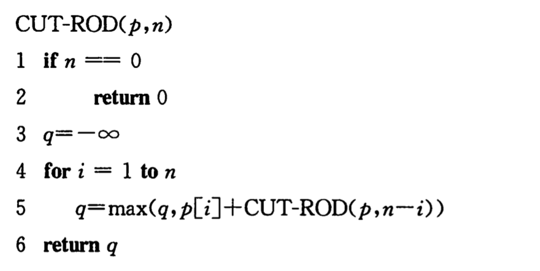
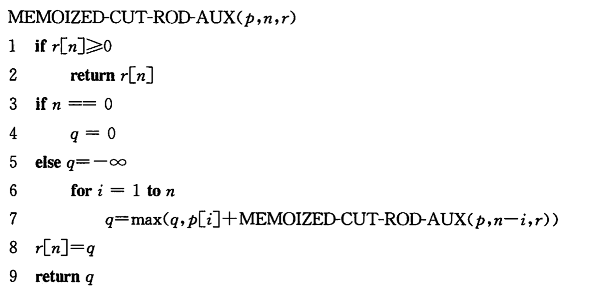
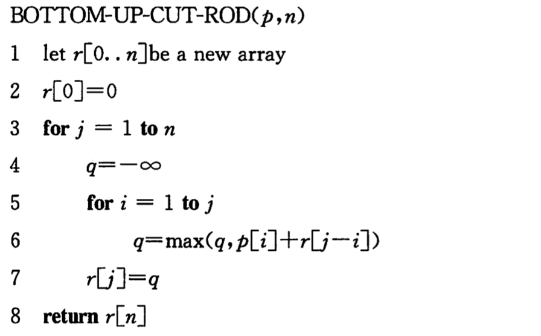
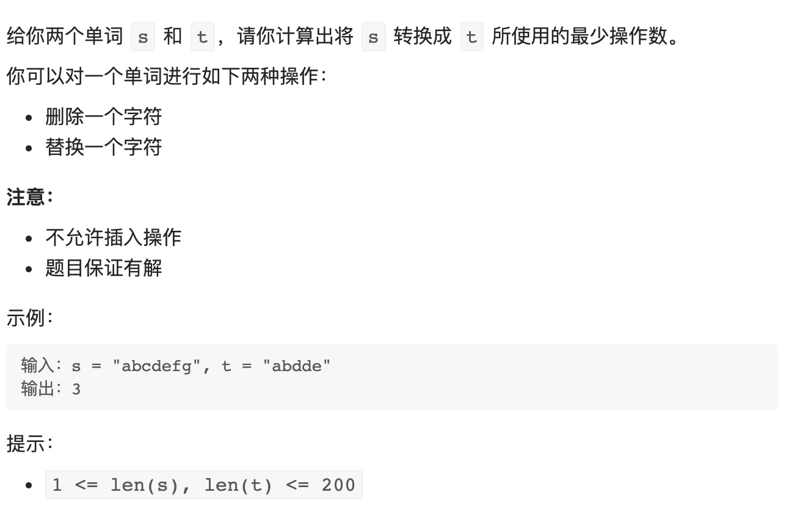

## 概念

### 简介

+ 动态规划(Dynamic Programming)与分治算法类似，都是通过组合子问题的解来求解原问题
+ 常用来求解**最优化问题**，通常为问题的**一个最优解**，而不是**最优解**(因为有可能存在多个最优解)
+ 其对每个子问题仅求解一次，并将结果保存下来，随后再需要此子问题的解，只需查找即可(不用重新求解)，是典型的时空均衡(空间换时间)的例子


### 两个性质

1. **最优子结构性质**：该问题的最优解包含其子问题的最优解
2. **重叠子问题性质**：其递归算法反复求解相同子问题


::: tip 对比分治算法和贪心算法：
+ [分治算法](./divide-and-conquer.md)通常在递归的每一步都生成(**相似的**)全新的子问题，而动态规划是求解**相同的**子问题(重叠子问题)
+ [贪心算法](./greedy.md)也具有最优子结构性质，但是其另一个贪心选择性质使它并不会求解/依赖子问题，因此其求解的是局部最优解而不是全局最优解
:::


### 设计步骤

1. 刻画一个最优解的结构特征
2. 递归地定义最优解的值
3. 计算最优解的值，通常采用自底向上的方法
4. 利用计算出的信息构造一个最优解


### 实现方式

1. 自顶向下法(带备忘)：使用递归的方式编写代码，并将子问题的解保存在一个数组(或散列表)中，
2. 自底向上法：采用迭代的方式编写代码，需要恰当定义子问题的 “规模” 的概念，使得任何子问题的求解都只依赖于 “更小的” 子问题的求解


## 问题求解

### 钢条切割

+ 问题描述：Serling 公司购买长钢条，将其切割为短钢条出售，切割本身无成本支出。假定出售长度为 $i$ 英寸的钢条的价格为 $p_i(i=1,2,...)$，钢条长度均为整英寸，以下为一个价格表：

|长度$i$|1|2|3|4|5|6|7|8|9|10|
|-|-|-|-|-|-|-|-|-|-|-|
|价格$p_i$|1|5|8|9|10|17|17|20|24|30|

+ 问：给定一段长度为 $n$ 英寸的钢条以及一个价格表，求解一个切割方案，使得销售收益 $r_n$ 最大？

+ 自顶向下的递归实现：

:::: tabs
::: tab 伪代码



:::

::: tab javascript
```js
function cutRod (p, n) {
  if (n === 0) return 0
  let q = -1
  for (let i = 1; i <= n; i++) {
    q = Math.max(q, p[i] + cutRod(p, n - i))
  }
  return q
}

let p = [0, 1, 5, 8, 9, 10, 17, 17, 20, 24, 30]
console.log(cutRod(p, 4))  // 10
```
:::
::::


+ 带备忘的自顶向下法：

:::: tabs
::: tab 伪代码



:::

::: tab javascript
```js
function cutRodAux (p, n, r) {
  if (r[n] >= 0) return r[n]
  let q = -1
  if (n === 0) {
    q = 0
  } else {
    for (let i = 1; i <= n; i++) {
      q = Math.max(q, p[i - 1] + cutRodAux(p, n - i, r))
    }
  }
  r[n] = q
  return q
}

function cutRod (p, n) {
  const r = new Array(n + 1).fill(-1)
  console.log(r)
  return cutRodAux(p, n, r)
}

let p = [1, 5, 8, 9, 10, 17, 17, 20, 24, 30]
console.log(cutRod(p, 4))  // 10
```
:::
::::

+ 自底向上法：

:::: tabs
::: tab 伪代码



:::

::: tab javascript
```js
function cutRodBottomUp (p, n) {
  const r = new Array(n + 1).fill(-1)
  r[0] = 0

  for (let j = 1; j <= n; j++) {
    let q = -1
    for (let i = 1; i <= j; i++) {
      q = Math.max(q, p[i - 1] + r[j - i])
    }
    r[j] = q
  }

  return r[n]
}

let p = [1, 5, 8, 9, 10, 17, 17, 20, 24, 30]
console.log(cutRodBottomUp(p, 4))  // 10
```
:::
::::


### 最长公共子序列


:::: tabs
::: tab 伪代码
```

```
:::

::: tab javascript
```js

```
:::
::::


### 0-1 背包

:::: tabs
::: tab 伪代码
```

```
:::

::: tab javascript
```js

```
:::
::::


## LeetCode 题目

### 编辑距离

### 编辑距离II



```js
/**
 * @param {string} s
 * @param {string} t
 * @return {number}
 */ 
 var edit_distance = function(s, t) {
  if (t.length === 0) return m
  const m = s.length, n = t.length
  const dp = new Array(m+1).fill(0).map(v => new Array(n+1).fill(0))
  // 初始化
  for (let i = 1; i <= m; i++) dp[i][0] = i
  // 状态转移
  for(let i = 1; i <= m; i++) {
    for (let j = 1; j <= n; j++) {
      if (i < j) {
        dp[i][j] = n + 1 // 不能构成解，取最大值
      } else {
        const case1 = dp[i-1][j] + 1 // 由 dp[i-1][j] 转移得到，加上删去最后一个字符的操作
        const case2 = dp[i-1][j-1] + (s[i-1] !== t[j-1]) // 由 dp[i-1][j-1] 转移得到，并分为尾字符是否相同的情况
        dp[i][j] = Math.min(case1, case2)
      }
    }
  }
  // 返回结果
  return dp[m][n]
}
```