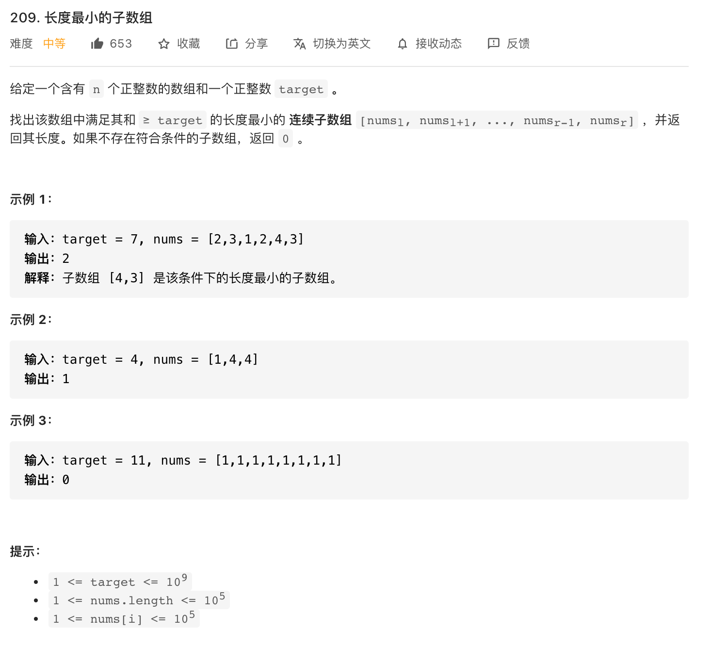

## 简介

+ 双指针非常巧妙的一种算法思想，它能降低某些问题的时间复杂度或空间复杂度
+ 双指针的方向可能是同向（链表、滑动窗口）或相向（二分查找）的，其中：
  + 同向：时间复杂度一般为 $O(n)$
  + 相向：时间复杂度一般为 $O(logn)$


## 链表

+ 链表问题是双指针最常见的场景
+ 辅助指针：通常用于临时交换的指针
+ 快慢指针：通常是链表的相遇/相交问题


## 二分查找

+ 二分查找一般应用于有序序列、或蕴含有序的序列的问题
+ 最常见的题型为：查找有序数组中是否存在某个数字，其时间复杂度为 $O(logn)$
+ 更多题型参考[查找算法-二分查找](../cate/search.md)


## 滑动窗口

+ 滑动窗口与前缀和有些类似，都是根据已计算的值，快速推算出下一个值（通常为 $O(1)$ 的时间复杂度）
+ 重难点在窗口的定义、窗口值的计算


### 题型一：连续序列

+ 此类题型题目中滑动窗口的思想比较明显，多是在子序列中求最值

+ [LeetCode-209. 长度最小的子数组](https://leetcode-cn.com/problems/minimum-size-subarray-sum/)
:::: tabs
::: tab 题目描述

:::

::: tab 解析和代码
+ 我们很容易写出一个时间复杂度为 $O(n^2)$ 的解法
```js
var minSubArrayLen = function(target, nums) {
  const N = nums.length;
  let ans = Number.MAX_SAFE_INTEGER;
  
  for (let i = 0; i < N; i++) {
    let sum = 0;
    for (let j = i; j < N; j++) {
      sum += nums[j];
      if (sum >= target) {
        ans = Math.min(ans, j - i + 1);
        break;
      }
    }
  }

  return ans === Number.MAX_SAFE_INTEGER ? 0 : ans;
};
```

+ 对于
```js
var minSubArrayLen = function(target, nums) {
  const N = nums.length;
  let ans = Number.MAX_SAFE_INTEGER;
  let l = 0, r = 0;
  let sum = 0;

  while (r < N) {
    // 将右侧元素移入，保证 sum 满足要求
    sum += nums[r];
    // 将左侧元素移出，保证窗口足够小
    while (sum >= target) {
      ans = Math.min(ans, r - l + 1);
      sum -= nums[l];
      l++;
    }
    r++;
  }

  return ans === Number.MAX_SAFE_INTEGER ? 0 : ans;
};
```
:::

+ 补充：该题还有一个基于「前缀和 + 二分查找」的解法，也是比较巧妙的解法，可参考官方题解
::::


+ [LeetCode-3. 无重复字符的最长子串](https://leetcode-cn.com/problems/longest-substring-without-repeating-characters/)
:::: tabs
::: tab 题目描述

:::

::: tab 解析和代码
```js

```
:::
::::