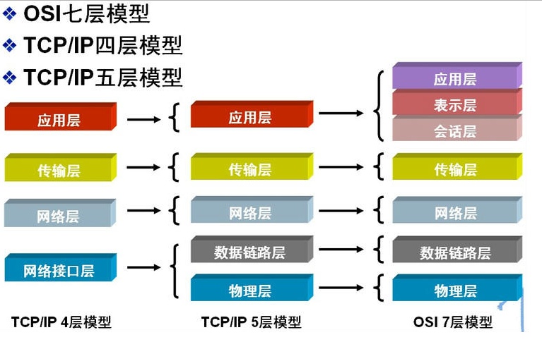

## 简介

+ 计算机网络可以说是计算机诞生后最伟大的发明之一，从网上冲浪到万物互联，它担任了非常重要的角色
+ 计算机网络的功能：
  + **数据通信**：所有其他功能的基础，无论在什么地方，只要有网络，就可以通信
  + **资源共享**：局域网、广域网、互联网等为我们共享硬件、软件和数据提供了基础
  + **负载均衡**：可以使用一个计算机集群提供更稳定、高性能的 Web 服务
  + ...
+ 计算机网络是复杂的，但是它又是层次分明的：

## TCP/IP

+ `TCP/IP`(Transmission Control Protocol/Internet Protocol, 传输控制协议/网络互联协议)是一组用于实现网络互联的通信协议，是 Internet 最基本的协议和互联网络的基础
+ 实际上，日常所说的 `TCP/IP` 不限于 TCP 和 IP 两个协议，而是包括了许多不同功能且相互关联的协议，组成了 TCP/IP 协议簇：

+ 发展到当前，众多的网络产品厂家都支持 TCP/IP 协议，成为了一个真正的工业标准

## HTTP

+ `HTTP`(Hyper Text Transfer Protocol，超文本传输协议)是基于 `TCP` 协议实现的
+ 用于传输 `HTML`(Hyper Text Markup Language，超文本标记语言)文档
+ 在 Web 开发中最常见的就是状态吗，以下为一些常见 `HTTP` 状态码(查看[全部状态码](/base/computed-network/http/status-code))

## DNS

+ DNS(Domain Name System)是一个分级的、基于域名的命名机制的分布式数据库系统
+ 用于实现域名和 IP 地址之间的转换

## WebSocket

