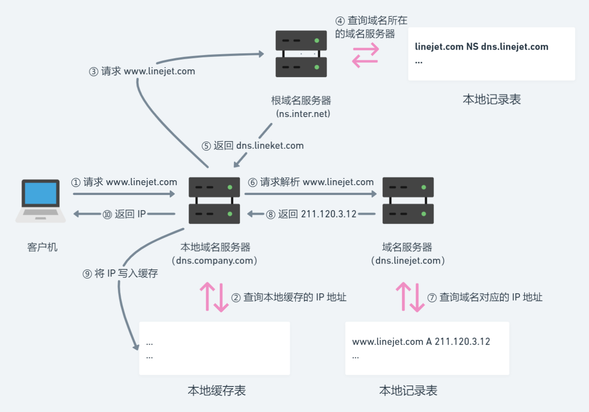

## 介绍

+ `DNS`(Domain Name System)是一个分级的、基于域名的命名机制的分布式数据库系统，用于实现域名和 IP 地址之间的转换
+ 域名采用层级结构，从左到右级别逐渐增高，彼此之间使用圆点隔开
```sh
主机名.N级域名.···.二级域名.顶级域名

# api 为三级域名
api.music.163.com
```
+ 域名大小写不敏感，成员名最长可达 63 个字符，全名最长不超过 255 个字符
+ 域名必须注册才能在 Internet 上使用
+ IP 地址与域名是一对多的关系，即一个 IP 地址可以对应多个域名，但一个域名只能对应一个 IP 地址


## 解析机制

+ 静态解析：域名解析由静态域名解析表完成，静态域名解析表是 win 系统下的 hosts 文件，该文件上有许多主机名到 IP 地址的映射，供主机查询时使用
+ 动态解析：域名解析由域名服务器完成，采用 UDP 协议，端口号为 53

::: tip 说明：
+ 解析域名时，可以先采用静态解析的方法，如果静态解析不成功，再采用动态解析的方法
:::


## 解析过程

::: tip 简单来说：
1. `浏览器`先请求本地域名服务器，`本地域名服务器`查看其本地 IP 缓存列表，尝试读取已缓存的 IP：
    + 若已缓存 IP，直接返回
    + 否则，本地域名服务器会请求根域名服务器
2. `根域名服务器`查询其**本地记录表**，取得域名所在的域名服务器，返回给本地域名服务器
3. `本地域名服务器`请求域名服务器，后者查询其本地记录表得到 IP 地址，返回给本地域名服务器
4. `本地域名服务器`将 IP 地址其添加到本地缓存表，最后再返回 IP 地址给浏览器
:::

**说明：**
+ 根域名服务器是 ns.inter.net
+ 客户机的本地域名服务器是 dns.company.com
+ 客户机访问的网站域名是 www.linejet.com，该网站所属的域名服务器是 dns.linejet.com



**解析：**
1. 客户机向本地域名服务器请求解析网站域名
2. 本地域名服务器收到请求后查询本地缓存，找到记录则跳至步骤 ⑩
3. 本地域名服务器没有相关记录，向根域名服务器请求网站域名的域名服务器
4. 根域名服务器收到请求后查询本地记录，得到域名对应的域名服务器
5. 根域名服务器将结果返回给本地域名服务器
6. 本地域名服务器收到响应后，向域名服务器请求解析网站域名
7. 域名服务器找到记录下的网站域名对应的 IP 地址
8. 域名服务器将结果返回给本地域名服务器
9. 本地域名服务器将返回的结果保存到本地缓存
10. 本地域名服务器将结果返回客户机，解析结束


## DNS 优化原理
