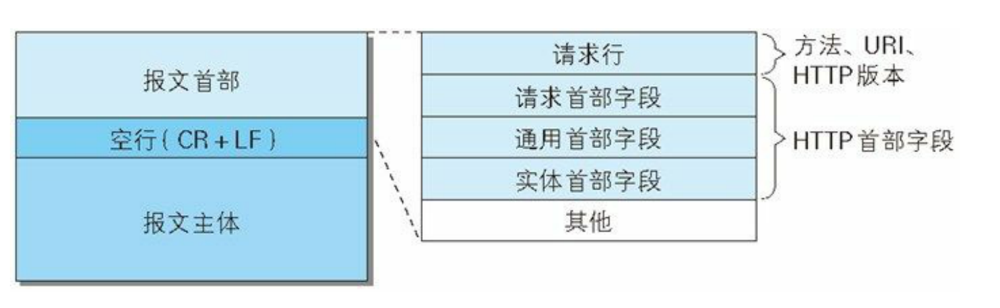
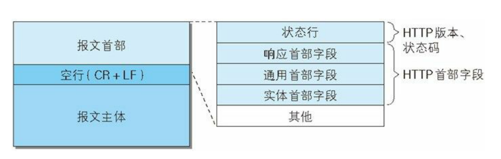

## 介绍

+ HTTP(Hyper Text Transfer Protocol，超文本传输协议)，用于传输 HTML(Hyper Text Markup Language，超文本标记语言)文档的一种协议
+ 是基于 TCP 协议实现的应用层协议
+ HTTP 是无状态的，它对发送过的请求和响应都不做持久化处理：
  + 优点：减轻服务器负担
  + 缺点：不能保存客户端的状态(验证登录等情况时)，但 `HTTP/1.1` 引入 Cookie 技术来缓存状态
+ 历史
  + 1990 年，由 Tim Berners-Lee 提出
  + 1990 年，提出 HTTP/0.9，但没有作为正式的标准
  + 1996 年，推出 HTTP/1.0
  + 1997 年，推出 HTTP/1.1 (当前使用广泛的版本)
  + 2015 年，推出 HTTP/2.0


## 版本区别

+ **1.1 VS 1.0**
  + **长连接**：`1.0` 需要使 `keep-alive` 参数来告知服务器建立一个长连接；`1.1` 默认支持长连接
  + **节约宽带**：`1.1` 支持只发送一个 `header` 信息（不带任何 `body`）
  + **host域**：虚拟站点，服务器上的多个虚拟站点可以共享同一个 `ip` 端口；`1.0` 没有 `host` 域
+ **2.0**
  + **多路复用**：`1.1` 为了避免浏览器过度消耗服务器资源，限制了浏览器对同一域名的并发请求数量；`2.0` 不会
  + **数据压缩**：启用了强制性的压缩算法来压缩报文
  + **TLS 支持**：允许使用 `TLS 1.2` 或更新版本的协议进行加密，使通信更加安全
  + **应用层协议协商**
  + **服务端推送**：服务端可以自行判断客户端的请求，选择返回比当前请求更多的数据
  + **流控制**：阻止发送方发送过量的数据，以免超出接收方的处理能力


## 请求方式

+ **GET**：用于获取资源。一般来说只用于数据的读取，而不用于会产生副作用的非幂等的操作中
+ **HEAD**：用于获取响应头部。常用于查看服务器的性能
+ **POST**：用于向指定资源提交数据，请求服务器进行处理。如表单数据提交、文件上传等，请求数据会被包含在请求体中；是非幂等的方法，因为这个请求可能会创建新的资源或修改现有资源
+ **DELETE**：用于删除指定内容。
+ **PUT**：用于更新现有资源。
+ **PATCH**：用于资源的部分更新。当资源不存在时创建一个新的资源
+ **OPTIONS**：用于查看服务器的性能。
+ **TRACE**：回显服务器收到的请求。主要用于测试或诊断
+ **CONNECT**：HTTP1.1预留给能够将连接改为管道方式的代理服务器。通常用于 SSL 加密服务器的链接与非加密的 HTTP代理服务器的通信

::: tip 说明：
+ GET, POST, HEAD 都是 HTTP 1.0 的产物
+ JavaScript 使用 XMLHttpRequest 对象进行 CORS 跨域资源共享时，就是使用 OPTIONS 方法发送嗅探请求，以判断是否有对指定资源的访问权限
:::


## GET/POST 的区别

+ GET 一般用于请求数据, POST 一般用于发送数据
+ GET 安全性底, POST 安全性较高
+ GET 传递参数大小有限制, POST 将请求参数放进请求体中, 大小没有限制
+ GET 一般会走缓存, POST 不走缓存


## 请求报文和响应报文

+ 请求报文



```sh
# 请求行
GET /home/msg/data/personalcontent?num=8 HTTP/1.1
# 请求头部字段
Host: www.baidu.com
Connection: keep-alive
Pragma: no-cache
Cache-Control: no-cache
Accept: text/plain, */*; q=0.01
User-Agent: Mozilla/5.0 (Macintosh; Intel Mac OS X 10_15_3) AppleWebKit/537.36 (KHTML, like Gecko) Chrome/83.0.4103.106 Safari/537.36
X-Requested-With: XMLHttpRequest
Sec-Fetch-Site: same-origin
Sec-Fetch-Mode: cors
Sec-Fetch-Dest: empty
Referer: https://www.baidu.com/?tn=62095104_19_oem_dg
Accept-Encoding: gzip, deflate, br
Accept-Language: zh-CN,zh;q=0.9
Cookie: BIDUPSID=1B90A499A1F594A342FC57A545380BF2;
```

+ 响应报文



```sh
# 状态行
HTTP/1.1 200 OK
# 响应头部字段
Cache-Control: private
Connection: keep-alive
Content-Encoding: gzip
Content-Type: text/html;charset=utf-8
Date: Thu, 18 Jun 2020 17:26:03 GMT
Expires: Thu, 18 Jun 2020 17:26:03 GMT
Server: BWS/1.0
Vary: Accept-Encoding
Content-Length: 47
```


## 常见状态码

+ **状态码分类：**

状态码|分类|说明
-|-|-
1xx|信息类|请求已接收，正在处理
2xx|响应成功类|请求已接收、处理且响应成功
3xx|页面重定向类|需要其他操作才能完成请求
4xx|客户端错误类|客户端请求出现错误或不符合服务器预期，导致服务端无法处理请求
5xx|服务端错误类|服务端处理请求时出错

+ **常见状态码：** [查看全部状态码](./status-code)

状态码|标识|含义
-|-|-
200|OK|服务器成功处理并响应客户端的请求。
204|No Content|请求已经成功处理，但是响应主体不返回内容
206|Partial Content|服务端成功处理并返回客户端指定某资源的某部分
301|Moved Permanently|请求的资源被永久移动到指定的 URL 上
302|Found|请求的资源暂时移动到指定的 URL 上
304|Not Modified|请求访问的资源未被修改，可以使用缓存的内容
307|Temporary Redirect|请求的资源暂时被移动到指定的 URL 上
400|Bad Request|客户端请求有语法错误(或请求参数错误)，不能被服务器所理解
401|Unauthorized|请求未经授权
403|Forbidden|服务器有能力处理该请求，但是拒绝授权访问
404|Not Found|服务器无法找到所请求的资源
500|Internal Server Error|服务器遇到不知道如何处理的情况
502|Bad Gateway|网关(或代理服务器)向上游服务器发起请求时得到无效的响应
503|Service Unavailable|服务端暂时处于超负载或正在进行停机维护，无法处理请求
504|Gateway Timeout|网关/代理服务器请求上游服务器/辅助服务器时未能收到响应


## 请求优化

+ **减少请求/连接**
  + 减少请求：优化数据请求，合并请求等
  + 减少连接：保持一定的连接时间，而不是经历多次的 "三次握手"
+ **缓存数据**
  + 客户端缓存在 localeStorage 中
  + 服务端缓存静态资源在 CDN 服务器上
+ **减少传输数据量**
  + 对文件进行压缩
+ **优化网络链路**
  + 减少域名：减少三级或更高级域名的使用，减少域名解析的时间
  + 使用 CDN


## HTTP 的缺点

+ **通信使用明文**：HTTP 协议本身不具有加密功能，无法对通信整体进行加密，所以采用明文方式发送
+ **不验证通信方身份**：HTTP 协议不具有判断对方身份的机制，容易造成很多安全问题：
  + 客户端无法确认请求发送的服务器是否是目标服务器，有可能是已伪装的 Web 服务器
  + 服务端无法确认接收响应的客户端是否是目标客户端，有可能是已伪装的 Web 客户端
  + 即使是无意义的请求，服务器也会收到，例如 DDOS(Distributed denial of service，拒绝服务)攻击
+ **无法证明报文的完整性**：如果中间方篡改了信息，通信双方都没有方法来确认信息的准确性，容易遭受中间人攻击；但可以通过其他方法，如 `数字签名` ，来保证信息的准确性。


## HTTPS 简介

+ HTTP 的安全版本，通过 `SSL` 加密


## 开启 HTTPS


## HTTPS 加密原理


::: tip 术语和技术：
**对称加密 & 非对称加密:**
+ 对称加密：`AES`、`DES` 等，加密解密使用同一个密钥
+ 非对称加密：`RSA` 等，有一对密钥(公钥，私钥)，两个密钥都可以加解密，但用其中一个密钥加密就只有用另一个密钥才能解密

**摘要 & 签名:**
+ 消息摘要：使用哈希函数(MD5, SHA 等)将数据生成唯一的定长的字符串，当数据改变时，使用同一哈希函数生成的摘要信息会不一样，从而验证数据的完整性
+ 签名：为了防止消息摘要在中途被篡改，使用加密算法对消息摘要进行加密，只有拥有密钥才能解密

**SSL 数字证书:**
+ 由 CA(认证中心)机构签发：CA 收到制作证书的请求后，会用非对称加密算法生成公钥和私钥，其中公钥保存在生成的 SSL 证书中，并用 CA 自身的私钥进行签名后，把 SSL 证书和对应的私钥返回给申请者
+ SSL 证书的作用：
  + 身份认证，客户端可以认证服务端的身份
  + 加密传递数据：利用 SSL 证书中的公钥加密数据(该数据应该是随机数生成的对称算法密钥)

**使用两种加密算法的原因:**
+ 单独使用非对称加密算法：这样相当于不加密(因为服务端在之前把公钥返回给浏览器，任何人都可能知道公钥)
+ 单独使用对称加密算法：服务端还要跟浏览器约定唯一密钥，保存密钥等工作
+ 同时使用两者：非对称加密算法用于确保对称加密算法的密钥不被窃取，对称加密算法则用于加密数据；这样服务端就不用保留对称加密的密钥，而是通过公钥解密即可
:::


## HTTPS 通信流程

1. 浏览器将自己支持的加密算法发给服务端
2. 服务端选择其中一组加密算法，将自己的 SSL 证书和公钥返回给浏览器
3. 浏览器验证该证书的合法性
4. 若证书合法(或用户接受了不受信任的证书)，浏览器会生成一串随机数密码，并用公钥进行加密后，发送至服务端
5. 服务端接收浏览器的数据后：
    + 用私钥解密出该随机数密码
    + 用该随机数密码解密握手信息
    + 用该随机数密码加密一段握手信息，发送至浏览器
6. 之后的通信都使用该随机数密码作密钥进行加解密

::: tip 说明：
+ 使用了两种加密算法：对称加密、非对称加密
+ 握手信息和数据是用对称加密的，密钥为浏览器生成的随机数密码
+ 该随机数密码是用非对称加密的，公钥一开始和 SSL 证书一并发送给浏览器，服务端保存私钥
:::


## 劫持 HTTPS 请求

+ **中间人攻击**：通过伪造证书，中间人截取客户端发送给服务器的请求，伪装成客户端与服务器进行通信，并将信息转发给客户端，伪装成服务器与客户端进行通信。此时中间人可以获取客户端与服务端的所有通信内容。
+ **预防**：证书校验。针对安全性比较高的应用，可以采用客户端预埋证书的方式锁死证书，只有当客户端证书与服务端证书完全一致的情况下才允许通信，而且证书过期必须强制更新。