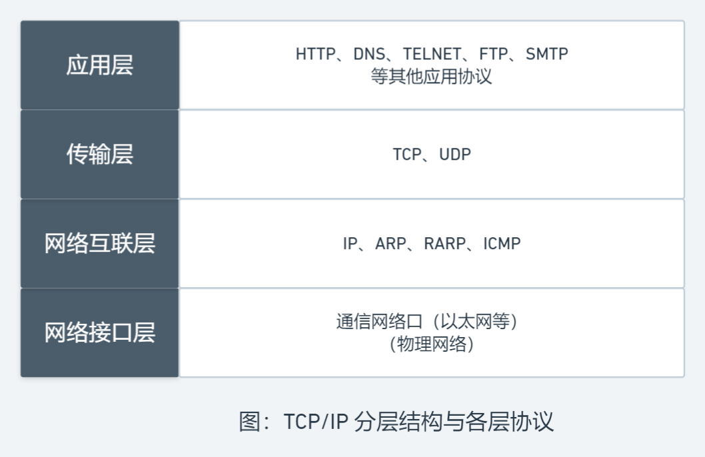
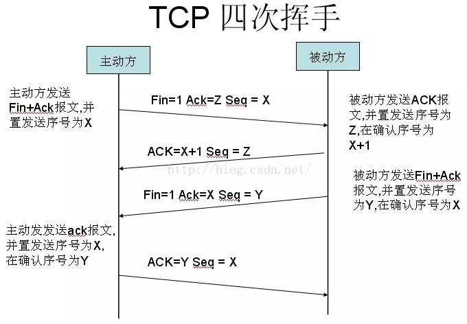

## TCP/IP 协议簇

+ `TCP/IP`(Transmission Control Protocol/Internet Protocol, 传输控制协议/网络互联协议)是一组用于实现网络互联的通信协议，是 Internet 最基本的协议和互联网络的基础
+ 实际上，日常所说的 `TCP/IP` 不限于 TCP 和 IP 两个协议，而是包括了许多不同功能且相互关联的协议，组成了 TCP/IP 协议簇：

### 每层协议的作用

+ **应用层**: 应用级别的最高层协议
  + **HTTP**: 超本文传输协议，提供超文本传输功能
  + **DNS**: 域名服务协议，提供域名和 IP 地址的转换，允许对域名资源进行分布式管理
  + **TELNET**: 远程登录协议，能利用 TCP 连接登录远程主机
  + **FTP**: 文件传输协议，为用户提供本地机与远程机之间的文件传输服务
  + **SMTP**: 简单邮件传输协议，规定两个相互通信的 SMTP 进程之间交换邮件信息的规则
+ **传输层**: 负责在源主机和目标主机之间提供端到端的数据传输服务
  + **TCP**: 面向连接的传输控制协议，提供用户之间的面向连接的可靠文件传输服务
  + **UDP**: 无连接的用户数据包协议，提供用户之间的无连接的不可靠报文传输服务
+ **网络互联层**: 提供互联网络环境下端到端的数据分组传输服务，采用无连接交换方式来实现
  + **IP**: 提供数据包按 IP 地址传输，路由选择等功能
  + **ARP**: 提供 IP 地址到物理地址的映射功能
  + **RARP**: 提供物理地址到 IP 地址的映射功能
  + **ICMP**: 提供传输差错控制信息以及主机和路由器之间的控制信息
+ **网络接口层**: 负责将 IP 分组封装成适合在物理网络上传输的帧并发送出去，或将从物理网络接收的帧解封并将 IP 分组递交给高层协议

## TCP

+ [面试官，不要再问我三次握手和四次挥手](https://zhuanlan.zhihu.com/p/86426969)

### 特点

+ 面向流的投递服务
+ 面向连接的投递服务
+ 可靠传输服务
+ 提供强制性传输和缓传输两种手段
+ 全双工传输
+ 流量控制

### 如何保证可靠传输

+ **序列号**：TCP 给发送的每一个包进行编号，接收方对数据包进行排序，把有序数据传送给应用层
+ **校验和**：TCP 将保持它首部和数据的检验和(端到端的检验和，用于检测数据在传输过程中的变化)，若收到段的检验和有差错，将丢弃该报文段并不会确认收到此报文段
+ **确认应答**：传输的过程中，每次接收方收到数据后，都会对传输方进行确认应答
+ **连接管理**：三次握手、四次挥手
+ **流量控制**：TCP 连接的双方都有固定大小的缓冲空间，当接收方来不及处理发送方的数据，能提示发送方降低发送的速率，防止包丢失
+ **拥塞控制**：当网络拥塞时，减少数据的发送
+ **超时重传**：发出一个段后，启动定时器等待目的端确认收到该报文段，若不能及时收到确认将重发该报文段
+ **停止等待**: 每发完一个分组就停止发送，等待对方确认，在收到确认后再发下一个分组

### 三次握手

+ 建立 TCP 连接需要三次握手
  1. 客户端发送报文给服务器，请求建立连接
  2. 服务器响应报文，回应客户端可以建立连接，并处于等待连接状态
  3. 客户端再次发送报文给服务器，完成建立连接
+ 过程图：

::: tip 备注：
+ 第 1、2 次握手不能携带数据，第 3 次可以
+ SYN 攻击是一种典型的 DoS/DDoS 攻击
+ 三次握手实际上是通信双方对对方通信功能的嗅探：
  + 第 1 次握手后，服务端确认客户端的发包功能
  + 第 2 次握手后，客户端确认服务端的收包、发包功能
  + 第 3 次握手后，服务端确认客户端的收包功能
+ 为什么不使用两次握手：
  + 客户端请求连接丢包时会放弃连接，重发请求
  + 而放弃的连接可能由于网络节点的滞留，会在客户端放弃连接后，服务端才收到
  + 服务端应对了该连接，并等待客户端发数据包(然而客户端永远不会发送)，浪费资源
:::

::: tip 优缺点：
+ 优点：保证了传输数据过程的稳定性(通过三次握手建立了连接)
+ 缺点：
  + 三次握手消耗时间
  + 服务器保持连接会消耗资源
  + 服务器不能主动给客户端发送信息(一般采取轮询来让客户端定时向服务端发送请求)
:::

### 四次挥手

+ 断开 TCP 连接需要四次挥手(TCP 的连接的拆除需要发送四个包)，也叫四次握手
+ 客户端或服务器均可主动发起挥手动作
+ 过程图：

## IP

### 功能

+ **寻址**：网络上的主机都用 IP 地址来标识，每个 IP 数据包中都携带分别标识源主机和目标主机的 IP 地址
+ **数据报的路由转发**：网络上的每个中间节点(路由器)都根据 IP 数据包中接收方的目标 IP 地址来确定是本网传送还是跨网传送
+ **数据报分段和重组**：由于 IP 数据报可能会在不同的通信网络中传输，而且不同网络的数据链路层可传输的数据帧的最大长度不同，因此 IP 会根据不同的情况(数据报中的分段和重组标识)来对数据报进行分段组装后再交给上层协议

### 提供的服务

+ **不可靠的投递服务**：IP 的任务是通过互联网传送数据报，所以其不关心在传输过程中数据包的丢失、重复传输、延迟、乱序等问题，也不将结果告知收发双方
+ **无连接的投递服务**：因为每个 IP 数据报都是独立处理和传输的，同一台主机发出的数据报在网络中可能会经过不同的路径，到达接收方时可能会乱序甚至丢失
+ **尽力的投递服务**：只要有希望就会向前投递，不会轻易丢失数据报

### IP 地址

+ 当前使用的 IP 地址版本为 IPv4，用 32 位二进制数组成，同时按照每 8 位为一段将其转化为十进制的形式(如 `202.119.2.199`)来简化记忆
+ IP 地址 = 网络 ID + 主机 ID
  + 网络 ID：具有唯一性，用来识别入网主机所在的网络
  + 主机 ID：在同一网络中唯一，用来区分该网络中的不同主机
+ IP 地址使寻址更方便，会先按网络 ID 找到网络，再按主机 ID 找到主机
+ **特殊的 IP 地址**：
  + **本机地址**(0.0.0.0)：32 位全为 0，在本网通信时可用该 IP 地址表示本机地址
  + **有限广播地址**(255.255.255.255)：32 位全为 1，代表本网段内的所有主机，用于在本网络内部广播
  + **直接广播地址**(x.x.x.255)：主机ID 为 1，一个主机可以使用该地址把数据分组广播给某个网络中的所有节点
  + **网络地址**(x.x.x.0)：主机ID 全为 0，不分配给任何主机，用于表示某个网络的网络地址
  + **回送地址**(127.x.x.x)：以数字 127 开头，是一个保留地址，常用形式为 `127.0.0.1`(localhost)

### IP 地址分类

+ IP 地址分为 A、B、C、D、E 五类，可分配使用的为前三类，D 类为多播地址，E 类保留用作特殊用途
+ 其中，从 IP 地址的前几位很容易看出所属的类别：

+ 区别：

|分类|前缀|网络个数|每个网络可容纳主机|
|-|-|-|-|
|A|0|126|16777214(2^24-2)|
|B|10|16382|65534(2^16-2)|
|C|110|209 万|254(2^8-2)|
|D|1110|||
|E|11110|||

::: tip 说明：
+ A 类地址一般分配给具有大量主机的网络使用
+ B 类地址一般分配给规模中等的网络使用
+ C 类地址一般分配给小型局域网使用
:::