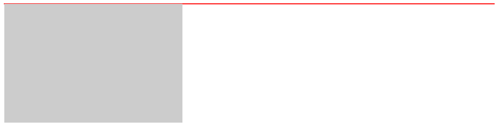
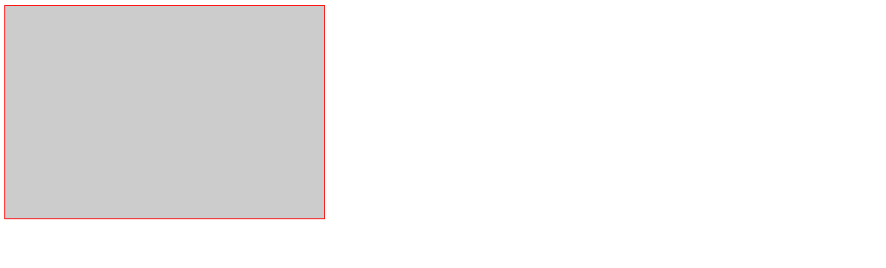

## 盒子模型

&emsp;&emsp;DOM 中所有的元素都是一个个的盒子，每个元素均具有自己的 '盒子属性'，可能是显式声明的，也可能是继承或者默认的。一个盒子的尺寸会收到很多因素的影响：

+ box-sizing
+ width / height
+ margin / padding
+ border
+ BFC
+ flex

## CSS 属性

属性|取值|类似属性|说明
-|-|-|-
`box-sizing`|`content-box`, `border-box`|none|设置盒子的组成模式
`width`|`<length>`<br>`<percentage>`|min-width, max-width, device-width|设置元素的宽度
`height`|`<length>`<br>`<percentage>`|min-height, max-height, device-height|设置元素的高度
`margin`|`<length>`<br>`<percentage>`|margin-[ top、right、bottom、left ]|设置元素的外边距，<font color='red'>可以为负值</font>
`padding`|`<length>`<br>`<percentage>`|padding-[ top、right、bottom、left ]|设置元素的内边距
`border`|`1px solid red`|border-[ top、left、bottom、right ]-[ width、style、color ]|设置边框的样式
`box-shadow`|-|-|设置元素的阴影

::: tip 说明：
+ 对于 `box-sizing: content-box;` 的正常盒子(没有受到 `flex` 等布局形式的影响)，设置 `margin/padding/border` 均会撑大盒子的宽高，其盒子宽高为：
  + box_width = margin-left + border-left + padding-left + width + padding-right + border-right + margin-right
  + box_height = margin-top + border-top + padding-top + height + padding-bottom + border-bottom + margin-bottom

+ 对于 `box-sizing: border-box;` 的正常盒子，显式的 `width/height` 属性已经包含了 `padding/border` 在内，设置额外的 `padding/border` 只会让盒子的 `content` 缩小，不会撑大盒子的宽高，其盒子宽高为：
  + box_width = margin-left + width + margin-right
  + box_height = margin-top + height + margin-bottom
:::


## BFC

&emsp;&emsp;`BFC`(Block Formatting Context)：格式化上下文。Web 页面中盒模型布局的 CSS 渲染模式，指一个独立的渲染区域或者说是一个隔离的独立容器。


### BFC 容器的特点

+ 在 BFC 内部的盒子会在垂直方向上排列
+ 垂直方向上的距离可以由 margin 控制
+ BFC 容器的区域不会与 float 元素区域重叠 （可用于设计自适应布局）
+ 计算 BFC 高度时，浮动元素参与计算 （可用于将父元素设置为 BFC 容器以解决浮动产生的高度塌陷问题）
+ BFC 容器是一个独立的容器，容器内部的子元素不会影响外部元素 （可用于取消文字环绕）

### 创建 BFC 的方式

1. 根元素或其它包含它的元素
2. float: `left` | `right`
3. position: `absolute` | `fixed`
4. display: `inline-block` | `table-cell` | `table-caption` | `flex` 等
5. overflow: `hidden` | `auto` | `scroll`


### 使用 BFC 解决问题

**1.防止父元素高度塌陷**

&emsp;&emsp;当一个盒子没有设置固定的高度时，若它的唯一子元素设置浮动，则会出现高度塌陷：

```html
<div class="content">
  <div class="box"></div>
</div>
```
```css
.content {
  border: 1px solid red;
}
.box {
  width: 300px;
  height: 200px;
  float: left;
  background-color: #ccc;
}
```
&emsp;&emsp;没有进行处理时，结果是这样的：




&emsp;&emsp;为父元素创建 BFC，这样计算父元素高度时，浮动元素参与计算(除了设置 `position` 属性，还可以设置 `float`/`display`/`overflow` 等，实际效果可能有少许不同，但是都为父元素创建了 BFC 并且防止了高度塌陷)。

```css
.content {
  position: absolute;
  border: 1px solid red;
}
.box {
  width: 300px;
  height: 200px;
  float: left;
  background-color: #ccc;
}
```
&emsp;&emsp;处理后，结果是这样的：

