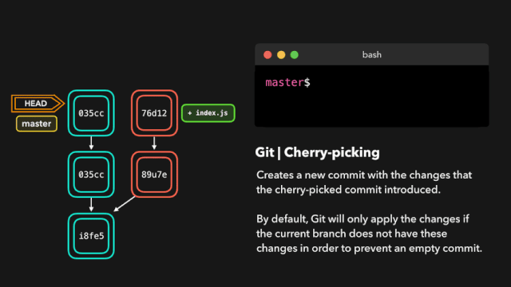

## 管理

+ `git branch`：分支管理
```sh
$ git branch              # 查看所有分支
$ git branch hotfix       # 创建分支，但并未切换到该分支
$ git branch -d hotfix    # 删除指定分支
$ git branch -D hotfix    # 强制删除分支(当分支没合并但要删除时，要使用 -D 才能强制删除)
```

+ `git checkout`：分支切换
```sh
$ git checkout hotfix     # 切换至指定分支
$ git checkout -b hotfix  # 创建并切换至分支
$ git checkout -b feat v1 # 创建一个分支，以指定标签为起点
```


## 贮存

+ `git stash`：保存当前分支的工作区，可以切换到其他分支修复内容，然后再切换回来，恢复工作区即可
```sh
$ git stash list    # 查看当前保存的工作区列表
$ git stash pop     # 切换最近的一个工作区，并删除记录，工作区列表长度减一
$ git stash apply   # 恢复特定或最近的一个工作区，但是不会修改工作区列表
$ git stash drop    # 删除特定或最近的一个工作区
```

+ 场景1：在 dev 分支上开发的时候，线上报警出现 BUG，需要马上解决
```sh
$ git add .                       # 当前在 dev 分支，现将分支上的内容添加至暂存区
$ git checkout -b issue-101       # 创建并切换到一个 fixup 分支
$ echo fixup issue-101 > a.txt    # 修复 BUG
$ git add .
$ git commit -m "fixup issue-101"
$ git checkout master
$ git merge --no-ff issue-101     # 提交到线上分支
$ git branch -d issue-101         # 删除 fixup 分支
$ git checkout dev                # 返回 dev 分支
$ git stash pop                   # 恢复工作区
$ git stash list                  # 之前保存的工作区已经没有了
```


## 合并

### merge

+ `git merge`：合并分支，且有两种合并模式：
  + `Fast-forward`：快进(默认)，直接使用 merge 记录覆盖被合并分支上的提交记录并移动 HEAD 指针(不需要输入合并说明，且不会保留被合并分支的信息)
  + `--no-ff`：不快进(no-fast-forward)，需要输入合并说明，并且在被合并分支上的提交记录会保留(即使该分支会被删除)

+ 场景1：Fast-forward 模式
```sh
$ git checkout -b dev       # 创建一个开发分支并切换
$ cat hello world > b.txt   # 增加一个文件
$ git add .
$ git commit -m "add b.txt" # 提交
$ git checkout master       # 切换回主分支
$ git merge dev             # 合并 dev 分支
$ git branch -d dev         # 删除 dev 分支
$ git log                   # 这里不会看到分支的提交记录
```


+ 场景2：no-ff 模式
```sh
# 前几步操作一样
$ git merge --no-ff dev     # 合并分支，使用 --no-ff 方式，此时会弹出编辑器，要求输入合并说明
$ git log                   # 此时分支的提交会在 log 中，并且标记有分支名
$ git branch -d dev         # 删除 dev 分支
$ git log                   # 分支的提交记录依然存在，但是没有了分支名字标记
```


+ 场景3：出现冲突
```sh
$ git checkout -b dev
$ echo hello > a.txt
$ git add .
$ git commit -m "modify in dev"     # 在 dev 分支修改并提交
$ git checkout master
$ echo world > a.txt
$ git add .
$ git commit -m "modify in master"  # 在 master 分支修改并提交
$ git merge --no-ff dev             # 尝试合并 dev 分支
# 发生冲突，打开 a.txt，它里面变成了以下内容

<<<<<<< HEAD
world
=======
hello
>>>>>>> dev

# ======= 用于分隔两个分支的差异
# <<<<<<< HEAD 表明下面的内容是在当前分支修改的
# >>>>>>> dev 表明上面的内容是在 dev 分支修改的
# 处理冲突：只保留 world 所在行，删除其他四行
$ git add .   # 重新添加到暂存区
$ git commit -m "final modify"
$ git branch -d dev
```

::: tip 备注：
+ `Fast-Forward` 会丢弃被合并分支的提交记录，当需要完整的分支提交记录时，确保使用 `--no-ff`
+ `merge` 出现冲突时需要手动处理冲突，然后再合并；但使用 `rebase` 和 `cherry-pick` 可以免去手动处理冲突
:::


### rebase

+ `git rebase`：分支变基，会形成 "线性" 提交树
+ 实际是 `Fast-Forward` 和 `--no-ff` 的折中版，既不会删除分支的提交信息，也不会形成交叉混乱的分支
```sh
# 假设 master 分支已经领先 dev 分支
# 方法1：
$ git checkout master
$ git merge dev         # 处理冲突后，提交树是线性的，但是丢失了 dev 的提交记录

# 方法2：
$ git checkout master
$ git merge --no-ff dev # 处理冲突后，提交树是非线性的，但保留了 dev 的提交记录

# 方法3：
$ git rebase master     # 将 master 分支的提交复制到 dev 分支提交前的位置
$ git checkout master
$ git merge dev         # 不会有冲突，提交树是线性的，且保留了 dev 的提交记录
```

+ 当在 dev 分支开发过程中 master 分支已有新提交记录，使用 `git rebase master` 可以将 dev 的开始指针移至 master 的 HEAD 处；此时回到 master 分支合并 dev 分支时就不需要处理冲突了(也可以使用 `cherry-pick`)


### cherry-pick

+ `git cherry-pick`：拣选合并，能够选择一个特定的提交记录合并到当前分支
```sh
# 场景1：接 stash 的场景1，回到 dev 分支后发现也需要那个 BUG 补丁
$ git checkout master           # 回到 master 分支
$ git log                       # 找到 fixup 的那个提交 id(注意不是 merge 的id)
$ git checkout dev
$ git cherry-pick 4b89ffb       # 将 fixup 提交的记录合并到 dev 分支
$ git echo create file > d.txt  # 继续在 dev 分支上开发
$ git add .
$ git commit -m "finish dev"
$ git checkout master
$ git merge dev --no-ff         # 回到 master 分支，合并 dev 分支(因此已经合并了 fixup，此时不会有冲突)
$ git branch -d dev
```

+ `cherry-pick` 图示




### 对比

+ `merge` 必须手动处理冲突，`rebase` 和 `cherry-pick` 可以免去手动处理冲突的麻烦

+ 选择使用 `merge` 还是 `rebase`
  + 当不需要分支的提交信息时，使用 `Fast-Forward` 模式的 `merge` 即可(比较少用，因为提交树信息丢失)
  + 当需要完整的分支提交信息时，使用 `--no-ff` 模式的 `merge` 即可(视情况而定，有可能提交树十分混乱)
  + 当需要完整的分支提交信息又想要比较线性的提交树，使用 `rebase` 即可
  + `git rebase` 尽量不要用于公共仓库的提交，否则有可能使提交树更混乱(除非团队约定用于清理提交历史)

+ 使用 `cherry-pick` 的场景：
  + 选择合并有冲突的提交，这样合并时不需要手动处理冲突
