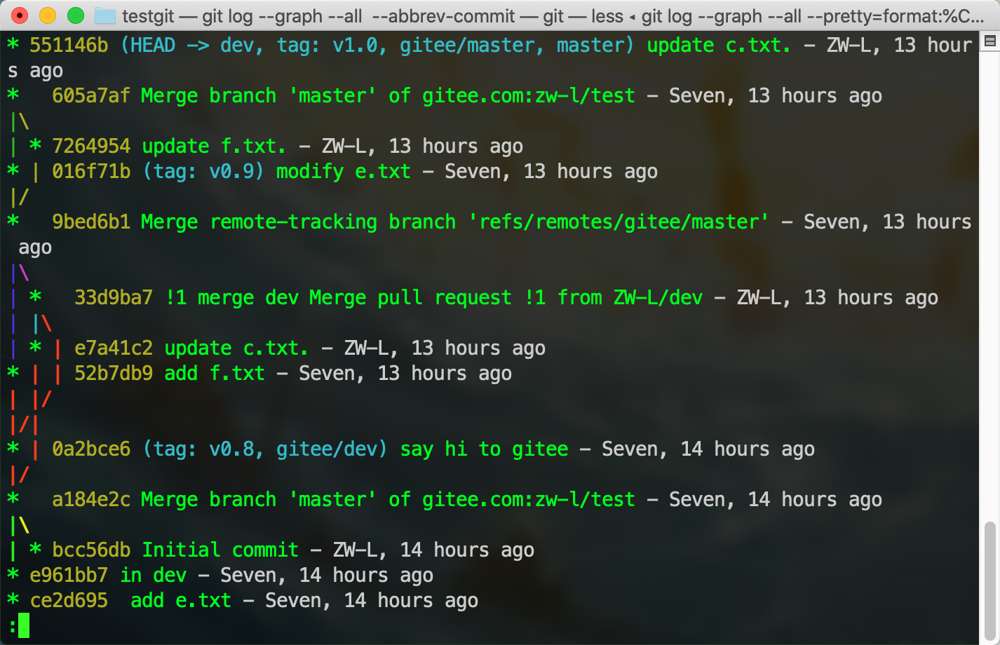
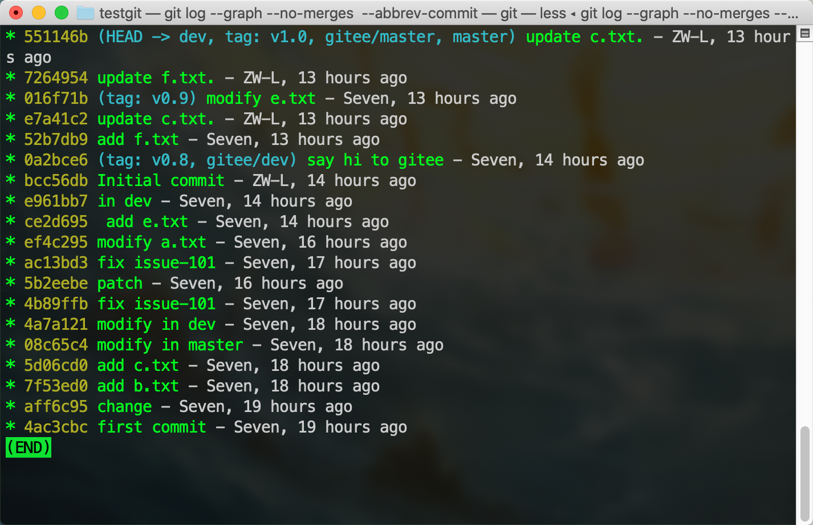
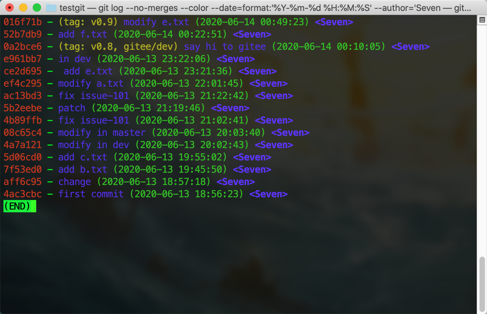
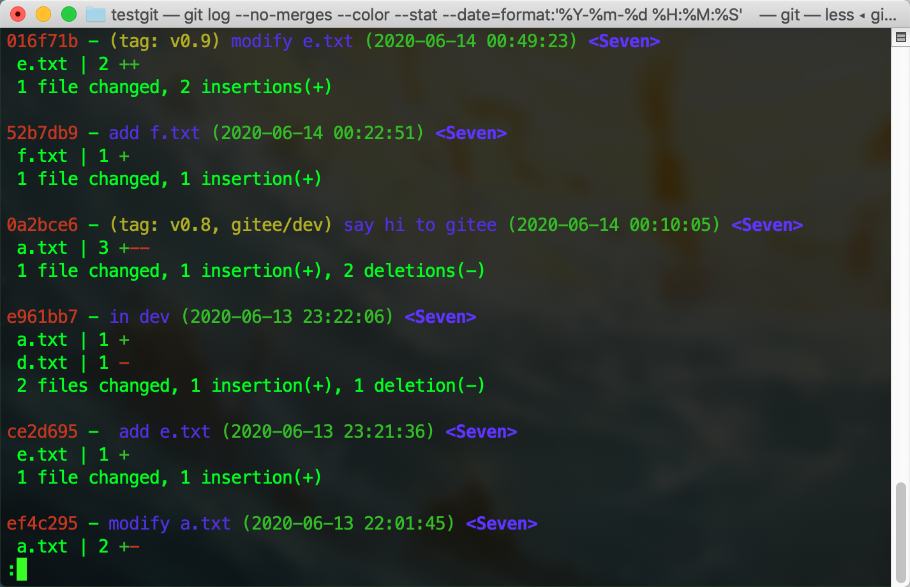

## 简介

+ `git config` 用于配置 git
  + --global 参数：指定配置影响到全局
  + --l 参数：查看配置
+ 全局配置文件 `.gitconfig` 在电脑用户的根目录下，每个 git 仓库中还存在一个局部配置文件，路径为 `.git/config`


## 用户配置

```sh
git config --global user.name "Alice"               # 全局配置用户名
git config --global user.email "Alice@example.com"  # 全局配置用户邮箱
```


## alias 别名

+ 设置某个命令的别名
```sh
git config --global alias.st status   # 以后 git st 相当于 git status
```
+ 美化 log 输出
```sh
# 使用 git lg 打印美化后的 log
git config --global alias.lg "log --color --graph --pretty=format:'%Cred%h%Creset -%C(yellow)%d%Creset %s %Cgreen(%cr) %C(bold blue)<%an>%Creset' --abbrev-commit"
```


## log 美化

### 参考

+ [git log 命令解析](https://www.cnblogs.com/bellkosmos/p/5923439.html)


### 模板

+ 以图的方式显示所有提交记录
```sh
git config --global alias.lg "log --graph --all --pretty=format:'%C(yellow)%h%C(cyan)%d%Creset %s %C(white)- %an, %ar%Creset' --abbrev-commit"
```


+ 以图的方式显示除 merge 外的提交记录
```sh
git config --global alias.lgnm "log --graph --no-merges --pretty=format:'%C(yellow)%h%C(cyan)%d%Creset %s %C(white)- %an, %ar%Creset' --abbrev-commit"
```


+ 线性显示，且不显示 merges，附加日期格式化、提交人名字
```sh
git config --global alias.lnm  "log --no-merges --color --date=format:'%Y-%m-%d %H:%M:%S' --author='Seven' --pretty=format:'%Cred%h%Creset -%C(yellow)%d%Cblue %s %Cgreen(%cd) %C(bold blue)<%an>%Creset' --abbrev-commit"
```


+ 线性显示，且不显示 merges，显示文件修改的简介，附加日期格式化、提交人名字
```sh
git config --global alias.lsnm  "log --no-merges --color --stat --date=format:'%Y-%m-%d %H:%M:%S' --author='Seven' --pretty=format:'%Cred%h%Creset -%C(yellow)%d%Cblue %s %Cgreen(%cd) %C(bold blue)<%an>%Creset' --abbrev-commit"
```
