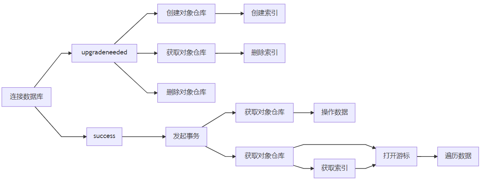

## 介绍

### [IndexedDB](https://developer.mozilla.org/zh-CN/docs/Web/API/IndexedDB_API)

+ 是一种低级 API，用于客户端存储大量结构化数据(包括文件/blobs)，使用索引来实现对该数据的高性能搜索
+ 是一个基于事务操作的 `key-value` 型数数据库，类似于基于 `SQL` 的 `RDBMS`
+ 是一个基于 `JavaScript` 的面向对象的数据库

::: tip 说明：
+ `Web Storage` 只用于存储较少量的数据，`IndexedDB` 用于存储更大量的结构化数据
+ `IndexedDB` 在 `Web Worker` 中可用
+ `IndexedDB` 遵守同源策略
+ `IndexedDB` 是异步执行的，不会阻塞应用程序
:::


### ACID

数据库事务保证了数据操作的 `ACID` 特性：

+ 原子性(Atomicity)：事务作为一个整体被执行，包含在其中的对数据库的操作要么全部被执行，要么都不执行
+ 一致性(Consistency)：事务应确保数据库的状态从一个一致状态转变为另一个一致状态
+ 隔离性(Isolation)：多个事务并发执行时，一个事务的执行不应影响其他事务的执行
+ 持久性(Durability)：已被提交的事务对数据库的修改应该永久保存在数据库中

::: tip 说明：
+ 简单来说，事务保证数据库操作要么全部成功，要么全部失败。
:::

## 使用

&emsp;&emsp;`API` 参考自 [MDN IndexedDB](https://developer.mozilla.org/zh-CN/docs/Web/API/IndexedDB_API)，或者本网站整理的 [API 列表](/appendix/indexeddb-api)。

### 使用方式

**对数据库的操作一般有以下几种：**




**操作的步骤可以概括为：**

1. 创建和连接数据库
2. 在 `upgradeneeded` 事件中管理对象仓库，根据需求管理索引
3. 在 `success` 事件中发起事务
4. 获取对象仓库
5. 可以直接在对象仓库上操作数据，或者结合游标、索引等筛选遍历数据

### 连接数据库

&emsp;&emsp;使用 `window.indexDB` 对象的 `open()` 方法连接一个数据库(当数据库不存在时会创建)，会返回一个 `IDBOpenDBRequest` 对象：

```js
const request = indexDB.open('dbName')

request.addEventListener('success', e => {
  console.log('Connect indexedDB success!')
})

request.addEventListener('error', e => {
  console.log('Failed to connect indexedDB!')
})
```

### 创建对象仓库

&emsp;&emsp;对象仓库相当于其他数据库的数据表，用于保存一系列对象数据；但创建对象仓库必须在 `upgradeneeded` 事件中(因为 `indexDB` 不允许数据库中的对象仓库在同一版本发生变换)，而 `upgradeneeded` 事件只会在数据库版本更新时。
&emsp;&emsp;使用 `IDBDatabase.createObjectStore()` 方法创建一个对象仓库：

```js
const request = indexedDB.open('dbName')

request.addEventListener('upgradeneeded', e => {
  const db = e.target.result
  // 当对象仓库不存在时，创建一个对象仓库并指定主键为 userId
  if (![...db.objectStoreNames].includes('Users')) {
    const store = db.createObjectStore('Users', { keyPath: 'userId', autoIncrement: true })
  }
})
```


### 创建事务

&emsp;&emsp;创建事务是操作数据前必须的一步，使用 `IDBDatabase.transaction()` 方法创建一个事务：

```js
const request = indexedDB.open('dbName')

request.addEventListener('success', e => {
  const db = e.target.result
  // 在对象仓库 Users 上以 readwrite 模式发起事务
  const tx = db.transaction('Users', 'readwrite')
})
```


### 在对象仓库上操作数据

&emsp;&emsp;创建事务后，可以使用事务对象(`IDBTransaction`)的 `objectStore()` 方法获取对象仓库，然后在对象仓库上进行操作，一些操作方法：

+ `add()`: 添加数据，数据存在时会报错
+ `put()`: 更改数据，数据不存在时等同于 `add()`
+ `get()`: 获取数据
+ `delete()`: 删除数据

**示例：**

```js
const request = indexedDB.open('dbName', 2)

request.addEventListener('success', e => {
  console.log('Connect indexedDB success!')
  const db = e.target.result
  const tx = db.transaction('Users', 'readwrite')
  // 获取对象仓库
  const store = tx.objectStore('Users')

  // 数据库操作
  const req = store.add({ 'userId': 1, 'userName': 'Alice', 'age': 24 })
  // const req = store.put({ 'userId': 1, 'userName': 'Alice', 'age': 26 })
  // const req = store.get(1)
  // const req = store.delete(1)

  // 监听数据库操作
  req.addEventListener('success', e => {
    console.log(e.target.result) // { 'userId': 1, 'userName': 'Alice', 'age': 24 }
  })
})
```


### 使用游标操作数据

&emsp;&emsp;使用游标能够同时获取和操作多条数据，可以将游标看作是一种遍历的方式。

创建游标的方式有：

+ `IDBObjectStore` 实例的 `openCursor()` 方法
+ `IDBIndex` 实例的 `openCursor()`/`openKeyCursor()` 方法

这些方法都需要接收一个范围作为参数，创建范围的方法(都是静态方法)有：

+ `IDBKeyRange.bound()`
+ `IDBKeyRange.only()`
+ `IDBKeyRange.lowerBound()`
+ `IDBKeyRange.upperBound()`


```js
const request = indexedDB.open('testDB', 12)

request.addEventListener('success', e => {
  const db = e.target.result
  const tx = db.transaction('Users', 'readonly') // 创建一个事务，模式为只读
  const store = tx.objectStore('Users') // 获取对象仓库
  const range = IDBKeyRange.lowerBound(1) // 创建一个范围
  const req = store.openCursor(range, 'next') // 创建一个游标
  let html = ''

  req.addEventListener('success', e => {
    const cursor = e.target.result
    if (cursor) {
      html += `<li>${cursor.value.userName} - ${cursor.value.age}</li>`
      cursor.continue() // 控制游标移动，读取下一条数据
    } else {
      console.log('Read all done!')
      document.getElementById('box').innerHTML = html
    }
  })
})
```

### 使用索引操作数据

&emsp;&emsp;使用索引能进行条件性的查找。需要注意的是，索引必须先在创建对象仓库的时候创建，然后才能在操作数据的时候获取：

```js
const request = indexedDB.open('dbName')

request.addEventListener('upgradeneeded', e => {
  const db = e.target.result
  // 当数据库不存在指定对象仓库时
  if (![...db.objectStoreNames].includes('Users')) {
    // 创建对象仓库
    const store = db.createObjectStore('Users', { keyPath: 'userId', autoIncrement: false })
    // 在对象仓库上创建索引
    store.createIndex('ageIndex', 'age', { unique: false })
  }
})

request.addEventListener('success', e => {
  const db = e.target.result
  const tx = db.transaction('Users', 'readwrite') // 发起事务
  const store = tx.objectStore('Users') // 获取对象仓库

  // 添加几条数据
  store.put({ age: 18, userName: 'Zed' })
  store.put({ age: 19, userName: 'Anna' })
  store.put({ age: 15, userName: 'Bod' })
  store.put({ age: 23, userName: 'Li' })
  store.put({ age: 32, userName: 'Noc' })

  const index = store.index('ageIndex') // 获取索引对象
  const req = index.openCursor(IDBKeyRange.lowerBound(18), 'next') // 在索引上打开游标

  // 遍历游标
  req.addEventListener('success', e => {
    const cursor = e.target.result
    if (cursor) {
      console.log(cursor.value)
      cursor.continue()
    } else {
      console.log('Read all done!')
    }
  })
})
```


## 一个完整的例子

**阅览：**


**代码：**

```html
<!DOCTYPE html>
<html lang="en">
<head>
  <meta charset="UTF-8">
  <meta name="viewport" content="width=device-width, initial-scale=1.0">
  <meta http-equiv="X-UA-Compatible" content="ie=edge">
  <title>Document</title>
</head>
<body>
  <button id="generate">生成随机数据</button>
  <button id="lower">未满18岁</button>
  <button id="upper">18岁以上</button>
  <div id="box"></div>
  <script>
    const generate = document.getElementById('generate')
    const lower = document.getElementById('lower')
    const upper = document.getElementById('upper')
    const box = document.getElementById('box')

    // 生成随机数据
    generate.addEventListener('click', e => {
      const request = indexedDB.open('myDB', 12)

      request.addEventListener('upgradeneeded', e => {
        console.log('upgradeneeded')
        const db = e.target.result
        // 当数据库不存在指定对象仓库时
        if (![...db.objectStoreNames].includes('Users')) {
          // 创建对象仓库
          const store = db.createObjectStore('Users', { keyPath: 'userId', autoIncrement: false })
          // 在对象仓库上创建索引
          store.createIndex('ageIndex', 'age', { unique: false })
        }
      })

      request.addEventListener('success', e => {
        console.log('success')
        const db = e.target.result
        const tx = db.transaction('Users', 'readwrite')
        const store = tx.objectStore('Users')

        // 添加 30 条随机数据
        for (let i = 1; i <= 30; i++) {
          store.put({ userId: i, age: randomAge(), username: randomUsername() })
        }
      })

      // 渲染数据
      const keyRange = IDBKeyRange.lowerBound(0)
      toDOM(request, keyRange, box)
    })

    // 显示 age < 18 的结果
    lower.addEventListener('click', e => {
      const request = indexedDB.open('myDB', 12)
      const keyRange = IDBKeyRange.upperBound(18, false)
      toDOM(request, keyRange, box)
    })

    // 显示 age >= 18 的结果
    upper.addEventListener('click', e => {
      const request = indexedDB.open('myDB', 12)
      const keyRange = IDBKeyRange.lowerBound(18)
      toDOM(request, keyRange, box)
    })

    // 渲染数据
    function toDOM(request, keyRange, dom) {
      request.addEventListener('success', e => {
        console.log('success')
        const db = e.target.result
        const tx = db.transaction('Users', 'readwrite')
        const store = tx.objectStore('Users')
        const index = store.index('ageIndex')
        let html = ''

        index.openCursor(keyRange).addEventListener('success', e => {
          const cursor = e.target.result
          if (cursor) {
            html += `<li>${cursor.value.username} - ${cursor.value.age}</li>`
            cursor.continue()
          } else {
            dom.innerHTML = html
          }
        })
      })
    }

    // 生成随机年龄
    function randomAge() {
      return Math.ceil(Math.random()*40)
    }

    // 生成随机用户名
    function randomUsername() {
      const first = String.fromCharCode(Math.floor(Math.random()*26)+65)
      const sub = new Array(Math.floor(Math.random()*5)+2).fill(null).map(v => {
        return String.fromCharCode(Math.floor(Math.random()*26)+97)
      })
      return first + sub.join('')
    }
  </script>
</body>
</html>
```