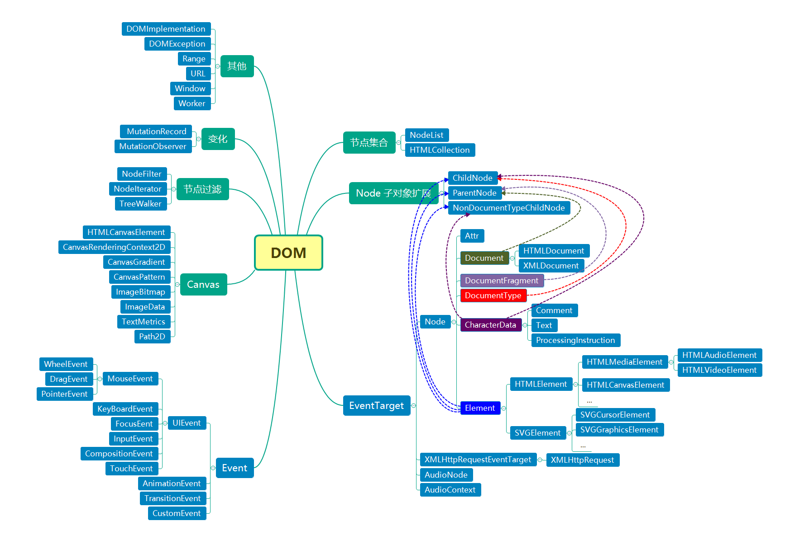

## DOM

&emsp;&emsp;DOM (Document Object Model, 文档对象模型)，是HTML和XML文档的编程接口。[DOM 介绍](https://developer.mozilla.org/zh-CN/docs/Web/API/Document_Object_Model/Introduction):

+ 提供了对文档的结构化的表述，并定义了一种方式可以使从程序中对该结构进行访问，从而改变文档的结构，样式和内容；
+ 将文档解析为一个由节点和对象（包含属性和方法的对象）组成的结构集合。简言之，它会将 web 页面和脚本或程序语言连接起来；
+ DOM 是 Web 页面的完全的面向对象表述，它能够使用如 JavaScript 等脚本语言进行修改；
+ [W3C DOM](https://www.w3.org/DOM/) 和 [WHATWG DOM](https://dom.spec.whatwg.org/) 标准在绝大多数现代浏览器中都有对DOM的基本实现；许多浏览器提供了对W3C标准的扩展，所以在使用时必须注意，文档可能会在多种浏览器上使用不同的 DOM 来访问。

## 节点类型

&emsp;&emsp;DOM 节点类型有以下几种，每种类型对应着一个 ID 值。

类型|ID|描述|规范
-|-|-|-
ELEMENT_NODE|1|元素节点，可以有子节点|-
TEXT_NODE|3|文本节点，无子节点|-
CDATA_SECTION_NODE|4|一个 `CDATASection，如` `<~CDATA[[...]]>`
PROCESSING_INSTRUCTION_NODE|7|一个 XML 文档的 `ProcessingInstruction`|-
COMMENT_NODE|8|注释节点，无子节点|-
DOCUMENT_NODE|9|Document 节点，代表整个文档|-
DOCUMENT_TYPE_NODE|10|描述文档类型的 `DocumentType` 节点，如 `<!DOCTYPE html>`|-
DOCUMENT_FRAGMENT_NODE|11|一个 `DocumentFragment` 节点，可以有子节点|-
ATTRIBUTE_NODE|2|属性节点，无子节点|DOM4 废弃
ENTITY_REFERENCE_NODE|5|一个 XML 实体引用节点|DOM4 废弃
ENTITY_NODE|6|一个 XML `<!ENTITY>` 节点|DOM4 废弃
NOTATION_NODE|12|一个 XML `<!NOTATION>` 节点|DOM4 废弃

## 接口关系图

MDN 所有 [DOM 接口](https://developer.mozilla.org/zh-CN/docs/Web/API/Document_Object_Model)：

## 接口说明

+ 常规 DOM 操作应用最多的接口为 `EventTarget`：
  + `Node` 描述了 DOM 的所有类型的节点对象
  + `Attr`(属性节点对象), `Document`(文档节点对象), `DocumentFragment`(文档片段节点对象), `Element`(元素节点对象)分别扩展了 `Node` 对象
  + `HTMLDocument` 对象继承自 `Document`，并扩展了一些属性
  + `CharacterData` 是一个抽象接口，作为下层接口 `Comment`(注释节点对象) 和 `Text`(文本节点对象) 的补充
  + `Element` 对象涵盖所有的标签节点，而且它的后代也有不同功能的扩展：`HTMLElement`(`HTML` 元素节点对象), `SVGElement`(`<svg>` 元素节点对象), `HTMLCanvasElement`(`<canvas>` 元素节点对象)
+ `ChildNode` 和 `ParentNode` 接口作为某些节点对象的补充，提供相关的属性和方法
+ `NodeList`(节点列表) 和 `HTMLCollection`(`HTML` 元素节点集合)
+ `Event` 对象作为所有事件对象的超类，包括自定义事件(`CustomEvent`)和常见的 UI 事件(`UIEvent`)