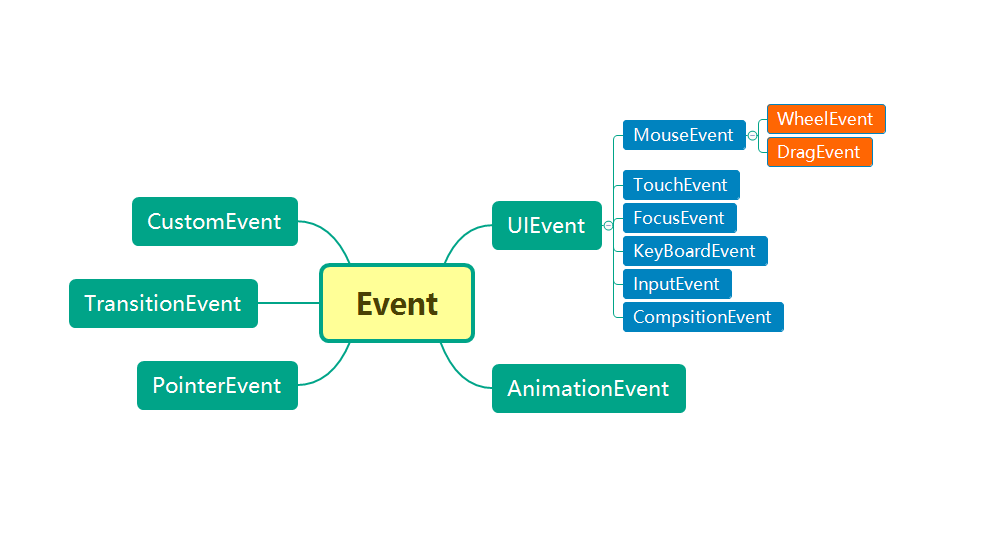

## 事件对象的关系

+ 本文所介绍事件对象都直接或间接继承了 [Event](/base/javascript/dom/event) 对象，并在其之上扩展了部分属性和方法
+ 事件对象关系图：



::: tip 说明：
+ 每个类型的事件都有自身的构造函数，而且创建该类型的事件时，可以传递一些参数，大部分这些参数都能在事件触发时的事件对象获取(因为在实际开发中很少使用构造函数，所以重点还是了解各个类型原生事件对象的属性)
+ DOM 操作中最常见的就是 UI 事件，而 UI 事件鼠标和键盘事件就更为常见(或移动端的触摸事件)
:::


## [UIEvent](https://developer.mozilla.org/zh-CN/docs/Web/API/UIEvent)

**介绍：**

+ 表示简单的用户界面事件
+ 主要为一些 UI 事件提供公共的属性和方法：
  + `MouseEvent`
    + `WheelEvent`
    + `DragEvent`
    + `PointerEvent`
  + `TouchEvent`
  + `FocusEvent`
  + `KeyBoardEvent`
  + `CompositionEvent`

**构造函数：**

```js
const ev = new UIEvent(type: String, init?: Object)
```

+ `type`: 事件的名字
+ `init`: 事件初始化的设置对象，有以下字段：
  + `detail=null: All`: 一个与事件相关的值
  + `view=null: WindowProxy`: 关联 `window` 与 `event`
  + `sourceCapabilities: InputDeviceCapabilities`: 提供物理设备的触摸信息

**属性：**

|属性|类型|描述|
|-|-|-|
|`detail`|`readonly Number`|提供当前鼠标点击数(和环境有关)|
|`layerX`|`readonly Number`|事件(鼠标点击位置)相对于当前层的水平坐标|
|`layerY`|`readonly Number`|事件(鼠标点击位置)相对于当前层的垂直坐标|
|`pageX`|`readonly Number`|事件(鼠标点击位置)相对于整个文档的水平坐标|
|`pageY`|`readonly Number`|事件(鼠标点击位置)相对于整个文档的垂直坐标|
|`which`|`readonly Number`|按下的键盘键或鼠标按键的 `keyCode`|
|`view`|`readonly WindowProxy`|返回产生该事件的视图(一般为 `window`)|

::: tip 说明：
+ `layerX`/`layerY` 返回的值是相对于定位属性不是 `static` 的父元素的，否则其效果相当于 `pageX`/`pageY`
:::

## [MouseEvent](https://developer.mozilla.org/zh-CN/docs/Web/API/MouseEvent)

**介绍：**

+ 继承 `UIEvent` 的属性和方法
+ 描述用户与指针设备(如鼠标)交互时发生的事件

**构造函数：**

```js
const ev = new MouseEvent(type: String, init?: Object)
```

+ `type`: 事件的名字
+ `init`: 事件初始化的设置对象，有以下字段：
  + `screenX=0: Number`: 设置鼠标事件发生时相对于用户屏幕的水平坐标位置
  + `screenY=0: Number`: 设置鼠标事件发生时相对于用户屏幕的垂直坐标位置
  + `clientX=0: Number`: 设置鼠标事件发生时相对于客户端窗口的水平坐标位置
  + `clientY=0: Number`: 设置鼠标事件发生时相对于客户端窗口的垂直坐标位置
  + `ctrlKey=false: Boolean`: 表明是否同时按下 `ctrl` 键
  + `shiftKey=false: Boolean`: 表明是否同时按下 `shift` 键
  + `altKey=false: Boolean`: 表明是否同时按下 `alt` 键
  + `metaKey=false: Boolean`: 表明是否同时按下 `meta` 键
  + `button=0: Number`: 描述事件发生时被按下或释放的按键
    + 0: 鼠标左键
    + 1: 鼠标中键
    + 2: 鼠标右键
  + `buttons=0: Number`: 描述事件发生时哪些按键被按下
  + `relatedTarget=null: EventTarget`: 若事件为 `mouseenter`/`mouseover`，则表示刚离开的元素；若事件为 `mouseout`/`mouseleave`，则表示刚进入的元素
  + `region=null: String`: 知名点击事件影响的 DOM 的 `id`

::: tip 说明：
+ 设置的 `screenX`/`screenY`/`clientX`/`clientY` 都不会影响真实触发事件的鼠标的位置
:::

**属性：**

|属性|类型|描述|
|-|-|-|
|`altKey`|`readonly Boolean`|指示事件触发时 `alt` 键是否按下|
|`ctrlKey`|`readonly Boolean`|指示事件触发时 `ctrl` 键是否按下|
|`metaKey`|`readonly Boolean`|指示事件触发时 `meta` 键是否按下|
|`shiftKey`|`readonly Boolean`|指示事件触发时 `shift` 键是否按下|
|`clientX`|`readonly Number`|鼠标指针相对于文档左上角的 X 坐标|
|`clientY`|`readonly Number`|鼠标指针相对于文档左上角的 Y 坐标|
|`offsetX`|`readonly Number`|鼠标指针相对于目标节点左上角的 X 坐标|
|`offsetY`|`readonly Number`|鼠标指针相对于目标节点左上角的 Y 坐标|
|`screenX`|`readonly Number`|鼠标指针相对于屏幕的 X 坐标|
|`screenY`|`readonly Number`|鼠标指针相对于屏幕的 X 坐标|
|`movementX`|`readonly Number`|鼠标指针相对于最后 `mousemove` 事件位置的 X 坐标|
|`movementY`|`readonly Number`|鼠标指针相对于最后 `mousemove` 事件位置的 Y 坐标|
|`button`|`readonly Number`|触发事件的鼠标按键|
|`buttons`|`readonly Number`|事件触发时被按下的一些鼠标按键|
|`region`|`readonly String | Null`|被点击事件影响的点击区域的 id|
|`relatedTarget`|`readonly EventTarget | Null`|鼠标事件的次要目标|


::: tip 说明：
+ 区分鼠标的位置：
  + `pageX`/`pageY` 相对于文档的左上角，受页面滚动影响
  + `clientX`/`clientY` 相对于文档的左上角，不受页面滚动的影响
  + `screenX`/`screenY` 相对于屏幕的左上角，不受页面滚动影响
  + `offsetX`/`offsetY` 相对于点击元素的左上角，受元素滚动影响
:::


## [WheelEvent](https://developer.mozilla.org/zh-CN/docs/Web/API/WheelEvent)

**介绍：**

+ 继承 `MouseEvent` 的属性和方法
+ 用户滚动鼠标滚轮时触发

**构造函数：**

```js
const ev = new WheelEvent(type: String, init?: Object)
```

+ `type`: 事件的名字
+ `init`: 事件初始化的设置对象，有以下字段：
  + `deltaX=0.0: Number`: 滚轮的 x 轴方向上的滚动量
  + `deltaY=0.0: Number`: 滚轮的 y 轴方向上的滚动量
  + `delta=0.0: Number`: 滚轮的 z 轴方向上的滚动量
  + `deltaMode=0: Number`: 表示滚动量的单位:
    + DOM_DELTA_PIXEL(0x00): 像素
    + DOM_DELTA_LINE(0x01): 行
    + DOM_DELTA_PAGE(0x02): 页

**属性：**

|属性|类型|描述|
|-|-|-|
|`deltaX`|`readonly Number`|滚轮的 x 轴方向上的滚动量|
|`deltaY`|`readonly Number`|滚轮的 y 轴方向上的滚动量|
|`deltaZ`|`readonly Number`|滚轮的 Z 轴方向上的滚动量|
|`deltaMode`|`readonly Number`|表示滚动量的单位|

## [DragEvent](https://developer.mozilla.org/zh-CN/docs/Web/API/DragEvent)

**介绍：**

+ 继承 `MouseEvent` 的属性和方法
+ 表示拖、放交互的一类事件
+ 包含以下事件：
  + `drag`
  + `dragstart`
  + `dragenter`
  + `dragleave`
  + `dragover`
  + `dragexit`
  + `dragend`
  + `drop`
+ 其他相关接口对象
  + `DataTransfer`

**构造函数：**

```js
const ev = new DragEvent(type: String, init?: Object)
```

+ `type`: 事件的名字
+ `init`: 事件初始化的设置对象，有以下字段：
  + `dataTransfer=null: DataTransfer`

**属性：**

|属性|类型|描述|
|-|-|-|
|`dataTransfer`|`DataTransfer`|拖放事件中传输的数据对象|


## [PointerEvent](https://developer.mozilla.org/zh-CN/docs/Web/API/PointerEvent)

**介绍：**

+ 继承 `MouseEvent` 的属性和方法
+ 一些列由指针引发的 DOM 事件，记录接触点的位置，引发事件的设备类型，接触表面受到的压力等
+ 指针是输入设备的硬件层抽象(如鼠标，触摸笔，或触摸屏上的触摸点)
+ 包括以下事件
  + `pointerover`
  + `pointerenter`
  + `pointerdown`
  + `pointermove`
  + `pointerup`
  + `pointercancel`
  + `pointerout`
  + `pointerleave`
  + `gotpointercapture`
  + `lostpointercapture`

**构造函数：**

```js
const ev = new PointerEvent(type: String, init?: Object)
```

+ `type`: 事件的名字
+ `init`: 事件初始化的设置对象，有以下字段：
  + `pointerId=0: Number`
  + `width=1: Number`
  + `height=1: Number`
  + `pressure=0: Number`
  + `tangentialPressure=0: Number`
  + `tiltX=0: Number`
  + `tiltY=0: Number`
  + `twist=0: Number`
  + `pointerType='': String`
  + `isPrimary=false: Boolean`


**属性：**

|属性|类型|描述|
|-|-|-|
|`pointerId`|`readonly Number`|标识事件的 id 标识符|
|`width`|`readonly Number`|接触面 X 轴的 CSS 像素密度|
|`height`|`readonly Number`|接触面 Y 轴的 CSS 像素密度|
|`pressure`|`readonly Number`|压力值，取值 [0, 1]|
|`tangentialPressure`|`readonly Number`|压力值，取值 [-1, 1|
|`tiltX`|`readonly Number`|指针的 Y-Z 平面和屏幕之间的夹角，取值 [-90, 90]|
|`tiltY`|`readonly Number`|指针的 X-Z 平面和屏幕之间的夹角，取值 [-90, 90]|
|`twist`|`readonly Number`|输入设备围绕自身主轴顺时针旋转的角度，取值 [0, 359]|
|`pointerTyp`|`readonly String`|触发事件的设备类型(`mouse`, `pen`, `touch`)|
|`isPrimary`|`readonly Boolean`|指示该指针是否是当前设备的主指针|


## [TouchEvent](https://developer.mozilla.org/zh-CN/docs/Web/API/TouchEvent)

**介绍：**

+ 继承 `UIEvent` 的属性和方法
+ 一类描述手指在触摸平面(触摸屏、触摸板等)的状态变化的事件，用于描述一个或多个触点，使开发者可以检测触点的移动、增加和减少等
+ 每个 `Touch` 对象代表一个触点，每个触点都由其位置、大小、形状、压力大小、和目标 element 描述组成，`TouchList` 对象代表多个触点的一个列表
+ 包含以下事件: 
  + `touchstart`
  + `touchmove`
  + `touchend`
  + `touchcancel`
+ 其他相关接口对象: 
  + `Touch`
  + `TouchList`

**构造函数：**

```js
const ev = new TouchEvent(type: String, init?: Object)
```

+ `type`: 事件的名字
+ `init`: 事件初始化的设置对象，有以下字段：
  + `touches=[]: TouchList`: 当前接触触摸平面的所有触点的 `Touch` 对象列表
  + `targetTouches=[]: TouchList`: 从上一次触摸事件到此次事件过程中，状态发生了改变的所有触点的 `Touch` 对象列表
  + `changedTouches=[]: TouchList`: 触摸起始于当前事件的目标 `element` 上，并且仍然没有离开触摸平面的所有触点的 `Touch` 对象列表
  + `ctrlKey=false: Boolean`: 表明是否同时按下 `ctrl` 键
  + `shiftKey=false: Boolean`: 表明是否同时按下 `shift` 键
  + `altKey=false: Boolean`: 表明是否同时按下 `alt` 键
  + `metaKey=false: Boolean`: 表明是否同时按下 `meta` 键

**属性：**

|属性|类型|描述|
|-|-|-|
|`touches`|`readonly TouchList`|当前接触触摸平面的所有触点的 `Touch` 对象列表|
|`targetTouches`|`readonly TouchList`|从上一次触摸事件到此次事件过程中，状态发生了改变的所有触点的 `Touch` 对象列表|
|`changedTouches`|`readonly TouchList`|触摸起始于当前事件的目标 `element` 上，并且仍然没有离开触摸平面的所有触点的 `Touch` 对象列表|
|`ctrlKey`|`readonly Boolean`|指示是否同时按下 `ctrl` 键|
|`shiftKey`|`readonly Boolean`|指示是否同时按下 `shift` 键|
|`altKey`|`readonly Boolean`|指示是否同时按下 `alt` 键|
|`metaKey`|`readonly Boolean`|指示是否同时按下 `meta` 键|

## [FocusEvent](https://developer.mozilla.org/zh-CN/docs/Web/API/FocusEvent)

**介绍：**

+ 继承 `UIEvent` 的属性和方法
+ 表示和焦点相关的事件
+ 包含以下事件：
  + `focus`
  + `focusin`
  + `focusout`
  + `blur`

**构造函数：**

```js
const ev = new FocusEvent(type: String, init?: Object)
```

+ `type`: 事件的名字
+ `init`: 事件初始化的设置对象，有以下字段：
  + `relatedTarget=null: EventTarget`: 事件的次要目标

**属性：**

|属性|类型|描述|
|-|-|-|
|`relatedTarget`|`readonly EventTarget | Null`|鼠标事件的次要目标|

## [KeyBoardEvent](https://developer.mozilla.org/zh-CN/docs/Web/API/KeyBoardEvent)

**介绍：**

+ 继承 `UIEvent` 的属性和方法
+ 描述了键盘的交互方式，每个事件都描述了一个按键
+ 包含以下事件：
  + `keydown`
  + `keyup`
  + `keypress`

**构造函数：**

```js
const ev = new KeyBoardEvent(type: String, init?: Object)
```

+ `type`: 事件的名字
+ `init`: 事件初始化的设置对象，有以下字段：
  + `key='': String`: 键盘按键的键值
  + `code='': String`: 包含键类型的按键字符串
  + `location=0: Number`: 按键在键盘或其他设备上的位置
  + `ctrlKey=false: Boolean`: 表明是否同时按下 `ctrl` 键
  + `shiftKey=false: Boolean`: 表明是否同时按下 `shift` 键
  + `altKey=false: Boolean`: 表明是否同时按下 `alt` 键
  + `metaKey=false: Boolean`: 表明是否同时按下 `meta` 键
  + `repeat=false: Boolean`: 指示按键是否一直被按住
  + `isComposing=false: Boolean`: 指示该事件是否在 `compositionstart` 后或 `compositionend` 前被触发

**属性：**

|属性|类型|描述|
|-|-|-|
|`ctrlKey`|`readonly Boolean`|表明是否同时按下 `ctrl` 键|
|`shiftKey`|`readonly Boolean`|表明是否同时按下 `shift` 键|
|`altKey`|`readonly Boolean`|表明是否同时按下 `alt` 键|
|`metaKey`|`readonly Boolean`|表明是否同时按下 `meta` 键|
|`key`|`readonly String`|键盘按键的键值|
|`code`|`readonly String`|包含键类型的按键字符串|
|`location`|`readonly Number`|按键在键盘或其他设备上的位置|
|`repeat`|`readonly Boolean`|指示按键是否一直被按住|
|`isComposing`|`readonly Boolean`|指示该事件是否在 `compositionstart` 后或 `compositionend` 前被触发|

::: tip 说明：
+ `key` 返回的是按键的小写字符，`code` 返回的是指示按键的字符串(如 Q 返回 `KeyQ`，1 返回 `Digit1`)
:::


**方法：**

+ `getModifierState(): Boolean`: 指示在创建事件时，修饰键(`alt`, `shift`, `meta`, `ctrl`)是否被按下


## [InputEvent](https://developer.mozilla.org/zh-CN/docs/Web/API/InputEvent)

**介绍：**

+ 继承 `UIEvent` 的属性和方法
+ 用来构造和字符输入相关的事件对象

**构造函数：**

```js
const ev = new InputEvent(type: String, init?: Object)
```

+ `type`: 事件的名字
+ `init`: 事件初始化的设置对象，有以下字段：
  + `inputType: String`: 指定可编辑内容的更改类型(如插入、删除、格式化)
  + `data: String`: 当前输入的字符串
  + `dataTransfer: DataTransfer`: 包含有关要添加到可编辑内容中或从中删除的富文本或明文数据的信息
  + `isComposing`: 指示该事件是否在 `compositionstart` 后或 `compositionend` 前被触发
  + `ranges`: 如果未取消输入事件，则静态范围的数组将受到 DOM 更改的影响

**属性：**

|属性|类型|描述|
|-|-|-|
|`data`|`readonly String`|当前输入的字符串(删除操作时返回空字符串)|
|`isComposing`|`readonly Boolean`|指示该事件是否在 `compositionstart` 后或 `compositionend` 前被触发|


## [CompositionEvent](https://developer.mozilla.org/zh-CN/docs/Web/API/CompositionEvent)

**介绍：**

+ 继承 `UIEvent` 的属性和方法
+ 用于处理用户间接输入文字的事件

**构造函数：**

```js
const ev = new CompositionEvent(type: String, init?: Object)
```

+ `type`: 事件的名字
+ `init`: 事件初始化的设置对象，有以下字段：
  + `data: String`: 将被初始化为 IME 合成生成的字符

**属性：**

|属性|类型|描述|
|-|-|-|
|`data`|`readonly String`|引发事件的输入方法生成的字符|


## [AnimationEvent](https://developer.mozilla.org/zh-CN/docs/Web/API/AnimationEvent)

**介绍：**

+ 继承 `Event` 的属性和方法
+ 提供了与 `animation` 相关的事件


**构造函数：**

```js
const ev = new AnimationEvent(type: String, init?: Object)
```

+ `type`: 事件的名字
+ `init`: 事件初始化的设置对象，有以下字段：
  + `animationName='': String`
  + `elapsedTime: Number`
  + `pseudoElement: String`

**属性：**

|属性|类型|描述|
|-|-|-|
|`animationName`|`readonly String`|动画的名字(对应 CSS 的动画名称)|
|`elapsedTime`|`readonly Number`|动画已运行的时间|
|`pseudoElement`|`readonly String`|运行动画的伪元素(不是伪元素则返回空串)|


## [TransitionEvent](https://developer.mozilla.org/zh-CN/docs/Web/API/TransitionEvent)

**介绍：**

+ 继承 `Event` 的属性和方法
+ 提供了与 `transition` 相关的事件


**构造函数：**

```js
const ev = new TransitionEvent(type: String, init?: Object)
```

+ `type`: 事件的名字
+ `init`: 事件初始化的设置对象，有以下字段：
  + `propertyName='': String`
  + `elapsedTime: Number`
  + `pseudoElement: String`

**属性：**

|属性|类型|描述|
|-|-|-|
|`propertyName`|`readonly String`|参与过渡的属性名(对应 CSS 的属性名)|
|`elapsedTime`|`readonly Number`|动画已运行的时间|
|`pseudoElement`|`readonly String`|运行动画的伪元素(不是伪元素则返回空串)|


## [CustomEvent](https://developer.mozilla.org/zh-CN/docs/Web/API/CustomEvent)

**介绍：**

+ 继承自 [Event](/base/javascript/dom/event)
+ 用于创建任意自定义功能的事件

**构造函数：**

```js
const ev = new CustomEvent(type: String, init?: Object)
```

+ `type`: 事件的名字
+ `init`: 事件初始化的设置对象，有以下字段：
  + `detail=null: All`: 一个与事件相关的值
  + `bubbles: Boolean`: 表示事件是否能冒泡
  + `cancelable: Boolean`: 表示事件是否可以取消