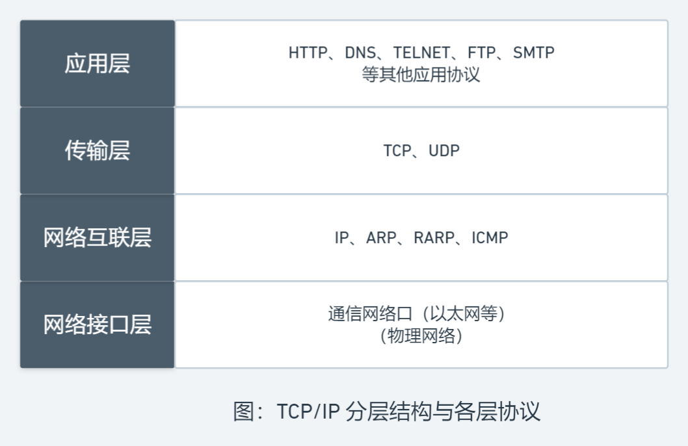
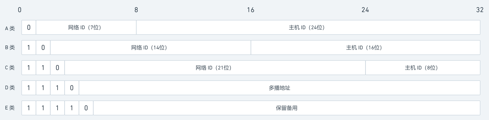
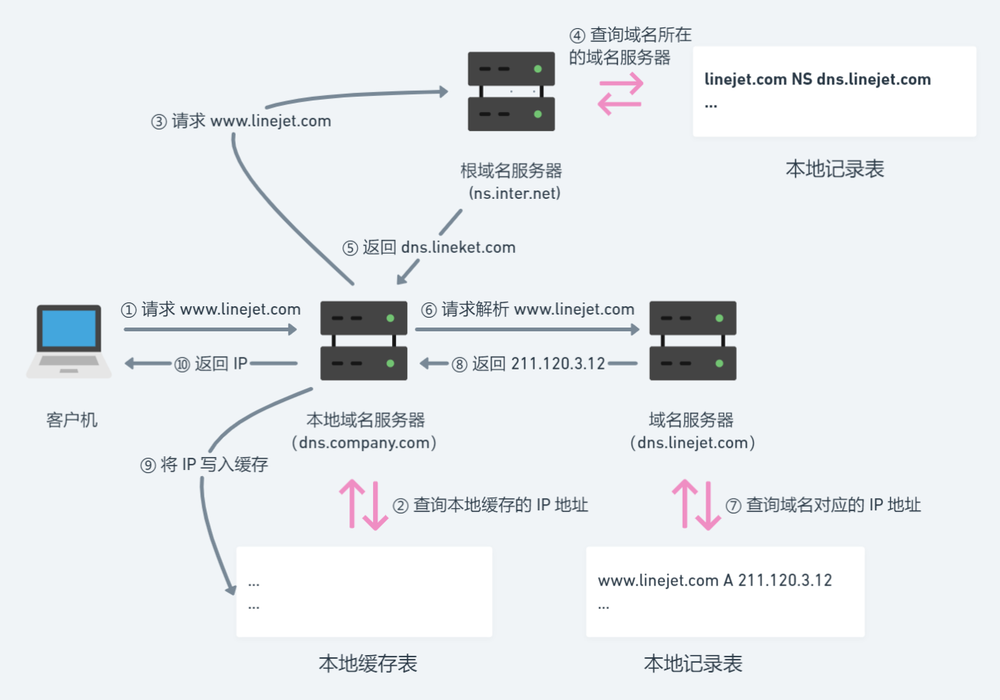

## TCP/IP 协议簇

`TCP/IP`(Transition Control Protocol/Internet Protocol, 传输控制协议/网络互联协议)是一组用于实现网络互联的通信协议，是 Internet 最基本的协议和互联网络的基础。


### 分层结构图




### 每层协议的作用

+ **应用层**: 应用级别的最高层协议
  + **HTTP**: 超本文传输协议，提供超文本传输功能
  + **DNS**: 域名服务协议，提供域名和 IP 地址的转换，允许对域名资源进行分布式管理
  + **TELNET**: 远程登录协议，能利用 TCP 连接登录远程主机
  + **FTP**: 文件传输协议，为用户提供本地机与远程机之间的文件传输服务
  + **SMTP**: 简单邮件传输协议，规定两个相互通信的 SMTP 进程之间交换邮件信息的规则
+ **传输层**: 负责在源主机和目标主机之间提供端到端的数据传输服务
  + **TCP**: 面向连接的传输控制协议，提供用户之间的面向连接的可靠文件传输服务
  + **UDP**: 无连接的用户数据包协议，提供用户之间的无连接的不可靠报文传输服务
+ **网络互联层**: 提供互联网络环境下端到端的数据分组传输服务，采用无连接交换方式来实现
  + **IP**: 提供数据包按 IP 地址传输，路由选择等功能
  + **ARP**: 提供 IP 地址到物理地址的映射功能
  + **RARP**: 提供物理地址到 IP 地址的映射功能
  + **ICMP**: 提供传输差错控制信息以及主机和路由器之间的控制信息
+ **网络接口层**: 负责将 IP 分组封装成适合在物理网络上传输的帧并发送出去，或将从物理网络接收的帧解封并将 IP 分组递交给高层协议


## TCP

### TCP 协议的特点

+ 面向流的投递服务
+ 面向连接的投递服务
+ 可靠传输服务
+ 提供强制性传输和缓传输两种手段
+ 全双工传输
+ 流量控制

### TCP 协议怎样保证可靠传输

+ **序列号**：TCP 给发送的每一个包进行编号，接收方对数据包进行排序，把有序数据传送给应用层
+ **校验和**：TCP 将保持它首部和数据的检验和(端到端的检验和，用于检测数据在传输过程中的变化)，若收到段的检验和有差错，将丢弃该报文段并不会确认收到此报文段
+ **确认应答**：传输的过程中，每次接收方收到数据后，都会对传输方进行确认应答
+ **连接管理**：三次握手、四次挥手
+ **流量控制**：TCP 连接的双方都有固定大小的缓冲空间，当接收方来不及处理发送方的数据，能提示发送方降低发送的速率，防止包丢失
+ **拥塞控制**：当网络拥塞时，减少数据的发送
+ **超时重传**：发出一个段后，启动定时器等待目的端确认收到该报文段，若不能及时收到确认将重发该报文段
+ **停止等待**: 每发完一个分组就停止发送，等待对方确认，在收到确认后再发下一个分组

### 三次握手 & 四次挥手 & 优缺点 & 为什么要使用这些机制

**三次握手：**


1. 客户端发送报文给服务器，请求建立连接
2. 服务器响应报文，回应服务器可以建立连接，并处于等待连接状态
3. 客户端再次发送报文给服务端，完成建立连接

**四次握手：**


**优缺点：**

+ 优点：保证了传输数据过程的稳定性(通过三次握手建立了连接)
+ 缺点：
  + 三次握手消耗时间
  + 服务器保持连接会消耗资源
  + 服务器不能主动给客户端发送信息(一般采取轮询来让客户端定时向服务端发送请求)


## IP

### IP 的功能

+ **寻址**：网络上的主机都用 IP 地址来标识，每个 IP 数据包中都携带分别标识源主机和目标主机的 IP 地址
+ **数据报的路由转发**：网络上的每个中间节点(路由器)都根据 IP 数据包中接收方的目标 IP 地址来确定是本网传送还是跨网传送
+ **数据报分段和重组**：由于 IP 数据报可能会在不同的通信网络中传输，而且不同网络的数据链路层可传输的数据帧的最大长度不同，因此 IP 会根据不同的情况(数据报中的分段和重组标识)来对数据报进行分段组装后再交给上层协议

### IP 提供的服务

+ **不可靠的投递服务**：IP 的任务是通过互联网传送数据报，所以其不关心在传输过程中数据包的丢失、重复传输、延迟、乱序等问题，也不将结果告知收发双方
+ **无连接的投递服务**：因为每个 IP 数据报都是独立处理和传输的，同一台主机发出的数据报在网络中可能会经过不同的路径，到达接收方时可能会乱序甚至丢失
+ **尽力的投递服务**：只要有希望就会向前投递，不会轻易丢失数据报

### IP 地址简介

+ 当前使用的 IP 地址版本为 IPv4，用 32 位二进制数组成，同时按照每 8 位为一段将其转化为十进制的形式(如 `202.119.2.199`)来简化记忆
+ IP 地址 = 网络 ID + 主机 ID
  + 网络 ID：具有唯一性，用来识别入网主机所在的网络
  + 主机 ID：在同一网络中唯一，用来区分该网络中的不同主机
+ IP 地址使寻址更方便，会先按网络 ID 找到网络，再按主机 ID 找到主机

### IP 地址分类

IP 地址分为 A、B、C、D、E 五类，可分配使用的为前三类，D 类为多播地址，E 类保留用作特殊用途。其中，从 IP 地址的前几位很容易看出所属的类别：




**区别：**

|分类|前缀|网络个数|每个网络可容纳主机|
|-|-|-|-|
|A|0|126|16777214(2^24-2)|
|B|10|16382|65534(2^16-2)|
|C|110|209 万|254(2^8-2)|
|D|1110|||
|E|11110|||

::: tip 说明：
+ A 类地址一般分配给具有大量主机的网络使用
+ B 类地址一般分配给规模中等的网络使用
+ C 类地址一般分配给小型局域网使用
:::

### 特殊的 IP 地址

+ **本机地址**：(0.0.0.0)，32位全为 0 的 IP 地址，在本网通信时可用该 IP 地址表示本机地址
+ **有限广播地址**：(255.255.255.255)，32 位全为 1 的 IP 地址，代表本网段内的所有主机，用于在本网络内部广播
+ **直接广播地址**：(x.x.x.255)，主机 ID 为 1 的 IP 地址，一个主机可以使用该地址把数据分组广播给某个网络中的所有节点
+ **网络地址**：(x.x.x.0)，主机 ID 全为 0 的 IP 地址，不分配给任何主机，用于表示某个网络的网络地址
+ **回送地址**：(127.x.x.x)，以数字 127 开头的 IP 地址，是一个保留地址，常用形式为 `127.0.0.1`


## HTTP

### HTTP 历史

&emsp;&emsp;`HTTP`(Hyper Text Transfer Protocol，超文本传输协议)，用于传输 `HTML`(Hyper Text Markup Language，超文本标记语言)文档的一种协议。并且是基于 `TCP` 协议实现的。

+ 1990 年，由 Tim Berners-Lee 提出
+ 1990 年，提出 HTTP/0.9，但没有作为正式的标准
+ 1996 年，推出 HTTP/1.0
+ 1997 年，推出 HTTP/1.1 (当前使用广泛的版本)
+ 2015 年，推出 HTTP/2.0

### 常见 HTTP 状态码

**状态码分类：**

状态码|分类|说明
-|-|-
1xx|信息类|请求已接收，正在处理
2xx|响应成功类|请求已接收、处理且响应成功
3xx|页面重定向类|需要其他操作才能完成请求
4xx|客户端错误类|客户端请求出现错误或不符合服务器预期，导致服务端无法处理请求
5xx|服务端错误类|服务端处理请求时出错

**常见状态码：**

查看[全部状态码](/appendix/http-referrence/status-code)

状态码|标识|含义
-|-|-
200|OK|服务器成功处理并响应客户端的请求。
204|No Content|请求已经成功处理，但是响应主体不返回内容
206|Partial Content|服务端成功处理并返回客户端指定某资源的某部分
301|Moved Permanently|请求的资源被永久移动到指定的 URL 上
302|Found|请求的资源暂时移动到指定的 URL 上
304|Not Modified|请求访问的资源未被修改，可以使用缓存的内容
307|Temporary Redirect|请求的资源暂时被移动到指定的 URL 上
400|Bad Request|客户端请求有语法错误(或请求参数错误)，不能被服务器所理解
401|Unauthorized|请求未经授权
403|Forbidden|服务器有能力处理该请求，但是拒绝授权访问
404|Not Found|服务器无法找到所请求的资源
500|Internal Server Error|服务器遇到不知道如何处理的情况
502|Bad Gateway|网关(或代理服务器)向上游服务器发起请求时得到无效的响应
503|Service Unavailable|服务端暂时处于超负载或正在进行停机维护，无法处理请求
504|Gateway Timeout|网关/代理服务器请求上游服务器/辅助服务器时未能收到响应


### HTTP 请求报文和响应报文的组成


### HTTP 常见请求头的含义

参考 [常见头部字段](/appendix/http-referrence/head-fields)

### HTTP 的状态 & 优缺点

`HTTP` 是无状态的，它对发送过的请求和响应都不做持久化处理：

+ 优点：减轻服务器负担
+ 缺点：不能保存客户端的状态(验证登录等情况时)，但 `HTTP/1.1` 引入了 `Cookie` 技术来缓存状态


### HTTP 请求方式和区别

+ **GET**：用于获取资源。一般来说只用于数据的读取，而不用于会产生副作用的非幂等的操作中
+ **HEAD**：用于获取响应头部。常用于查看服务器的性能
+ **POST**：用于向指定资源提交数据，请求服务器进行处理。如表单数据提交、文件上传等，请求数据会被包含在请求体中；是非幂等的方法，因为这个请求可能会创建新的资源或修改现有资源
+ **DELETE**：用于删除指定内容。
+ **PUT**：用于更新现有资源。
+ **PATCH**：用于资源的部分更新。当资源不存在时创建一个新的资源
+ **OPTIONS**：用于查看服务器的性能。
+ **TRACE**：回显服务器收到的请求。主要用于测试或诊断
+ **CONNECT**：HTTP1.1预留给能够将连接改为管道方式的代理服务器。通常用于 SSL 加密服务器的链接与非加密的 HTTP代理服务器的通信

::: tip 说明：
+ GET, POST, HEAD 都是 HTTP 1.0 的产物
+ JavaScript 使用 XMLHttpRequest 对象进行 CORS 跨域资源共享时，就是使用 OPTIONS 方法发送嗅探请求，以判断是否有对指定资源的访问权限
:::


### GET 和 POST 的区别

+ GET 一般用于请求数据, POST 一般用于发送数据
+ GET 安全性底, POST 安全性较高
+ GET 传递参数大小有限制, POST 将请求参数放进请求体中, 大小没有限制
+ GET 一般会走缓存, POST 不走缓存

### HTTP 请求优化

+ 减少请求/连接
  + 减少请求：优化数据请求，合并请求等
  + 减少连接：保持一定的连接时间，而不是经历多次的 "三次握手"
+ 缓存数据
  + 客户端缓存在 localeStorage 中
  + 服务端缓存静态资源在 CDN 服务器上
+ 减少传输数据量：对文件进行压缩
+ 优化网络链路
  + 减少域名：减少三级或更高级域名的使用，减少域名解析的时间
  + 使用 CDN


### HTTP 的缺点

+ 通信使用明文：HTTP 协议本身不具有加密功能，无法对通信整体进行加密，所以采用明文方式发送
+ 不验证通信方身份：HTTP 协议不具有判断对方身份的机制，容易造成很多安全问题：
  + 客户端无法确认请求发送的服务器是否是目标服务器，有可能是已伪装的 Web 服务器
  + 服务端无法确认接收响应的客户端是否是目标客户端，有可能是已伪装的 Web 客户端
  + 即使是无意义的请求，服务器也会收到，例如 DDOS(Distributed denial of service，拒绝服务)攻击
+ 无法证明报文的完整性：如果中间方篡改了信息，通信双方都没有方法来确认信息的准确性，容易遭受中间人攻击。但可以通过其他方法，如 `数字签名` ，来保证信息的准确性。


### HTTPS 加密原理

+ `HTTP` 的安全版本，通过 `SSL` 加密

::: tip 术语和技术：
**对称加密 & 非对称加密:**
+ 对称加密：`AES`、`DES` 等，加密解密使用同一个密钥
+ 非对称加密：`RSA` 等，有一对密钥(公钥，私钥)，两个密钥都可以加解密，但用其中一个密钥加密就只有用另一个密钥才能解密

**摘要 & 签名:**
+ 消息摘要：使用哈希函数(MD5, SHA 等)将数据生成唯一的定长的字符串，当数据改变时，使用同一哈希函数生成的摘要信息会不一样，从而验证数据的完整性
+ 签名：为了防止消息摘要在中途被篡改，使用加密算法对消息摘要进行加密，只有拥有密钥才能解密

**SSL 数字证书:**
+ 由 CA(认证中心)机构签发：CA 收到制作证书的请求后，会用非对称加密算法生成公钥和私钥，其中公钥保存在生成的 SSL 证书中，并用 CA 自身的私钥进行签名后，把 SSL 证书和对应的私钥返回给申请者
+ SSL 证书的作用：
  + 身份认证，客户端可以认证服务端的身份
  + 加密传递数据：利用 SSL 证书中的公钥加密数据(该数据应该是随机数生成的对称算法密钥)

**使用两种加密算法的原因:**
+ 单独使用非对称加密算法：这样相当于不加密(因为服务端在之前把公钥返回给浏览器，任何人都可能知道公钥)
+ 单独使用对称加密算法：服务端还要跟浏览器约定唯一密钥，保存密钥等工作
+ 同时使用两者：非对称加密算法用于确保对称加密算法的密钥不被窃取，对称加密算法则用于加密数据；这样服务端就不用保留对称加密的密钥，而是通过公钥解密即可
:::

### HTTPS 通信流程

1. 浏览器将自己支持的加密算法发给服务端
2. 服务端选择其中一组加密算法，将自己的 SSL 证书和公钥返回给浏览器
3. 浏览器验证该证书的合法性
4. 若证书合法(或用户接受了不受信任的证书)，浏览器会生成一串随机数密码，并用公钥进行加密后，发送至服务端
5. 服务端接收浏览器的数据后：
    + 用私钥解密出该随机数密码
    + 用该随机数密码解密握手信息
    + 用该随机数密码加密一段握手信息，发送至浏览器
6. 之后的通信都使用该随机数密码作密钥进行加解密

::: tip 说明：
+ 使用了两种加密算法：对称加密、非对称加密
+ 握手信息和数据是用对称加密的，密钥为浏览器生成的随机数密码
+ 该随机数密码是用非对称加密的，公钥一开始和 SSL 证书一并发送给浏览器，服务端保存私钥
:::


### 开启 HTTPS


### 劫持 HTTPS 请求

**中间人攻击**：通过伪造证书，中间人截取客户端发送给服务器的请求，伪装成客户端与服务器进行通信，并将信息转发给客户端，伪装成服务器与客户端进行通信。此时中间人可以获取客户端与服务端的所有通信内容。

**预防**：证书校验。针对安全性比较高的应用，可以采用客户端预埋证书的方式锁死证书，只有当客户端证书与服务端证书完全一致的情况下才允许通信，而且证书过期必须强制更新。


### HTTP 1.0/1.1/2.0 的区别

**HTTP 1.0/1.1**

+ **长连接**：`HTTP 1.0` 需要使用 `keep-alive` 参数来告知服务器建立一个长连接，而 `HTTP 1.1` 默认支持长连接
+ **节约宽带**：`HTTP 1.1` 支持只发送一个 `header` 信息（不带任何 `body` 信息）
+ **`host` 域**：设置虚拟站点，`web server` 上的多个虚拟站点可以共享同一个 `ip` 端口，`HTTP 1.0` 没有 `host` 域

**HTTP 2.0：**

+ **多路复用**：`HTTP 1.1` 为了避免浏览器过度消耗服务器资源，限制了浏览器对同一域名的并发请求数量；而 `HTTP 2.0` 不会
+ **数据压缩**：启用了强制性的压缩算法来压缩报文
+ **支持 `TLS`**：允许使用 `TLS 1.2` 或更新版本的协议进行加密，使通信更加安全
+ **应用层协议协商**
+ **服务端推送**：服务端可以自行判断客户端的请求，选择返回比当前请求更多的数据
+ **流控制**：阻止发送方发送过量的数据，以免超出接收方的处理能力


## WebSocket

### 理解 WebSocket 协议

+ `WebSocket` 在 `HTML5` 中引入，与 `HTTP` 协议一样都是建立在 `TCP` 协议之上的应用层协议，都属于可靠协议
+ `WebSocket` 连接时需要使用 `HTTP` 协议通信
+ `WebSocket` 只需要完成一次握手就能创建持久性连接(`HTTP` 需要三次握手)；它也是有状态的(`HTTP` 是无状态的)，不用再每次发送报文都提供报文信息
+ `WebSocket` 允许双工通信，不仅客户端能向服务端发送消息，而且服务端也能主动向客户端发送消息


### 浏览器使用

**使用全局构造函数：**

```js
const ws = new WebSocket(url, protocols)
```

**参数：**

+ `url: String`: 请求 url 地址
+ `protocols='': Array`: 单个协议名称或包含多个协议的数组

更多实例属性和方法 [HTML5 WebSocket](/base/html/html5/websocket)

### 服务端使用

**Node.js 中使用第三方模块 `ws`：**

```js
const WebSocket = require('ws')
const http = require('ws')

// 两种方式创建 WebSocket 实例
// 1.传入一个对象
const wsServer = new WebSocket.Server({ port: 1234 })

// 2.传入一个 http 实例
const httpServer = new https.createServer()
const wsServer = new WebSocket.Server({ server: httpServer })
```


### 在客户端和服务端通信

```js
// 客户端
const ws = new WebSocket('ws://localhost:1234')
console.log('Try to connect WebSocket Server...')

ws.addEventListener('open', () => {
  console.log('Connect Success!')
  ws.send('Client: Hi, WebSocket!')
})

ws.addEventListener('message', event => {
  console.log(event.data)
})

// 服务端
const WebSocket = require('ws')
const wss = new WebSocket.Server({ port: 1234 })

wss.on('connection', ws => {
  console.log('Server connection success!')
  ws.on('message', message => {
    console.log('received: %s', message)
    ws.send(message)
    ws.send('Server: Hello, I\'m WebSocket!')
  })
})
```


## DNS

### 介绍

+ DNS(Domain Name System)是一个分级的、基于域名的命名机制的分布式数据库系统，用于实现域名和 IP 地址之间的转换
+ 域名采用层级结构，从左到右级别逐渐增高，彼此之间使用圆点隔开
```
主机名.N级域名.···.二级域名.顶级域名
```
+ 域名大小写不敏感，成员名最长可达 63 个字符，全名最长不超过 255 个字符
+ 域名必须注册才能在 Internet 上使用
+ IP 地址与域名是一对多的关系，即一个 IP 地址可以对应多个域名，但一个域名只能对应一个 IP 地址


### DNS 解析机制

+ 静态解析：域名解析由静态域名解析表完成，静态域名解析表是 win 系统下的 hosts 文件，该文件上有许多主机名到 IP 地址的映射，供主机查询时使用
+ 动态解析：域名解析由域名服务器完成，采用 UDP 协议，端口号为 53

::: tip 说明：
+ 解析域名时，可以先采用静态解析的方法，如果静态解析不成功，再采用动态解析的方法
:::


### DNS 解析过程

**假设：**

+ 根域名服务器是 ns.inter.net
+ 客户机的本地域名服务器是 dns.company.com
+ 客户机访问的网站域名是 www.linejet.com，该网站所属的域名服务器是 dns.linejet.com

**解析过程图：**



**说明：**

1. 客户机向本地域名服务器请求解析网站域名
2. 本地域名服务器收到请求后查询本地缓存，找到记录则跳至步骤 ⑩
3. 本地域名服务器没有相关记录，向根域名服务器请求网站域名的域名服务器
4. 根域名服务器收到请求后查询本地记录，得到域名对应的域名服务器
5. 根域名服务器将结果返回给本地域名服务器
6. 本地域名服务器收到响应后，向域名服务器请求解析网站域名
7. 域名服务器找到记录下的网站域名对应的 IP 地址
8. 域名服务器将结果返回给本地域名服务器
9. 本地域名服务器将返回的结果保存到本地缓存
10. 本地域名服务器将结果返回客户机，解析结束


### DNS 优化原理


## URL

### 认识 URL

**URL 地址：**

```
https://www.zwlike.top:3000/blog/index.html?tag=note&limit=10#/main
```

**分析：**

+ 协议（protocol）：`http`, `https`, `ftp` 等
+ 主机名（hostname）：域名(`www.zwlike.top`)或 `IP` 地址
+ 端口（port）：`3000`，在服务器地址和一个 `:` 标识后的数字(没有则使用默认端口)
+ 请求路径（path）：`/blog/index.html`，指示服务器下的文件相对路径
+ 请求参数（query）：`tag=note&limit=10`，以 `?` 标识开始，且以 `key=value` 形式的单组或多组(用 `&` 分隔)的查询参数
+ 片段标识符（hash）：`#/main`，用 `<a>` 标签作锚点的跳转定位页面位置或 HTML5 的单页应用劫持跳转使请求路径和参数发生的变化

::: tip 说明：
+ `HTTP` 默认端口为 `80`，`HTTPS` 默认端口为 `443`
:::


## CDN

### CDN 的作用和原理

**CDN**：内容分发网络。尽可能的避开互联网有可能影响数据传输速度和稳定性的瓶颈和环节，使内容传输的更快更稳定。

**原理**：

+ 广泛采用各种缓存服务器，将这些缓存服务器分布到用户访问相对的地区或者网络中
+ 将用户的访问指向距离最近的缓存服务器，由缓存服务器直接响应用户的请求


## Cookie

&emsp;&emsp;由于 `HTTP` 是无状态的，不能保存客户端的状态(验证登录等情况时)，因此 `HTTP/1.1` 引入了 `Cookie` 技术来缓存状态。

### 分类

+ 持久化 `Cookie`: 保存在硬盘中，由一个过期时间(或被用户手动清理)
+ 非持久化 `Cookie`: 保存在内存中，相当于临时缓存，在浏览器关闭后消失

### 使用

+ 请求报文的 `Cookie` 字段: `Cookie`
+ 响应报文的 `Cookie` 字段: `set-Cookie`，可以使用多个该字段，并且可以使用以下几个附加属性(`键=值` 的形式，多个属性间用 `;` 分隔): 
  + `expires`: 指定数据的有效期，否则默认在浏览器关闭后消失；而且当 `Cookie` 从浏览器发出后就无法直接删除，只能覆盖
  + `path`: 指定 `Cookie` 发送范围的路径，默认为根路径
  + `domain`: 指定 `Cookie` 适用的域名，匹配规则为结尾匹配
  + `secure`: 指定 `Cookie` 只能在 HTTPS 安全连接中使用，默认可在 HTTP/HTTPS 中使用
  + `HttpOnly`: 指定浏览器端的 Javascript 脚本无法获取 `Cookie` 内容(从而无法轻易修改或删除)，常用于防止跨站脚本(XSS)对 `Cookie` 信息的窃取


### 缺陷

+ 大小受限，浏览器限制为 4KB 左右
+ 消耗网络带宽
+ 可以被客户端禁用的
+ 可能会被窃取或篡改
+ 场景受限，有些端不支持 `Cookie`(微信小程序)


### 对比其他存储

存储方式|说明|容量|特点
-|-|-|-
Cookie|服务端设置，分为持久化 Cookie和非持久化 Cookie|4KB 左右|容量小，可被禁用，可能被窃取或篡改，在同源窗口中共享的
Session Storage|浏览器全局对象，非持久化存储|5MB|只能存储简单数据(复杂数据只能 json 化)，页面关闭后清除，不同域之间不共享
Locale Storage|浏览器全局对象，持久化存储|5MB|只能存储简单数据(复杂数据只能 json 化)，不会消失，除非手动清除，在同源窗口中共享的
Indexed DB|浏览器非关系型数据库(NoSQL)|-|直接将数据存储在浏览器端的数据库中


### Cookie 与状态

&emsp;&emsp;在 `Cookie` 的使用场景中，最重要的是授权认证。授权认证的常用方式有两种：基于 `Cookie`、基于 `Token`，他们的实现有所不同，但步骤大致相同。


**授权认证的步骤：**

+ 保存登录状态信息：浏览器发送 `POST` 请求提交登录信息 --> 服务端响应信息、验证通过并返回一个状态值来保存登录状态
+ 提取登陆状态信息：登录完成后 --> 浏览器发送请求，服务端总能获取浏览器的登录状态，从而正确响应页面


**授权认证的方式：**

+ 基于 `Cookie`
  1. 服务端收到浏览器请求后，创建一个 `Session` 会话，保存在服务端的内存或数据库中
  2. 接着生成一个随机的、唯一的 id，用来和会话信息进行映射并写入 `Cookie`，该 `Cookie` 通常带 `HttpOnly` 属性
+ 基于 `Token`
  1. 服务端收到浏览器请求后，对用户信息进行编码(生成一串较长的字符串)
  2. 将该字符串作为 `Token` 字段的属性值，返回给浏览器


**两种认证方式的主要区别：**

+ 基于 `Cookie`：有状态。获取状态时，服务端要获取请求头部的 `Cookie` 字段的 `Session` 属性值，再找到之前保存在服务端的会话信息进行校验；这种方式需要客户端和服务端都保存信息
+ 基于 `Token`：无状态。获取状态时，直接利用密钥信息对 `Token` 进行解密和校验；这种方式下服务端不用保存信息，能够减轻服务端的压力，也可用于不支持 `Cookie` 的情况(微信小程序)


**基于 Token 的优点：**

+ **无状态**: 服务端不用保存状态信息，减轻服务端压力
+ **域无关**: `Cookie` 与域有关，`Token` 与域无关
+ **性能好**: 请求头部会自动带上 `Cookie`，占用带宽，而 `Token` 则可以按需添加；另外服务端收到 `Cookie` 后可能要在数据库中查询认证，而 `Token` 则直接解密认证
+ **通用性强**: 很多设备(或小程序等应用)不支持 `Cookie`，而且 `Cookie` 可以被用户禁用，因此 `Token` 通用性更好


**创建 Token 的方式：**

使用最多的是 `JSON Web Token`，简称 `JWT`。该方式生成的 `Token` 分为三个部分(通过 `.` 分割)：

+ `Header`: 头部。由算法和 `Token` 类型组成，属性名使用简写: `{ "alg": "HS256", "typ": "JWT" }`
+ `Payload`: 负载。
+ `Signature`: 签名。


## 理解和区别 Token/Cookie/Session

+ `Cookie`：
  + 浏览器里面能永久存储的一种数据，由服务器生成，发送给浏览器
  + 浏览器把 `Cookie` 以 `k-v` 形式保存到某个目录下的文本文件内，下一次请求同一网站时会把该 `Cookie` 发送给服务器
  + 浏览器加入了一些限制确保 `Cookie` 不会被恶意使用，同时每个域的 `Cookie` 数量是有限的
+ `Session`：
  + 会话，服务器给客户端分配的不同的身份标识，客户端每次向服务器发请求的时候都带上这个身份标识
  + 在基于 `Session` 的身份验证中，服务器将在用户登录后为用户创建一个 `Session`。然后，`Session ID` 会被存储在用户浏览器的 `Cookie` 中。当用户保持登录状态时，`Cookie` 将与每个后续请求一起被发送出去。然后，服务器可以将存储在 `Cookie` 上的 `Session ID` 与存储在内存中或者数据库中的 `Session` 信息进行比较，以验证用户的身份，返回给用户客户端响应信息的时候会附带用户当前的状态
  + 客户端有多种方式保存这个身份标识，浏览器端一般采用 `Cookie` 的方式
  + 服务器使用 `Session` 把用户的信息临时保存在服务器上，用户离开网站后 `Session` 会被销毁，这种用户信息存储方式相对 `Cookie` 来说更安全，但是有一个缺陷：如果 Web 服务器做了负载均衡，那么下一个操作请求到另一台服务器的时候`Session` 会丢失
+ `Token`：
  + 无状态：基于 `Token` 的身份验证是无状态的，不将用户信息存在服务器或 `Session`
  + 安全性：`Token` 是有时效的，一段时间之后用户需要重新验证，也可以手动撤回 `Token`
  + 可扩展性：`Token` 能够创建与其它程序共享权限的程序
  + 多平台跨域：只要用户有一个通过了验证的 `Token`，数据和资源就能够在任何域上被请求到
  + 基于标准：创建 `Token` 的时候，可以设定一些选项


## 服务端 API

&emsp;&emsp;服务端 `API`(Application Programming Interface，应用程序编程接口)，在程序内部指的是各个模块、函数、类的调用参数和返回值，在程序外部指不同程序之间的调用参数和返回结果。在 Web 中指的是前后端通信的接口，一般借助 HTTP(S) 协议来实现。

&emsp;&emsp;当前流行的 Web API 设计规范为 `REST API` 和 `GraphQL`。


### REST API

&emsp;&emsp;简称 `REST`(Representation State Transfer，表现层状态转换)，指的是一种设计风格(不是标准)。

**特点：**

+ 所有通信都是无状态的，状态统一由客户端进行维护，减轻了服务端的压力
+ 可以利用缓存来提升通信效率
+ 可结合一些 HTTP 协议的特点：用 URL 的方式指向不同的资源


**定制团队规范：**

+ **请求路径**
  + 所有请求路径对应特点的资源，不要包含动词、形容词等修饰符，必要时应该使用复数
  + 多个单词组合使用 `songList`, `song_list`, `song-list` 三者之一
  + 合适的资源嵌套层级，使用 id 占位符(`:id`)标识资源
  + 用参数对资源进行过滤而不是使用无规则的 URL，参数之间用 `&` 分开，多个参数值用 `,` 分开
+ **请求头部**: 不同的操作使用对应语义的请求方法
  + `GET`: 获取资源，常用于查询
  + `POST`: 创建资源，或数据提交(用户登录等)
  + `PUT`: 修改资源
  + `DELETE`: 删除资源
+ **请求体**: 一般采用 JSON 格式提交数据(文件上传除外)
+ **响应头部**: 遵循 HTTP(S) 规范的状态码和状态信息描述请求结果
+ **响应体**
  + 一般响应为 JSON 格式
  + 响应结果处理: 包括响应描述和响应分页


**工具：**

+ Swagger


### GraphQL

&emsp;&emsp;简称 `GraphQL`(Graph Query Language，图表化查询语言)，由 `Facebook` 推出。


**特点：**

+ 它使用模式(Schema)来描述一类数据的结构，类似 mongoose 的形式
+ 所有请求都使用 POST 方法，同时将 Schema 作为请求参数放入请求体中


**设计：**

+ **类型**: 返回后端定义的类型
+ **验证**: 后端对于不符合要求的 GraphQL 请求会给出明确的错误提示
+ **内省**: 告诉调用者当前服务器指出哪些查询
+ **查询与变更**: 查询操作以 `query` 开头，变更操作以 `mutation` 开头


**工具：**

+ GraphiQL
+ GraphQL Voyager

