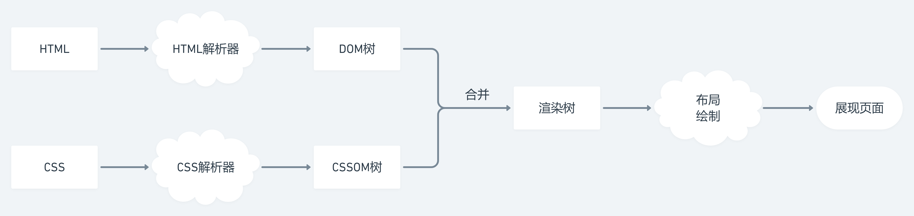

## 原理

### 渲染流程

1. **构建 `DOM` 树**：`HTML` 解析器解析 `HTML` 文档，构建 `DOM` 树
2. **构建 `CSSOM` 树**：`CSS` 解析器解析 `CSS` 样式文件，构建 `CSSOM` 树
3. **合并为 `Render` 树**：从根节点递归调用，计算每一个元素的大小，位置等
4. **布局绘制**：遍历 `Render` 树，绘制每一个节点




### 重绘和回流

**说明：**

+ 重绘（Repaint）：当页面中元素样式的改变并不影响它在文档流中的位置时(如修改 color, visibility 等)，浏览器将新样式赋予给元素并重新绘制的过程
+ 回流（Reflow）：当渲染树中部分或全部元素的尺寸、结构、或某些属性发生改变时，浏览器重新渲染部分或全部文档的过程(**回流必将引起重绘，重绘不一定会引起回流**)

**触发回流的情况：**

+ 页面首次渲染
+ 浏览器窗口大小变化
+ 元素尺寸或位置变化
+ 元素内容变化
+ 添加或删除元素

**回流的性能影响：**

+ 往往回流一个元素发生回流，它的父元素以及它附近的元素也会产生回流，造成浏览器不必要的性能损耗
+ 现代浏览器也对频繁的回流或重绘操作进行优化，浏览器会维护一个队列，把所有引起回流和重绘的操作放入队列，若队列中的任务数量或时间间隔达到一个阈值，浏览器就会将队列清空，进行一次批处理，这样可以把多次回流和重绘变成一次，访问以下属性会使浏览器立刻清空该队列：
  + `clientWidth`/`clientHeight`/`clientTop`/`clientLeft`
  + `offsetWidth`/`offsetHeight`/`offsetTop`/`offsetLeft`
  + `scrollWidth`/`scrollHeight`/`scrollTop`/`scrollLeft`
  + `width`/`height`
  + `getComputedStyle()`
  + `getBoundingClientRect()`

**避免发生回流：**

+ CSS 优化
  + 避免使用 `table` 布局
  + 避免设置多层内联样式
  + 将动画效果应用到 `absolute`/`fixed` 定位的元素上
+ Javascript 优化
  + 避免频繁修改样式
  + 避免频繁操作 `DOM`，或使用 `DocumentFragment`
  + 使用变量将会触发回流或重绘的属性缓存


### 从输入网址到渲染完成经历了什么

1. 输入 `URL` 并回车后, 浏览器先查找当前 `URL` 是否存在缓存, 确认缓存是否过期
2. `URL` 经过 `DNS` 服务器解析为对应的 `IP` 地址
3. 根据 `IP` 与服务器建立 `TCP` 连接(三次握手)
4. 三次握手完成, 浏览器开始发起 `HTTP` 请求, 服务器处理并响应请求(也可能返回错误或重定向), 浏览器接收 HTTP 响应数据和信息
5. 浏览器根据服务器返回的数据(`html`, `js`, `css` 等)构建 `DOM` 树, 渲染页面
6. 关闭 `TCP` 连接(四次握手)


### 其他

+ 浏览器解析 HTML 代码的原理，构建 DOM 树的流程
+ 浏览器如何解析 CSS 规则，并将其应用到 DOM 树上
+ 浏览器如何将解析好的带有样式的 DOM 树进行绘制
+ 列举 IE 与其他浏览器不一样的特性
+ 各浏览器使用的 Javascript 引擎以及异同点、如何在代码中区分
+ 请求数据到请求结束的过程与服务器进行了几次交互
+ 浏览器的运行机制，如何配置资源异步/同步加载
+ 浏览器的垃圾回收机制、如何避免内存泄漏
+ 浏览器采用的缓存方案，如何选择和控制合适的缓存方案
+ 浏览器提供的几种存储机制、优缺点、开发中的选择
+ 浏览器跨标签通信
+ 浏览器的同源策略，如何避免同源策略，几种方式的异同以及如何选型
+ 前端发起网络请求的几种方式及其底层实现，可以手写原生 Ajax、fetch，熟练使用第三方库
+ DOM 事件流的具体实现机制、不同浏览器的差异、事件代理


## 安全

### XSS 攻击原理、分类、具体案例，前端如何防御

### CSRF 攻击原理、具体案例，前端如何防御

### HTTP 劫持、页面劫持原理，防御措施

### 常见的 Web 安全及防护原理

**SQL注入：** 将 `SQL` 代码伪装到输入参数中，传递到服务器解析并执行的一种攻击手法。防范：
+ 对用户输入进行校验
+ 不适用动态拼接 `SQL`

**XSS(跨站脚本攻击)：** 往 `Web` 页面插入恶意的 `html` 标签或者 `js` 代码。防范：
+ 尽量采用 `post` 而不使用 `get` 提交表单
+ 避免 `cookie` 中泄漏用户的隐式

**CSRF(跨站请求伪装)：** 通过伪装来自受信任用户的请求(例如利用 `CSRF` 跨站请求伪装来获取服务器数据)。防范：
+ 在客服端页面增加伪随机数，通过验证码

**点击劫持：**

### XSS 和 CSRF 的区别

+ `XSS` 是获取信息，不需要提前知道其他用户页面的代码和数据包
+ `CSRF` 代替用户完成指定的动作，需要知道其他页面的代码和数据包


## 跨域

### 同源策略


### 跨域的方式

+ jsonp


### Ajax 的过程和实现

**过程：**

1. 创建 `XMLHttpRequest` 对象的实例
2. 为实例添加 `onreadystatechange` 监听请求状态的变化
3. 使用实例的 `open(method, url)` 方法创建一个请求
4. 使用实例的 `send()` 方法发送请求

**实现：**

```js
function _ajax(url) {
  let xmlhttp = null
  if (window.XMLHttpRequest) {
    xmlhttp = new XMLHttpRequest()
  } else if (window.ActiveXObject) {
    // 不支持 XMLHttpRequest 对象的浏览器
    xmlhttp = new ActiveXObject('Microsoft.XMLHTTP')
  }

  if (!xmlhttp) {
    alert("Your browser does not support XMLHTTP.")
  } else {
    // 添加 onreadystatechange 事件处理函数
    xmlhttp.onreadystatechange = function() {
      if (xmlhttp.readyState === 4) { // 
        if (xmlhttp.status === 200) { // 成功响应时
          box.innerHTML = xmlhttp.responseText
        }
      }
    }
    // 创建 GET 请求
    xmlhttp.open('GET', url, true)
    // 同时可以给服务器附加信息
    xmlhttp.send(null)
  }
}
```


::: tip readyState：
+ 0: 
+ 1: 
+ 2: 
+ 3: 
+ 4: 
:::