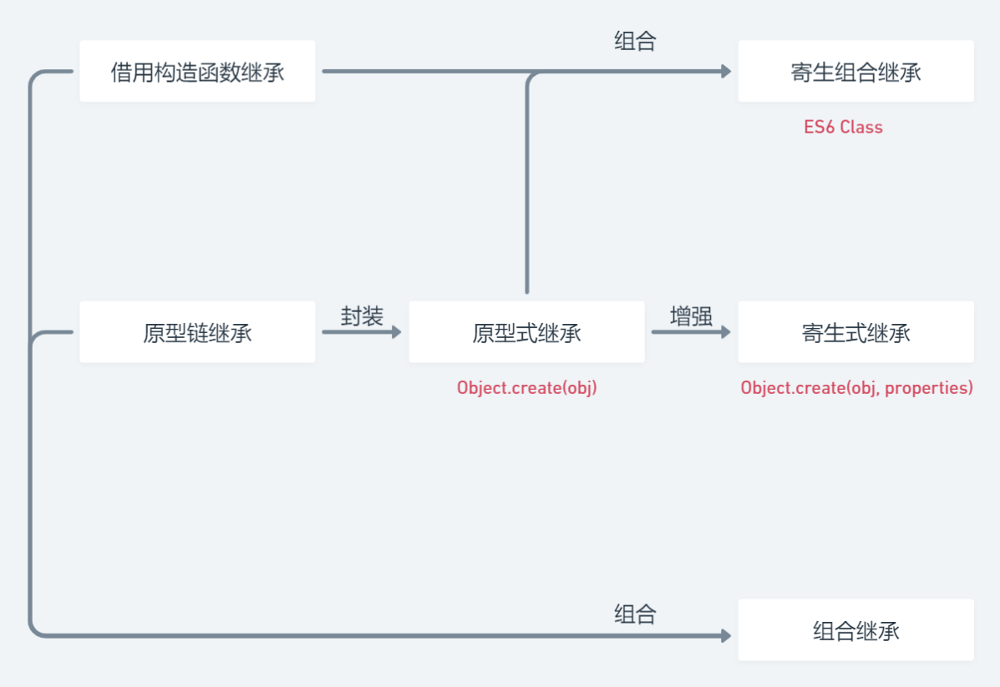
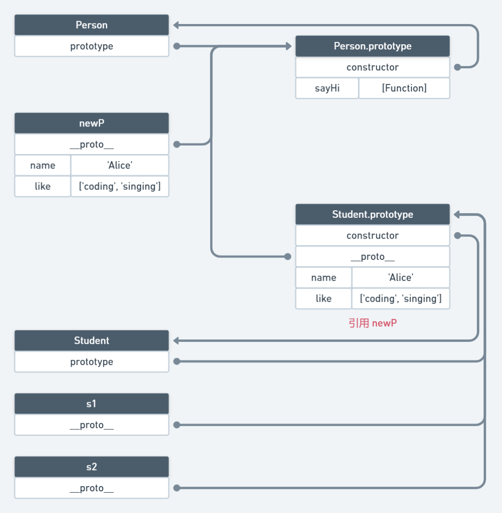
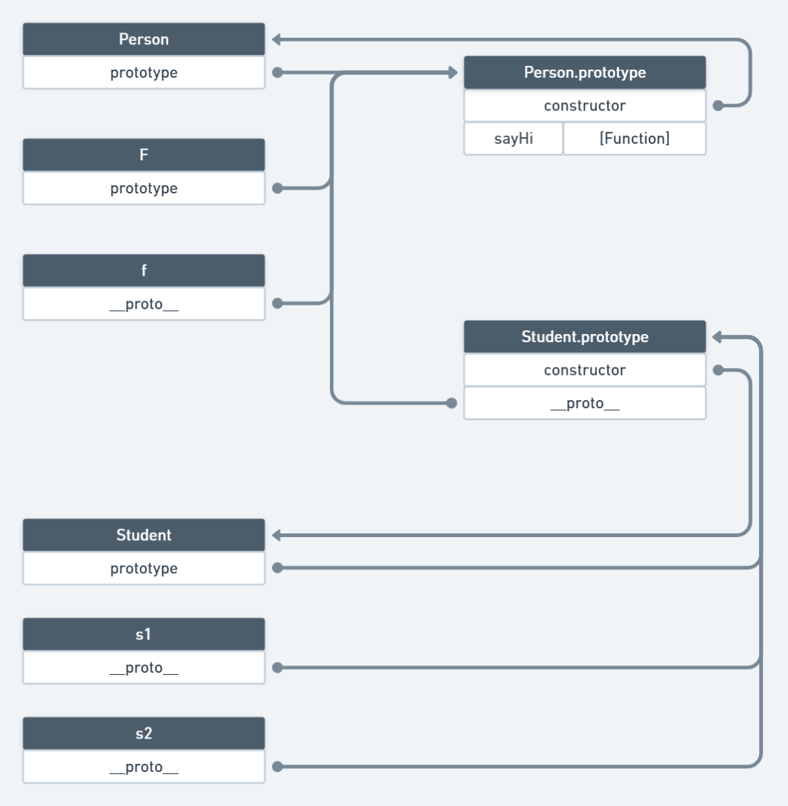
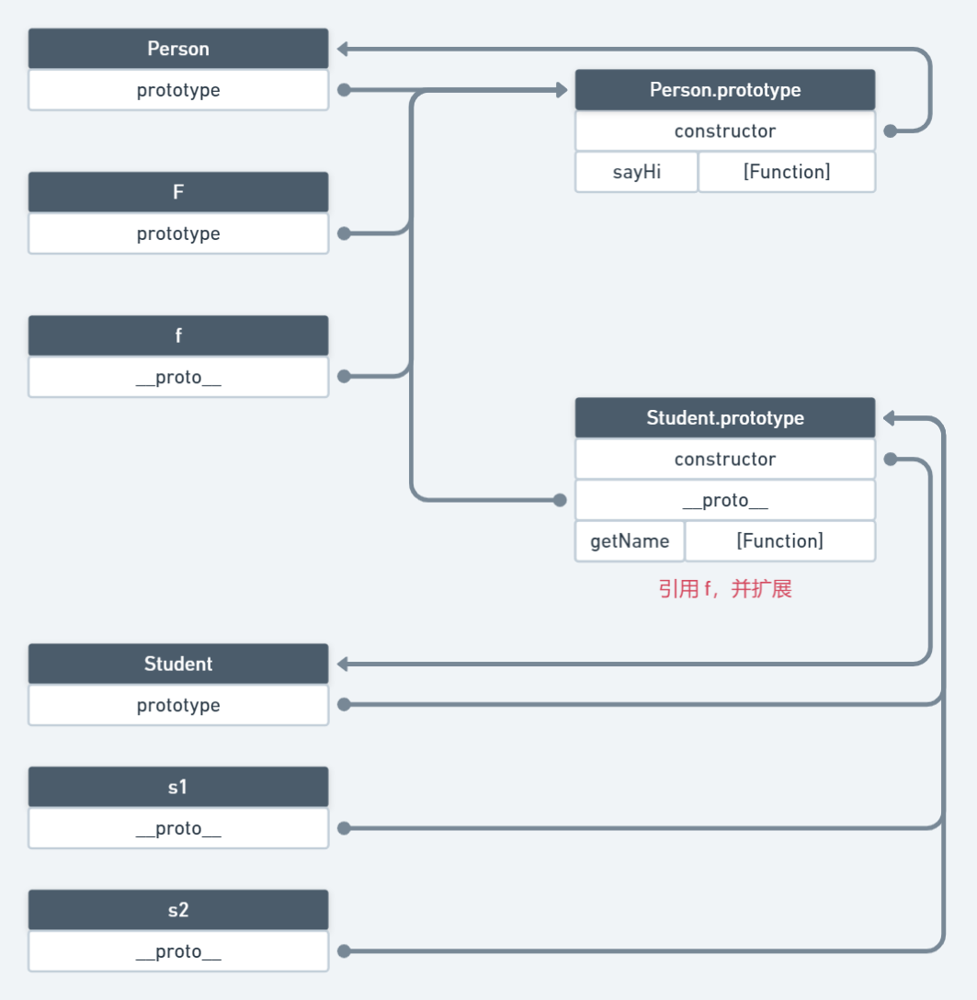
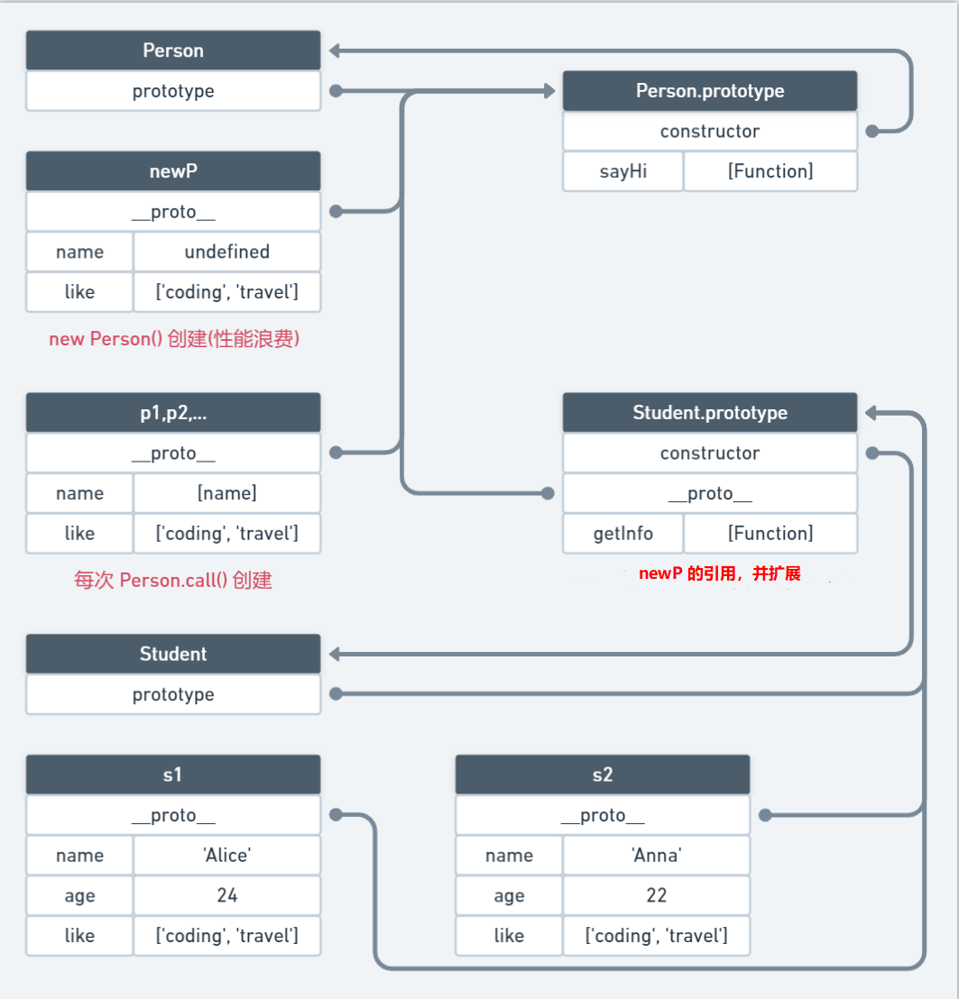
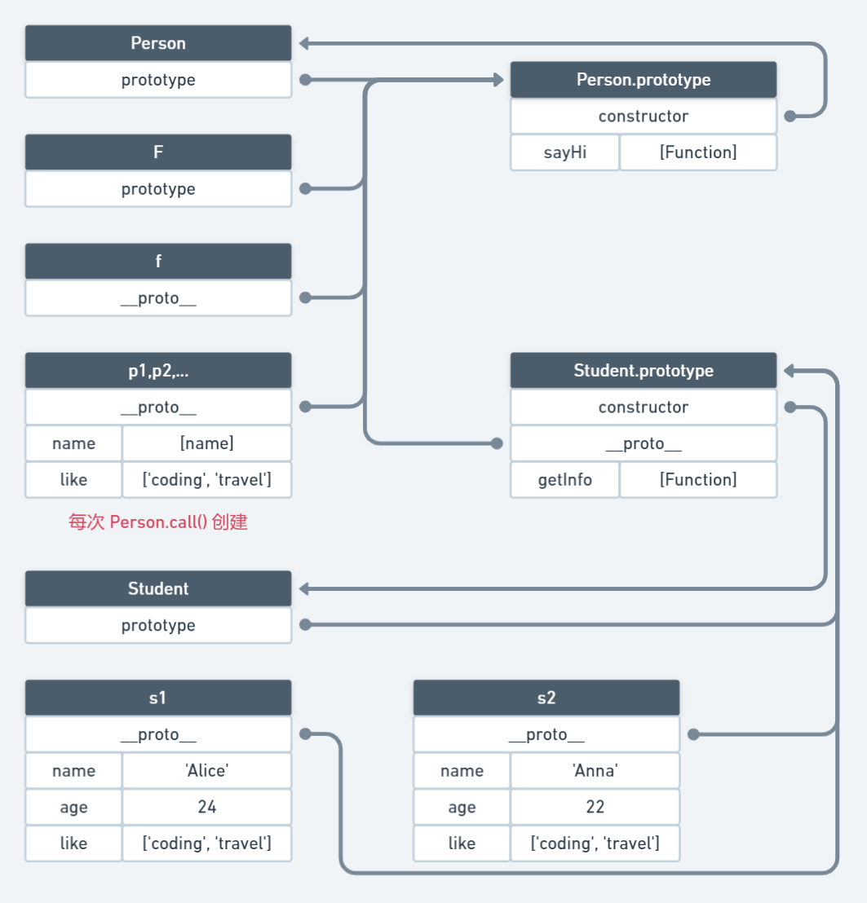

## 说明

**概述**：
+ **借用构造函数继承**：一般不会单独使用
+ **原型链继承**：一般不会单独使用
+ **原型式继承**：将**原型链继承**封装在函数中
+ **寄生式继承**：增强**原型式继承**，能够根据需求扩展属性
+ **组合继承** = **借用构造函数继承** + **原型链继承**，基本完美的方式
+ **寄生组合继承** = **借用构造函数继承** + **原型式继承**，完美的方式


**对比**：
+ **借用构造函数继承**和**原型链继承**是互补的，因此它们结合产生了**组合继承**
+ **原型链继承**有一个性能缺点：创建父类实例时的内存不能释放
+ **原型式继承**不仅使用封装了**原型链继承**，而且释放了创建父类实例的内存
+ **寄生式继承**增强了**原型式继承**，提供更大的灵活性
+ 用**原型式继承**代替**原型链继承**去优化**组合继承**，产生了**寄生组合继承**（之所以不使用更灵活的**寄生式继承**，是因为子类本身能通过**借用构造函数继承**扩展属性）





**应用场景**：
+ 需要快速实现继承时，使用**原型式继承**/**寄生式继承**，或直接使用 `Object.create()`
+ 需要大量使用继承的场景，使用**组合继承**/**寄生组合继承**，或直接使用 `ES6 Class`


::: tip 说明：
+ 继承的基本方式：**借用构造函数继承**、**原型链继承**，其他方式都是它们的增强或组合
+ `Object.create()` 使用**寄生式继承**实现，但将除 `[[value]]` 外的属性描述符设置为 `false`
  + **原型式继承**相当于使用一个参数的 `Object.create()`
  + **寄生式继承**相当于使用两个参数的 `Object.create()`
+ `ES6 Class` 语法糖使用**寄生组合继承**实现
:::


## 借用构造函数继承

```js
function Person(name) {
  this.type = 'Person'
  this.name = name
}

function Student(name, age, like) {
  Person.call(this, name) // 调用父类的构造函数
  // 子类特有的属性，应该在调用父类构造函数之后定义
  this.type = 'Student'
  this.age = age
  this.like = like
}

const s1 = new Student('Alice', 24, ['coding', 'reading'])
const s2 = new Student('Anna', 22, ['singing', 'travel'])
s1.like.push('basketball')
console.log(s1.type, s2.type) // Student Student
console.log(s1.like) // [ 'coding', 'reading', 'basketball' ]
console.log(s2.like) // [ 'singing', 'travel' ]
```

::: tip 分析
+ **原理**：通过 `call()` 或 `apply()` 在一个类(子类)的构造函数中调用另一个类(父类)的构造函数
+ **解决的问题**：
  + 子类能够向父类传递参数
  + 子类继承的引用类型的属性不会共享，因为调用构造函数生成的是不同的实例
+ **不足**：
  + 只继承了父类的属性，没有继承父类原型中的属性和方法
  + `instanceof` 不能识别子类实例继承于父类
:::


## 原型链继承

```js
function Person() {
  this.name = 'Alice'
  this.like = ['coding', 'singing']
}
Person.prototype.sayName = function() {
  console.log(this.name)
}

function Student() {}

Student.prototype = new Person() // 共享父类的原型

const s1 = new Student()
console.log(s1.name) // Alice
s1.sayName() // Alice
console.log(s1 instanceof Student) // true
console.log(s1 instanceof Person) // true

const s2 = new Student()
s2.like.push('travel')
console.log(s1.like) // [ 'coding', 'singing', 'travel' ]
console.log(s2.like) // [ 'coding', 'singing', 'travel' ]
```



::: tip 分析
+ **原理**：将一个类(父类)的实例设置为另一个类(子类)的原型对象
+ **解决的问题**：通过原型链实现继承，子类实例能够共享父类的属性和方法
+ **不足**：
  + 创建不同的子类实例时，不能向父类的构造函数中传递不同的参数
  + 父类原型属性中为引用类型的数据会被所有实例共享
:::


## 原型式继承

```js
// 原型式继承核心函数
function object(o) {
  function F() {}
  F.prototype = o
  return new F()
}

function Person() {}
Person.prototype.sayHi = () => console.log('Hi')

function Student() {}
Student.prototype = object(Person.prototype)
Student.prototype.constructor = Student

const s = new Student()
s.sayHi() // Hi
console.log(s instanceof Student, s instanceof Person) // true true
console.log(s.constructor) // [Function: Student]
```



::: tip 分析
+ **原理**：将原型链继承的逻辑封装在函数中
+ **解决的问题**：快速从由已有的对象实现继承
+ **不足**：生成的所有实例共享父类的引用数据类型
:::


## 寄生式继承

```js
// 原型式继承核心函数
function object(o) {
  function F() {}
  F.prototype = o
  return new F()
}
// 用于增强实例并返回
function createObj(o) {
  const clone = object(o)
  clone.getName = function() {
    console.log('Alice')
  }
  return clone
}

function Person() {}
Person.prototype.sayHi = function() {
  console.log('Hi')
}

function Student() {}
Student.prototype = createObj(Person.prototype)
Student.prototype.constructor = Student

const s = new Student()
s.sayHi() // Hi
s.getName() // Alice
console.log(s.constructor) // [Function: Person]
console.log(s instanceof Student, s instanceof Person) // true true
```



::: tip 分析
+ **原理**：在原型式继承的基础上，进一步增强实例
+ **解决的问题**：能根据需求扩展实例属性
+ **不足**：生成的所有实例共享超类的引用数据类型
:::


## 组合继承

```js
function Person(name) {
  this.name = name
  this.like = ['coding', 'travel']
}
Person.prototype.sayHi = function() {
  console.log('Hi')
}

function Student(name, age) {
  Person.call(this, name) // 调用父类的构造函数
  this.age = age
}
Student.prototype = new Person() // 共享父类的原型
Student.prototype.constructor = Student // 更该 constructor 指向
Student.prototype.getInfo = function() {
  console.log(`${this.name}: ${this.age}`)
}

const s1 = new Student('Alice', 24)
const s2 = new Student('Anna', 22)
s1.sayHi() // Hi
s2.sayHi() // Hi
s1.getInfo() // Alice: 24
s2.getInfo() // Anna: 22
s1.like.push('reading')
console.log(s1.like) // [ 'coding', 'travel', 'basketball' ]
console.log(s2.like) // [ 'coding', 'travel' ]
console.log(s1 instanceof Student, s1 instanceof Person) // true true
console.log(s2 instanceof Student, s2 instanceof Person) // true true
```



::: tip 分析
+ **原理**：使用原型链共享父类的原型，使用借用构造函数继承实例属性
+ **解决的问题**：
  + 融合原型链继承和借用构造函数继承的优点
  + 能用 `instanceof` 识别实例的子类和超类的关系
+ **不足**：调用两次父类的构造函数，生成多余的属性，造成性能浪费
:::


## 寄生组合继承

```js
// 原型式继承核心函数
function object(o) {
  function F() {}
  F.prototype = o
  return new F()
}
// 寄生组合继承核心函数
function inheritPrototype(subType, superType) {
  const prototype = object(superType.prototype) // 原型式继承
  prototype.constructor = subType // 更该 constructor 指向
  subType.prototype = prototype
}

function Person(name) {
  this.name = name
}
Person.prototype.sayHi = function() {
  console.log('Hi')
}

function Student(name, age) {
  Person.call(this, name) // 调用父类的构造函数
  this.age = age
}
inheritPrototype(Student, Person)
Student.prototype.getInfo = function() {
  console.log(`${this.name}: ${this.age}`)
}

const s = new Student('Alice', 24)
s.sayHi() // Hi
s.getInfo() // Alice: 24
console.log(s instanceof Student, s instanceof Person) // true true
console.log(s.constructor) // [Function: Student]
```



::: tip 分析
+ **原理**：通过借用构造函数来继承属性，再通过原型式继承来借用父类的原型
+ **解决的问题**：增强了组合继承，不用再调用两次超类的构造函数
+ **不足**：无敌
:::