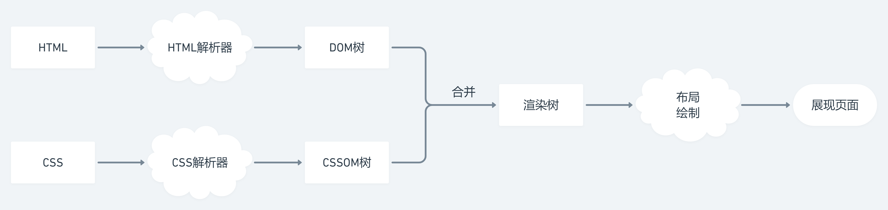

## 浏览器架构

|组成|功能、包含组件|
|-|-|-|
|用户界面|除页面 page 外的其他组件，如 tab 栏、地址栏、书签等组件
|浏览器引擎|用于查询及操作渲染引擎的接口
|渲染引擎|渲染并显示请求的内容，通常为解析 html、css，并回显渲染结果
|网络|用于网络调用，如 http 请求。其具备平台无关的接口，因此可跨平台
|JavaScript 解释器|解释执行 JavaScript 代码
|UI 后端|绘制类似组合选择框及对话框等基本组件，具有不特定于某个平台的接通用口，底层使用操作系统的用户接口
|数据持久层|浏览器在磁盘中保存 Cookie 等持久化数据，是一种轻量级的客户端存储技术

## 多进程浏览器

+ 多进程浏览器根据不同的功能来创建进程，以 Chrome 为例：

|进程|功能|
|-|-|
浏览器进程|控制除标签页外的用户界面，以及负责与浏览器其他进程协调工作
GPU 进程|渲染整个浏览器界面
插件进程|控制网站使用的插件
渲染器进程|控制 Tab 标签内显示的所有内容，默认会为每个 Tab 标签创建一个该进程
网络进程|发起、接受网络请求
缓存进程|
...|

+ Chrome 有 4 种[进程模型](https://www.chromium.org/developers/design-documents/process-models)：
  + Process-per-site-instance：默认。访问不同站点或同一站点的不同页面都会创建新的渲染器进程
  + Process-per-site：同一站点使用同一进程
  + Process-per-tab：一个 Tab 使用一个进程
  + Single process：浏览器引擎和渲染器引擎共用一个线程

::: tip 目前的浏览器一般都为多进程浏览器（早期浏览器是单进程的），因为单进程浏览器缺点过多：
+ 不稳定：其中一个线程卡死，导致整个进程出问题，如其中一个标签页卡死就会导致整个浏览器无法运作
+ 不安全：JS 线程可以访问进程内的任意数据
+ 不流畅：单进程运行太多任务，导致运行效率低
:::

## 渲染流程

### 流程概览

1. `浏览器进程`：**控制除标签页外的用户界面，以及负责与浏览器其他进程协调工作**
    1. **UI 线程**：捕捉输入的内容，若是关键词，使用默认配置的搜索引擎来查询；若是域名则启动一个**网络线程**
    2. **网络线程**：请求 DNS 服务器进行[域名解析](/base/computed-network/dns/intro.html#解析过程)，得到 IP 地址后[连接服务器](/base/computed-network/tcp-ip/intro.html#三次握手)获取数据
    3. 通过 **SafeBrowsing** 来检查站点是否为恶意站点，对于恶意站点会显示警告（但仍可忽略并继续访问）
    4. **UI 线程**启动渲染器进程来渲染页面，同时`浏览器进程`通过 IPC 管道将数据传递给`渲染器进程`，进入渲染流程
2. `渲染器进程`：**将 html、js、css、image 等资源渲染为用户可以交互的 web 页面**
    + **主线程**：首先构建 DOM Tree 和 CSSOM Tree，它们同步进行
        + 构建 DOM Tree：html 解析器解析 html，遇到 `<script>` 标签时会停止解析，转而去加载并执行 JS 脚本
        + 构建 CSSOM Tree：css 解析器解析 css，查询[各浏览器默认样式](https://browserdefaultstyles.com/)
        + 合并 Render Tree：从 DOM Tree 根节点递归调用，结合 CSSOM Tree 计算每一个元素的大小，位置等
        + 布局（Layout）：**主线程**遍历 Render Tree，生成 Layout Tree
        + 绘制（Paint）：根据绘制记录表，正确地绘制每一个节点
    + **合成器线程**：**切分图层并生成合成器帧**
        + 接受**主线程**传送的绘制记录表和 Layout Tree 等信息，将每个图层切分为许多图块（tiles）后发送给**栅格化线程**
        + 栅格化完成后，根据**栅格化线程**传送的 “draw quads” 图块信息生成一个合成器帧（Compositor Frame），并通过 IPC 管道传送给`浏览器进程`
        + 当页面内容发生变化（如滚动内容），都会重新生成一个新的合成器帧
    + **栅格化线程**：**栅格化图块**
        + 栅格化每个图块，将它们存储在 GPU 内存中
        + 传送 “draw quads” 图块信息（记录了图块在内存中的位置以及绘制在页面中的位置）给**合成器线程**
3. `GPU 进程`：**接受浏览器进程传送的合成器帧，将其渲染展示到屏幕上**

::: tip 备注：
+ SafeBrowsing：谷歌内部的一套站点安全系统，通过检查该站点的数据来判断是否安全；若该站点的 IP 地址在谷歌的黑名单内，也会显示为恶意站点
+ 栅格化（Rastering）：
  + Chrome 以前的栅格化方案：只栅格化浏览器窗口显示的内容，当页面滚动时再栅格化后面的内容，但容易形成页面断层
  + Chrome 目前使用一种叫合成（Compositing）的栅格化方案，它将页面的各个部分分成多个图层，分别对其进行栅格化，并在`合成器线程`中单独进行页面合成
:::

### 渲染器主线程

#### 主线程概览

+ 构建 DOM Tree：html 解析器解析 html，遇到 `<script>` 标签时会停止解析，转而去加载并执行 JS 脚本
+ 构建 CSSOM Tree：css 解析器解析 css，查询[各浏览器默认样式](https://browserdefaultstyles.com/)
+ 合并 Render Tree：从 DOM Tree 根节点递归调用，结合 CSSOM Tree 计算每一个元素的大小，位置等
+ 布局（Layout）：**主线程**遍历 Render Tree，生成 Layout Tree
+ 绘制（Paint）：根据绘制记录表，正确地绘制每一个节点

#### 构建 DOM Tree

+ 浏览器解析 HTML 代码的原理，构建 DOM 树的流程

#### 构建 CSSOM Tree

+ 浏览器如何解析 CSS 规则，并将其应用到 DOM 树上

#### 合并为 Render Tree

#### 绘制

+ 浏览器如何将解析好的带有样式的 DOM 树进行绘制

### 重绘和回流

**说明：**

+ 重绘（Repaint）：当页面中元素样式的改变并不影响它在文档流中的位置时(如修改 `color`, `visibility` 等)，浏览器将新样式赋予给元素并重新绘制的过程
+ 回流（Reflow）：当渲染树中部分或全部元素的尺寸、结构、或某些属性发生改变时，浏览器重新渲染部分或全部文档的过程(**回流必将引起重绘，重绘不一定会引起回流**)

**触发回流的情况：**

+ 页面首次渲染
+ 浏览器窗口大小变化
+ 元素尺寸或位置变化
+ 元素内容变化
+ 添加或删除元素

**回流的性能影响：**

+ 往往回流一个元素发生回流，它的父元素以及它附近的元素也会产生回流，造成浏览器不必要的性能损耗
+ 现代浏览器也对频繁的回流或重绘操作进行优化，浏览器会维护一个队列，把所有引起回流和重绘的操作放入队列，若队列中的任务数量或时间间隔达到一个阈值，浏览器就会将队列清空，进行一次批处理，这样可以把多次回流和重绘变成一次，访问以下属性会使浏览器立刻清空该队列：
  + `clientWidth`/`clientHeight`/`clientTop`/`clientLeft`
  + `offsetWidth`/`offsetHeight`/`offsetTop`/`offsetLeft`
  + `scrollWidth`/`scrollHeight`/`scrollTop`/`scrollLeft`
  + `width`/`height`
  + `getComputedStyle()`
  + `getBoundingClientRect()`

**避免发生回流：**

+ CSS 优化
  + 避免使用 `table` 布局
  + 避免设置多层内联样式
  + 将动画效果应用到 `absolute`/`fixed` 定位的元素上
+ Javascript 优化
  + 避免频繁修改样式
  + 避免频繁操作 `DOM`，或使用 `DocumentFragment`
  + 使用变量将会触发回流或重绘的属性缓存

### 问答

+ 为什么解析 html 的过程中不跳过 JS 的加载和执行？
  + 因为 JS 中有可能修改了 html

+ 为什么要把 script 标签放在合适的位置？还可以采用什么做法？
  + 为了防止 JS 阻塞 html 的解析
  + 使用 `async` 或 `defer` 属性来异步加载执行 JS

+ DOM Tree 和 Layout Tree 的区别？
  + 它们的节点并不是一一对应的，但 Layout Tree 和显示在页面上的节点是一一对应的
  + 因为 DOM Tree 由 html 解析得到，并不关心样式，故一些伪类（`::before`, `::after`）添加的内容不会出现在 DOM Tree 上
  + 而 Layout Tree 通过 DOM Tree 和 CSSOM Tree 合并后的 Render Tree 生成，故 `display:none;` 的节点不会出现在 Layout Tree 上

+ 重排、重绘（repaint）和回流（reflow）
  + 重排、重绘、JS 都占用主线程，处理动画时，可以使用 `requestAnimationFrame()` 优化 JS 动画，或者使用 `transform` 的 CSS 属性
  + `requestAnimationFrame()` 会在每一帧的空余时间执行 JS，并在当前帧结束后归还主线程
  + `transform` 实现的动画不会经过合成和绘制（节省很多运算时间），而是直接运行在合成器线程和栅格化线程中

+ 请求数据到请求结束的过程与服务器进行了几次交互
+ DOM 事件流的具体实现机制、不同浏览器的差异、事件代理