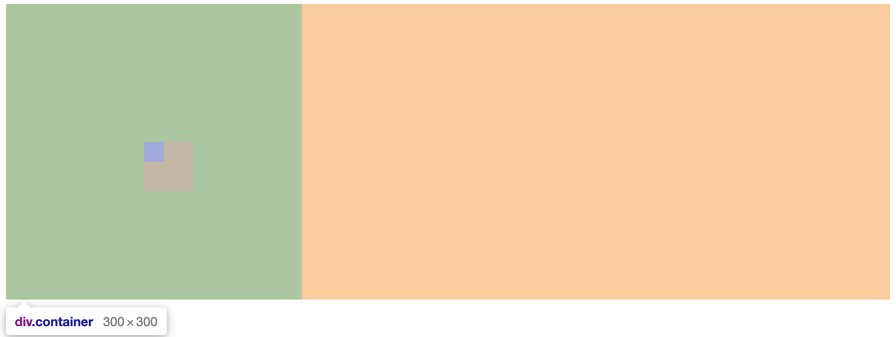
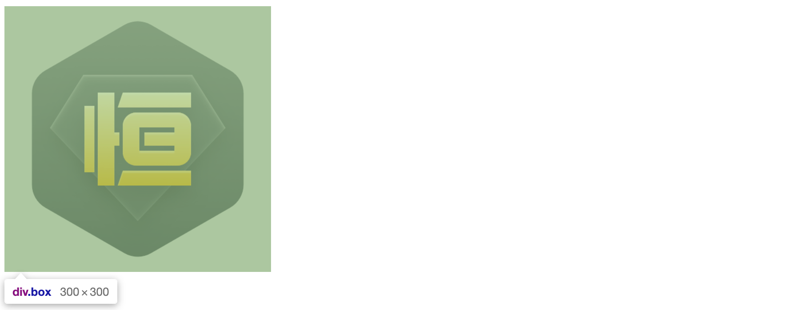
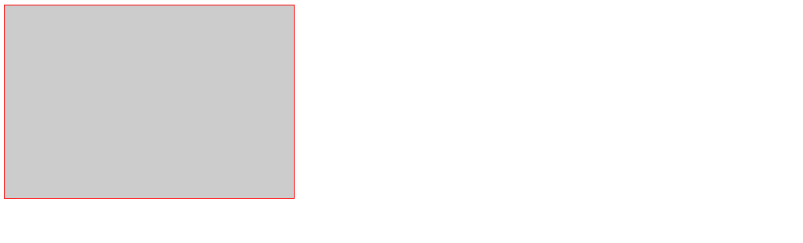

## 简介

DOM 中所有的元素都是一个个的盒子，每个元素均具有自己的 '盒子属性'，可能是显式声明的，也可能是继承或者默认的。一个盒子的尺寸会收到很多因素的影响：
+ box-sizing
+ width / height
+ margin / padding
+ border
+ BFC
+ flex


### 属性说明

属性|取值|类似属性|说明
-|-|-|-
`box-sizing`|`content-box`<br>`border-box`|none|设置盒子的组成模式
`width`|`<length>`<br>`<percentage>`|min-width, max-width, device-width|设置元素的宽度
`height`|`<length>`<br>`<percentage>`|min-height, max-height, device-height|设置元素的高度
`margin`|`<length>`<br>`<percentage>`|margin-[ top、right、bottom、left ]|设置元素的外边距，<font color='red'>可以为负值</font>
`padding`|`<length>`<br>`<percentage>`|padding-[ top、right、bottom、left ]|设置元素的内边距
`border`|`1px solid red`|border-[ top、left、bottom、right ]-[ width、style、color ]|设置边框的样式

::: tip 区分 content-box 和 border-box：
+ `content-box`：没有受到 `flex` 等布局形式的影响时，设置 `padding/border` 均会撑大盒子的宽高，其盒子宽高为：
  + 宽度 = 左右border + 左右padding + width
  + 高度 = 上下border + 上下padding + height
+ `border-box`：显式的 `width/height` 属性已经包含 `padding/border` 在内，设置额外的 `padding/border` 只会让盒子的 `content` 缩小，不会撑大盒子的宽高，其盒子宽高为：
  + 宽度 = width
  + 高度 = height
:::

::: tip 区分 padding-top/padding-left 和 padding-bottom/padding-right：
+ padding-top/padding-left 占据的内边距永远不可能被内容占据，但 padding-bottom/padding-right 却可以(当内容超出盒子区域时)：
```html
<div class="container">
  <div class="box"></div>
</div>
```
```css
.container {
  box-sizing: border-box;
  overflow: hidden;
  width: 300px;
  height: 300px;
  padding: 140px;   /* 父元素 content 尺寸为 20x20 */
  background-color: #ccc;
}
.box {
  width: 50px;
  height: 50px;
  background-color: #fad;
}
```



+ 利用这一特性，可以使用 `padding-bottom` 为图片占位：
```html
<div class="container">
  <div class="box">
    
  </div>
</div>
```
```css
.container {
  width: 300px;
  height: 300px;
}
.box {
  width: 100%;
  height: 0;
  padding-bottom: 100%;
  background-color: #ccc;
}
.img {
  width: 100%;
}
```


:::


### 百分比单位

+ 百分比单位属于相对单位，即值会通过一个相对的目标来计算
+ 本章节的百分比单位：
  + `width`/`height：相对于` parent 的 `width`/`height` 计算得到
  + `margin`/`padding：相对于` parent 的 `width` 计算得到（与 `height` 无关，并且 `margin` 允许负值）
+ 其他百分比单位：
  + `left`/`right`：相对于 parent 的 `width` 计算得到
  + `top`/`bottom`：相对于 parent 的 `height` 计算得到
  + `font-size`：相对于 parent 的 `font-size` 计算得到
  + `translateX`/`translateY`：相对于自身的 `width`/`height` 计算得到
+ 由于 `padding`/`margin` 都是相对于父元素的 width 计算的，因此它们都有一些很好的应用：
  + 利用 `padding-bottom` 为图片占位
  + 利用 `margin` 负值布局


## 层叠上下文

+ 参考：[彻底搞懂CSS层叠上下文、层叠等级、层叠顺序、z-index](https://blog.csdn.net/llll789789/article/details/97562099)
+ 层叠上下文其实是一个三维的概念，它表示元素盒子在 Z 轴上面的展现层级，`z-index` 属性用于控制它们的层级


+ `z-index` 仅对非 static 定位的元素有效，值越大表示优先级越高(在同一个层叠上下文中)，并且可以取负值
+ 层叠顺序是一种规则，它与层叠上下文密切相关：


::: tip 备注：
+ 从页面的设计来理解：
  + 背景是最无关紧要的
  + 浮动和行内元素都属于内容，理应优先于包裹它们的容器
+ 虽然 `z-index: auto` 和 `z-index: 0` 在同一层级，但这两个属性值本身是有根本区别的
:::

+ 可以有多个层叠上下文，其创建方法：
  + `<html>` 元素为根层叠上下文
  + 元素为非 static 定位、且设置 `z-index` 属性
  + 父元素 display 属性值为 flex/inline-flex、且子元素 z-index 属性值不为 auto 时，子元素为层叠上下文元素
  + 元素的 opacity 属性值不是1
  + 元素的 transform 属性值不是 none
  + 元素 mix-blend-mode 属性值不是 normal
  + 元素的 filter 属性值不是 none
  + 元素的 isolation 属性值是 isolate
  + will-change 指定的属性值为上面任意一个
  + 元素的 -webkit-overflow-scrolling 属性值设置为touch
+ 层叠上下文的比较是基于祖先(非 `<html>`)的层叠上下文元素的，理解为 “子凭父贵”：
```html
<!-- 
  1.两个 box 分别创建了层叠上下文，且 box1 的层叠优先级高于 box2
  2.无论 child-1/child-2 的层叠优先级如何，child-1 始终优先显示
 -->
<div class="box1" style="position: absolute; top: 0; z-index: 10;">
  <div class="child-1" style="position: absolute; z-index: -999;">child-1</div>
</div>
<div class="box2" style="position: absolute; top: 30px; z-index: 5;">
  <div class="child-2" style="position: absolute; z-index: 999;">child-2</div>
</div>
```


## BFC

### 简介

+ `BFC`(Block Formatting Context)：格式化上下文。Web 页面中盒模型布局的 CSS 渲染模式，指一个独立的渲染区域或者说是一个隔离的独立容器。


### 特点

+ 在 BFC 内部的盒子会在垂直方向上排列
+ 垂直方向上的距离可以由 margin 控制
+ BFC 容器的区域不会与 float 元素区域重叠 （可用于设计自适应布局）
+ 计算 BFC 高度时，浮动元素参与计算 （可用于将父元素设置为 BFC 容器以解决浮动产生的高度塌陷问题）
+ BFC 容器是一个独立的容器，容器内部的子元素不会影响外部元素 （可用于取消文字环绕）


### 创建方式

1. 根元素或其它包含它的元素
2. float: `left` | `right`
3. position: `absolute` | `fixed`
4. display: `inline-block` | `table-cell` | `table-caption` | `flex` 等
5. overflow: `hidden` | `auto` | `scroll`


### 应用 

+ 防止父元素高度塌陷(当一个盒子没有设置固定的高度时，若它的唯一子元素设置浮动，则会出现高度塌陷)
```html
<div class="content">
  <div class="box"></div>
</div>
```
```css
.content {
  border: 1px solid red;
}
.box {
  width: 300px;
  height: 200px;
  float: left;
  background-color: #ccc;
}
```


+ 为父元素创建 BFC，这样计算父元素高度时，浮动元素参与计算(除了设置 `position` 属性，还可以设置 `float`/`display`/`overflow` 等，实际效果可能有少许不同，但是都为父元素创建了 BFC 并且防止了高度塌陷)
```css
.content {
  position: absolute;
  border: 1px solid red;
}
.box {
  width: 300px;
  height: 200px;
  float: left;
  background-color: #ccc;
}
```

