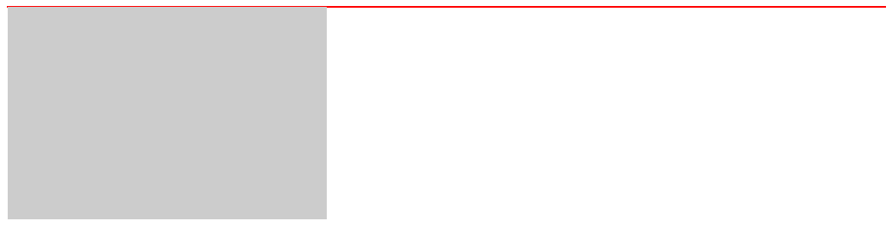

## 定位

**CSS 属性：**

属性|说明|备注
-|-|-
`position`|设置定位方式。取值：<br><br>`static`: <font color="orange">默认值。</font>静态定位<br><br>`relative`: 相对定位<br><br>`absolute`: 绝对定位，脱离正常文档流<br><br>`fixed`: 固定定位，脱离正常文档流<br><br>`sticky`: 粘性定位，|IE6 不支持 fixed
`z-index`|设置对象的层叠优先级。取值: <br><br>`auto`: <font color="orange">默认值。</font>遵循父对象的行为。<br><br>`<integer>`: 整数，可为负值|非 `static` 时生效<br><br><Badge>支持负值</Badge>
`top`<br><br>`right`<br><br>`bottom`<br><br>`left`|设置对象相对其最近定位父元素顶部的偏移。取值: <br><br>`auto`: <font color="orange">默认值。</font>无特殊定位，根据 HTML 定位规则在文档流中分配<br><br>`<length>`: 长度，可以为负值<br><br>`<percentage>`: 百分比，可以为负值|非 `static` 时生效<br><br><Badge>支持负值</Badge>


::: tip 脱离正常文档流：
+ `absolute` | `fixed` | `float` 都可脱离正常文档流，生成一个 [BFC 容器]()

+ `absolute` 会发生层叠覆盖；而 `float` 会占有位置

+ `absolute` 相对于最近一个非 `static` 定位属性的父元素定位

+ `fixed` 默认相对于浏览器窗口定位，但当元素祖先的 `transform`, `perspective` 或 `filter` 属性非 none 时，容器由视口改为该祖先
:::


## 布局

**CSS 属性：**

属性|说明|兼容性
-|-|-
`display`|设置对象的显示方式。取值(常用): <br><br>`none`: 隐藏对象，不占有其位置。<br><br>`inline`: 内联元素。<br><br>`block`: 块级元素。<br><br>`inline-block`: 内联块级元素|-
`float`|设置对象的浮动方式。取值: <br><br>`none`: <font color="orange">默认值。</font>不浮动。<br><br>`left`: 左浮动。<br><br>`right`: 右浮动。|-
`clear`|指定不允许有浮动的边。取值: <br><br>`none`: <font color="orange">默认值。</font><br><br>`left`: 不允许左侧有浮动元素。<br><br>`right`: 不允许右侧有浮动元素。<br><br>`both`: 两侧均不允许有浮动元素。|-
`visibility`|设置元素的显示方式。取值: <br><br>`visible`: <font color="orange">默认值。</font>元素可见。<br><br>`hidden`: 元素不可见，但仍占有其位置。<br><br>`collapse`: 元素被折叠，常用于折叠表格的行或列。|IE6 不支持 collapse
`clip`|将对象进行剪切|<font color="red">已废弃。</font>
`clip-path`|创建一个只有元素的部分区域可以显示的剪切区域|-
`overflow`<br><br>`overflow-x`<br><br>`overflow-y`|设置对象内容溢出的处理方式。取值: <br><br>`visible`: <font color="orange">默认值。</font>元素可见，但会溢出。<br><br>`hidden`: 超出部分隐藏。<br><br>`scroll`: 超出部分可滚动，出现滚动条。<br><br>`auto`: 自动添加滚动条(`body` 和 `textarea` 的默认值)。|-


::: tip 说明
+ 对于不同的元素(行内元素、块级元素、行内块级元素)，`display` 属性有不同的默认值

+ `overflow`: `body` | `textarea` 默认值为 `auto`，在溢出时自动出现滚动条

+ `display: none;` | `visibility: hidden;` 都使元素不可见，但 `hidden` 的元素仍占有空间

+ 块级元素(block)可以设置宽高，独占一行，常见：`h1~h6`,`p`,`div`,`dl`,`dt`,`hr`,`ol`,`ul`,`li`,`form`,`pre`,`table`,`td`,`th`
+ 行内元素(inline)不可设置宽高，会在一行中按顺序排列，排满时会换行，常见：`span`,`button`,`input`,`label`,`select`,`img`,`textarea`以及 `strong` 等文本类标签
+ 行内块级元素(inline-block)具有两者的特点
:::


## 解决浮动引起的高度塌陷

+ 当一个盒子没有设置固定的高度时，若它的唯一子元素设置浮动，则会出现高度塌陷
```html
<div class="content">
  <div class="box"></div>
</div>
```
```css
.content {
  border: 1px solid red;
}
.box {
  width: 300px;
  height: 200px;
  float: left;
  background-color: #ccc;
}
```




### 父元素定高

+ 原理：直接为父元素设置一个高度
+ 优点：简单直接
+ 缺点：不适用父元素高度不确定的场景

```html
<div class="container">
  <div class="box"></div>
</div>
```
```css
.container {
  height: 100px;
  border: 1px solid red;
}
.box {
  float: left;
  width: 100px;
  height: 100px;
  background-color: #ccc;
}
```


### 创建 BFC

+ 原理：为父元素创建 [BFC](./box-model#bfc)，这样计算父元素高度时，浮动元素参与计算
  + `position`：`absolute` | `fixed`
  + `float`：`left` | `right`
  + `display`：`inline-block` | `flex` | `table-cell` 等
  + `overflow`：`hidden` | `auto` | `scroll`
+ 优点：设置比较简单
+ 缺点：或多或小都有些缺陷，如对溢出的处理、影响上一层布局等
```html
<div class="container">
  <div class="box"></div>
</div>
```
```css
.container {
  float: left;
  border: 1px solid red;
}
.box {
  float: left;
  width: 100px;
  height: 100px;
  background-color: #ccc;
}
```


### 空 div + clear

+ 原理：在浮动元素下方添加空 div，并给该元素设置 clear 属性
+ 优点：简单直接
+ 缺点：添加额外的空元素

```html
<div class="container">
  <div class="box"></div>
  <div class="empty"></div>
</div>
```
```css
.container {
  border: 1px solid red;
}
.box {
  float: left;
  width: 100px;
  height: 100px;
  background-color: #ccc;
}
.empty {
  clear: both;
}
```


### ::after + clear

+ 原理：父元素添加 `::after` 伪元素，效果相当于添加空 `div`，但不用更改 HTML
+ 优点：基本完美，适用大多数情况
+ 缺点：代码比较多
+ html
```html
<div class="cf">
  <div class="box"></div>
</div>
```

+ 基本样式
```css
.cf {
  border: 1px solid red;
}
.box {
  float: left;
  width: 100px;
  height: 100px;
  background-color: #ccc;
}
```

+ 方法1
```css
.cf::after {
  display: block;   /* 显示为块级元素 */
  height: 0;        /* 高度为 0，content 不占空间，但仍会折行 */
  content: "";      /* 任何一个字符串均可 */
  overflow: hidden; /* 隐藏 content */
  clear: both;      /* 清除浮动 */
}
```

+ 方法2：参考 [A new micro clearfix hack](http://nicolasgallagher.com/micro-clearfix-hack/)
```css
.cf:before,
.cf:after {
  content: "";
  display: table;
}

.cf:after {
  clear: both;
}
```