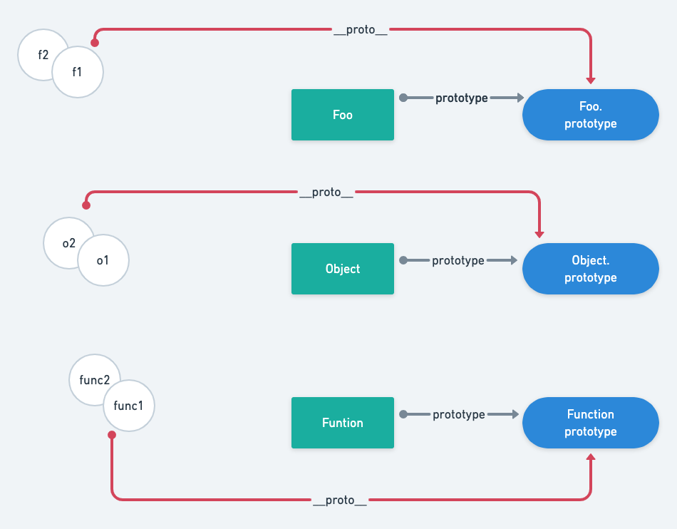
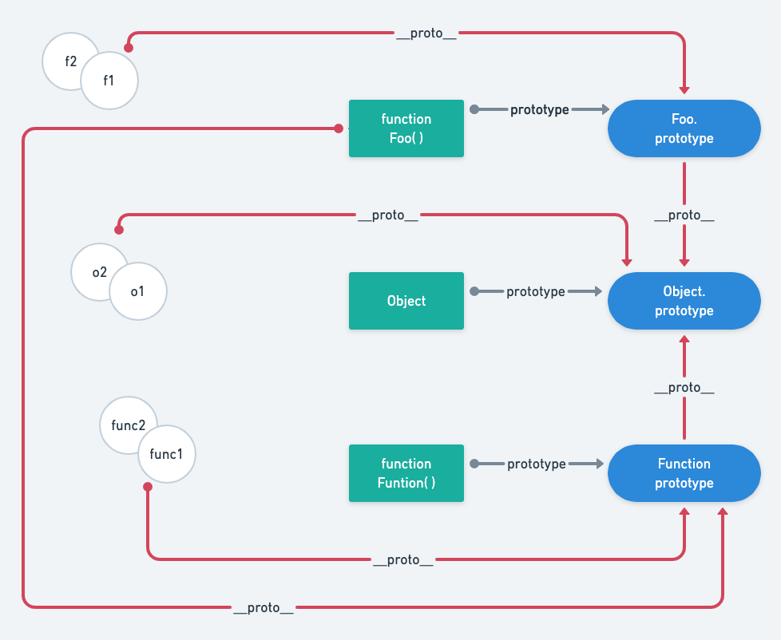
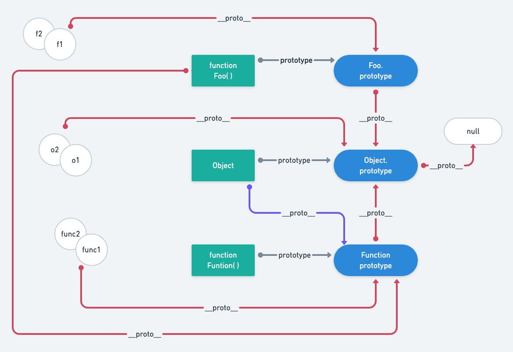
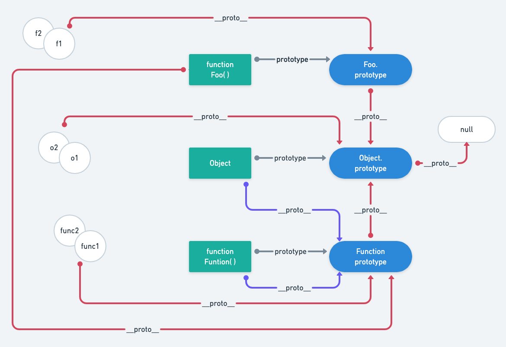

## 前言

&emsp;&emsp;最近复习了原型和原型链，为了更深刻地记住原理，所以便有了这篇文章；本文的目的是由浅及深分析原型和原型链，相信大家对这个图都不陌生：


&emsp;&emsp;要是觉得我啰嗦的话，直接看[总结](#揭秘)。

&emsp;&emsp;那么，就让我们进入海贼(原型)的世界吧！


## 序

&emsp;&emsp;在大海上，有一些臭名昭著的海盗，他们给自己取了一些名号：`Foo`、`Object`、`Function`。传闻他们都有自己的秘宝(`prototype`)，但是他们打不开这个秘宝，这像是大海对他们的一个诅咒：他们永远无法打开自己的秘宝，但是他们的孩子可以。

&emsp;&emsp;大海很大，但也很小，海盗们总会碰个照面，一言不合就是开大，打他个几天几夜的。没有什么东西能够永远保持新鲜感，海盗们最终也对打架厌倦了，打来打去那几个，而且都是只抽(单挑)，他们就开始反思：我好歹都是某片海域的王，凭什么凡事都要亲力亲为？于是他们就萌生了一个看法：招小弟！看着小弟们厮杀，也是一种乐趣。他们就开始拉新人下水，用自己的秘宝(`prototype`)诱惑他们：想要我的秘宝吗？喊我一声老爹，这些都是你们的！

&emsp;&emsp;新人们对秘宝趋之若鹜，纷纷带上了海贼团的印记(`__proto__`)，获得了老爹的秘宝(`prototype`)的使用权。从此，世界开启了海贼大时代！




::: tip 海贼小 tips
+ `__proto__` 就像是一条秘密通道，它通向秘宝(`prototype`)：
```js
function Foo () {}
Foo.prototype.tag = 'Foo'

const f1 = {}
f1.__proto__ = Foo.prototype

console.log(f1.tag)   // 'Foo'
```
+ 海贼无法给自己带上 `__proto__` 印记(谁能认自己做爹？)，因此无法享用自己的秘宝：
```js
function Foo () {}
Foo.prototype.tag = 'Foo'

console.log(Foo.tag)  // undefined
```
:::


## 万国

&emsp;&emsp;两虎相斗必有一伤，总会有一个称王的，另一个想要在新世界立足，就只能暗地里认了爹。`Foo` 就认了 `Function` 做爹，除了 `Foo`，还有 `Bar`、`Baz`、`Array`...他们都认了 `Function` 做爹。于是 `Function` 建立了一个万国大集团，并且重新定义了海贼头头的说法：船长(`function`)。从此，`function` 便成了船长的专属标记，除了一头倔牛(`Object`)，他目前还没认可 `Function`。


::: tip 海贼小 tips
+ 船长们都从万国(`Function`)收获了新秘宝：`call`/`bind`/`apply`
```js
function Foo () {
  console.log(this.tag)
}

const treasure = {
  tag: 'Function'
}

Foo()                 // undefined
Foo.call(treasure)    // 'Function'
console.log(Foo.call) // [Function call]
```
+ 船长们是私下认的爹，他们的孩子们不知道自己有个爷，因此无法窥探万国的秘宝(`Function.prototype`)
```js
function Foo () {}

const f1 = {}
f1.__proto__ = Foo.prototype

console.log(f1.call)  // undefined
f1.call()             // TypeError: f1.call is not a function
```
:::


## 特殊的秘宝

&emsp;&emsp;就像上一回所说的，小海贼们无法找到万国的秘宝(`Function.prototype`)；但是，忽然有一天，他们发现自己的老爹的秘宝(`prototype`)里面，竟然有一条秘密通道，这条通道可以通往 `Object` 的秘宝；于是，外界都知道 `Object` 的秘宝是与众不同的，人们给他取了一个外号：海贼王！



::: tip 海贼小 tips
+ 通过这一条特殊的通道，小海贼们找到了海贼王的秘宝(`Object.prototype`)
```js
function Foo () {}

const f1 = {}
f1.__proto__ = Foo.prototype

console.log(Foo.prototype.hasOwnProperty('toString')) // false

// 通道：f1.__proto__.__proto__ = Object.prototype
console.log(f1.toString)                              // [Function: toString]
```
+ 当然，船长们因为私下认的爹，也间接找到了海贼王的秘宝(`Object.prototype`)
```js
function Foo () {}

console.log(Foo.hasOwnProperty('toString'))           // false
console.log(Foo.prototype.hasOwnProperty('toString')) // false

// 通道：Foo.__proto__.__proto__ = Object.prototype
console.log(Foo.toString)                           // [Function toString]
```
+ 切记，这两个找到海贼王秘宝的方式是不一样的，它们是两条线路；但是这又说明了一个事情：要找到海贼王的秘宝(`Object.prototype`)，必须要认个爹！因为通往海贼王的秘宝的通道就藏在老爹的秘宝里面。
:::


## 终极秘宝

&emsp;&emsp;海贼王(`Object`)对于外人们给他的称号丝毫不在意，他在意的是这个世界的真相：我从哪里来？在处处碰壁之后，有人给他提醒，万国的秘宝与众不同，或许从他哪里能找到一些消息。认爹是不可能的，于是他就伪造了一个印记(`__proto__`)，找到了万国的秘宝(`Function.prototype`)，第一次有可以使用秘宝的权力(假装认了个爹)。更加令他惊讶的是，之所以自己的秘宝与众不同，是因为他的爷爷(假爹也算爹)就是他自己！

&emsp;&emsp;另外，他是世界上第一个进入自己的秘宝的人。当他还沉迷于自己的秘宝的时候，旁人告诉他，这里还有一条密道，但是没有人能够进得去；听完之后，他急忙走到密道跟前，发现上面写着 “终极秘宝” 四个大字，想都没想就走了进去。当他穿过这个通道，看见了一片白茫茫的世界，除了他，什么都没有！这时候，他猛然顿悟：我能来到这里，并不是因为我有多么的特殊，而是这是时代赋予我的使命，我的使命只能走到这里，我无法再往前走，前面的道路不属于我。想到这里，他便哈哈大笑了起来。。。

&emsp;&emsp;他沿原路返回，并告诉通行的人，通往 “终极秘宝” 的方法，并且给他取了一个名字：`null`。至此，所有人都能找到 “终极秘宝”，但是，谁也无法从它那里得知什么。




::: tip 海贼小 tips
+ 海贼王(`Object`)是这样发现自己是自己的爷爷的，并且他现在能使用自己的秘宝(`prototype`)了
```js
console.log(Object.__proto__ === Function.prototype)          // true
console.log(Object.__proto__.__proto__ === Object.prototype)  // true

console.log(Object.hasOwnProperty('toString'))  // false
console.log(Object.toString)                    // [Function toString]
```
+ 至此，基本上所有的海贼(除了 `Function`)都被指引到了终极之路
```js
function Foo() {}

console.log(Foo.__proto__.__proto__.__proto__)      // null
console.log(Object.__proto__.__proto__.__proto__)   // null

const f1 = {}
const f2 = {}
f1.__proto__ = Foo.prototype

console.log(f1.__proto__.__proto__.__proto__)       // null
console.log(f2.__proto__.__proto__)                 // null
```
:::


## 疯狂的万国

&emsp;&emsp;万国(`Function`)听说海贼王通过偷取他的秘宝找到了 “终极秘宝”，非常的愤怒，最终患上了暴怒症。最终有一天，在照镜子的时候，暴怒症发作了！他不停地对着镜子里的自己说：你是我爹，你爹是我...

&emsp;&emsp;然后，结果就是：他成为了自己的爹，而且找到了 “终极秘宝”。从此以后，大家都说他是一个疯子。




::: tip 海贼小 tips
+ 万国(`Function`)是第二个进入自己秘宝的人，因为他能把自己认作爹
```js
console.log(Function.__proto__ === Function.prototype)          // true
console.log(Function.__proto__.__proto__ === Object.prototype)  // true

console.log(Function.call)                                // [Function call]
console.log(Function.prototype.hasOwnProperty('call'))    // true
```
:::


## 新的规则

至此，海贼世界的规则基本上形成了，他们有一些公认的规则，但也有不遵守规则的人。


### new 规则

+ 一个权威的认爹机构，以后想要上船，通过 `new` 就行了
```js
function Foo() {}
Foo.prototype.tag = 'Foo'

const f1 = new Foo()
console.log(f1.tag)   // 'Foo'
```
+ 这样不用自己去申请印记(`__proto__`)，主要是为了解决一些问题：
  + 有些船长认可 `__proto__` 印记，但有些认可 `[[prototype]]` 印记，其实他们是一样的
  + 使用 `new` 的方式让别人看起来更像我的亲儿子(面向对象编程)，这样我也是有亲儿子(继承)的了
+ 海贼世界 6.0 版本(ES6)后，又出现了新的认爹规则，但其实都是换汤不换药：[ES6 Class]()


### instanceof 规则

+ 一个老爹检测机构，在大海上需要别人给个面子的时候，只有通过这个检测别人才会承认你的继承资格，而且它只会检测印记(`__proto__`)
```js
function Foo() {}
const f1 = new Foo()

console.log(f1 instanceof Foo)    // true
console.log(f1 instanceof Object) // true
```
+ 有一个叫 “蒂奇” 的海贼反水，自立为王了：
```js
function Foo() {}
const f2 = new Foo()

f2.__proto__ = Object.prototype

console.log(f2 instanceof Foo)    // false
console.log(f2 instanceof Object) // true
```


### prototype 规则

+ 谨记，秘宝是老爹给孩子们(实例)的奖励(交易)，老爹自己无法访问，除了海贼王(`Object`)和万国(`Function`)
+ 为了区分船长(构造函数)和万国队长(普通函数)，约定了船长(构造函数)的名字要大写
```js
// 构造函数
function Foo(){}
// 普通函数
function foo (){}
```


### constructor 规则

+ 为了让海贼世界更加稳定，秘宝也被贴上了一个标签(`constructor`)，它表示这个秘宝的主人是谁
```js
function Foo() {}
console.log(Foo.prototype.constructor === Foo)  // true
```


### Object 规则

+ 这不算是规则，只是到了海贼 6.0(ES6)时代，海贼王(`Object`)为了让海贼世界更加稳定，定义了一系列的规则(方法)
+ `Foo.prototype.isPrototypeOf(f1)`：相当于 `f1 instanceof Foo`
+ `Object.setPrototypeOf(f1, Foo.prototype)`：相当于 `f1.__proto__ = Foo.prototype`


## 总结

啰里八嗦了这么久，就稍微总结一些吧：

+ **原型**：就是原型对象(prototype)，这个属性是所有构造函数都有的，定义所有子实例共享的内容，它是原型链的基础
+ **原型链**：以 `__proto__` 作为链条，以相关的原型作为节点组装成的关系链；子实例可以通过这条关系链，找到更多共享的内容
+ **两条原型链**：作为对象的原型链，作为函数的原型链；如果一个数据结构不是函数，那么只有一条原型链
  + 作为函数的原型链：主要是为了使用 `Function` 原型上的 `call`/`bind`/`apply` 等方法
  + 作为对象的原型链：主要是为了使用 `Object` 原型上的一众方法
+ **构造函数**：实际上就是一个函数，但一用上 `new` 操作符，就变成了构造函数，一般来说，规定首字母大写
+ **继承**：学习过其他语言的话，对 js 的继承会很不习惯；
  1. 它可以通过[多种方式实现继承](./es-implement-extend-patterns)，但是原理都是一样的，即：**基于原型，需要什么就去原型(原型链)上面找**
  2. 基于原型的继承中，我们对 A 继承于 B 不感兴趣，只对 a 继承于 A 和 B 感兴趣
+ **原型链顶端**：这时一个先有 `Object` 还是先有 `Function` 的问题；实际上，当没有添加最后两条指向(紫色 `__proto__`)的时候，很难解析谁才是原型链的顶端，这时候可以看作有三个顶端：`Object`、`Function` 和 `null`，它们之间没有任何关系。所以：
  1. 设置 `Object.__proto__ = Function.prototype`：`Object` 会先后获取到 `Function` 和他自身的原型，从而可以到达顶端 `null`
  2. 设置 `Function.__proto__ = Function.prototype`：`Function` 会先后获取到他自身和 `Object` 的原型，从而可以到达顶端 `null`
  3. 所以可以理解原型链的顶端是 `null`，而 `Object` 和 `Function` 是同时出现的，它们共同协作构造了这样一个原型体系
