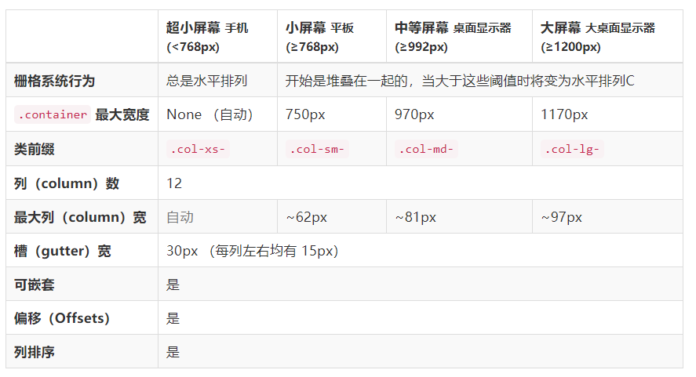

## 开始

### 介绍

+ [Bootstrap](https://v3.bootcss.com/) 用于开发响应式布局、移动设备优先的 WEB 项目

### 使用

+ CDN
```html
<!-- 最新版本的 Bootstrap 核心 CSS 文件 -->
<link rel="stylesheet" 
  href="https://cdn.jsdelivr.net/npm/bootstrap@3.3.7/dist/css/bootstrap.min.css" 
  integrity="sha384-BVYiiSIFeK1dGmJRAkycuHAHRg32OmUcww7on3RYdg4Va+PmSTsz/K68vbdEjh4u" 
  crossorigin="anonymous"
>

<!-- 可选的 Bootstrap 主题文件（一般不用引入） -->
<link rel="stylesheet" 
  href="https://cdn.jsdelivr.net/npm/bootstrap@3.3.7/dist/css/bootstrap-theme.min.css" 
  integrity="sha384-rHyoN1iRsVXV4nD0JutlnGaslCJuC7uwjduW9SVrLvRYooPp2bWYgmgJQIXwl/Sp" 
  crossorigin="anonymous"
>

<!-- 最新的 Bootstrap 核心 JavaScript 文件 -->
<script 
  src="https://cdn.jsdelivr.net/npm/bootstrap@3.3.7/dist/js/bootstrap.min.js" 
  integrity="sha384-Tc5IQib027qvyjSMfHjOMaLkfuWVxZxUPnCJA7l2mCWNIpG9mGCD8wGNIcPD7Txa" 
  crossorigin="anonymous"
></script>
```

+ npm 安装
```powershell
npm install bootstrap@3
```

## 全局 CSS 样式

### 移动设备优先

在 `<head>` 添加 `viewport` 元数据标签：
```html
<!-- 常用的设置 -->
<meta name="viewport" content="width=device-width,initial-scale=1">

<!-- 禁用缩放功能，更贴近原生应用 -->
<meta name="viewport" content="width=device-width,initial-scale=1,maximum-scale=1,user-scalable=no">
```

### 布局容器

+ `.container` 用于固定宽度并支持响应式布局的容器
+ `.container-fluid` 用于 100% 宽度，占据全部视口（viewport）的容器

```html
<div class="container"></div>

<div class="container-fluid"></div>
```

::: tip 说明：
+ 由于 `padding` 等属性的原因，这两种容器类不能互相嵌套
:::


### 栅格系统

+ **栅格参数：**



+ **类名参考**：
  + 创建行：`.row`
  + 创建列：`.col-xs/sm/md/lg-*` (*为1~12)
  + 列偏移：`.col-xs/sm/md/lg-offset-*` (*为偏移的列数)
  + 列排序：`.col-xs/sm/md/lg-push-*`/`.col-xs/sm/md/lg-pull-*` 分别为向右/向左偏移

::: tip 说明：
+ 约定：行必须包含在布局容器或嵌套于列中；列必须包含在行中
```html
<div class="container">
  <div class="row">
    <div class="col-md-4">col-md-4</div>
    <div class="col-md-4">col-md-4</div>
    <div class="col-md-4">
      <div class="row">
        <div class="col-md-8">col-md-8</div>
        <div class="col-md-4">col-md-4</div>
      </div>
    </div>
  </div>
</div>
```
+ 列偏移：
```html
<div class="row">
  <div class="col-md-4">col-md-4</div>
  <div class="col-md-4 col-md-offset-4">col-md-4</div>
</div>
```
+ 列排序：`push` 向右偏移，`pull` 向左偏移
```html
<div class="row">
  <div class="col-md-8 col-md-push-4">col-md-8</div>
  <div class="col-md-4 col-md-pull-8">col-md-4</div>
</div>
```
+ 列嵌套：在列中使用行
+ 列间隔：为列设置 `padding` 属性
+ 列折行：一行的列数大于 12 时多余的列另起一行排列
:::


### 排版

**类名**：
+ 副标题：`.small` 或 `<small>`（包含在 `<h1>~<h6>` 中）
+ 突出段落：`.lead`
+ 内联文本：相当于原生标签
  + 背景高亮：`<mark>`
  + 删除：`<del>`
  + 无用：`<s>`
  + 插入：`<ins>`
  + 下划线：`<u>`
  + 强调：`<strong>`
  + 斜体：`<em>`
  + 小号：`<small> ` 或 `.small`
+ 对齐：`.text-left/right/center/justify/nowrap`
+ 大小写：`.text-lowercase/uppercase/capitalize`
+ 缩略语：`.initialism`（`<abbr>` 中）
+ 地址：行结尾添加 `<br>`
+ 引用
  + 默认的 `<blockquote>`
  + 添加 `<footer>` 和 `<site>`
  + 右对齐：`.blockquote-reverse` 
+ 列表
  + 无样式列表：`.list-unstyled`（`<ul> ` 中）
  + 内联列表：`list-inline`（`<ul>` 中）
  + 水平排列的描述列表：`.dl-horizontal`（`<dl>` 中）


### 代码

+ 内联代码：`<code>`
+ 用户输入：`<kbd>`
+ 代码块：`<pre>`（尖括号要转义）
+ 变量：`<var>`
+ 程序输出：`<samp>`


### 表格

+ 基本样式：`.table`（`<table>` 中）
+ 条纹：`.table-striped`（`<table>` 中）
+ 边框：`.table-bordered`（`<table>` 中）
+ 鼠标悬停效果：`.table-hover`（`<table>` 中）
+ 紧凑：`.table-condensed`（`<table>` 中）
+ 状态：`.active`/`.success`/`.info`/`.warning`/`.danger`（`<tr>`，`<th>`，`<td>` 中）
+ 响应式：`.table-responsive`（`<table>` 中）


### 表单

+ 组织 `<label>` 和 `<input>`：`.form-group`（父级 `<div>`）
+ 占据整行：`.form-control`
+ 内联表单：`.form-inline`（`<form>`）
+ 块级表单：`.form-horizontal`（`<form>`）
+ addon：`.input-group-addon` （单个元素）
+ 输入框组：`.input-group`（父级 div 包裹元素）
+ 多行文本行数：设置 `rows` 属性
+ 内联选择框：`.checkbox-inline/.radio-inline`（`<label>`）
+ 静态纯文本：`.form-control-static`
+ 帮助文本：`.help-block`
+ 状态：`disabled`/`readonly` 属性
+ 校验状态：`.has-warning/error/success`
+ 表单组尺寸：`.form-group-sm/lg`
+ 控件尺寸：用 `.input-sm/lg` 设置高度，用栅格列属性设置宽度
+ 额外的图标：`.has-feedback`（父元素），`.form-control-feedback`（图标子元素）

::: tip 说明：
+ 设置了 `.form-control` 类的 `<input>`/`<textarea>`/`<select>` 宽度默认为 100%
:::

### 按钮

+ 基础类：`.btn`
+ 预定义样式：`.btn-default/primary/success/info/warning/danger/link`
+ 尺寸：`.btn-xs/sm/lg`
+ 块级：`.btn-block`（等于父元素宽度）
+ 激活状态：`.active`
+ 禁用状态：`.disabled`

::: tip 说明：
+ `<a>`/`<button>`/`<input>` 都能应用按钮样式
+ 导航和导航条组件只支持 `<button>` 元素
+ 如果 `<a>` 元素被作为按钮使用，务必设置 `role="button"` 属性
:::


### 图片

+ 响应式：`.img-responsive`
+ 图片居中：`.center-block`
+ 图片形状：`.img-rounded/circle/thumbnail`


### 辅助类

+ 情景文本：`.text-muted/primary/success/info/warning/danger`
+ 情景背景色：`.bg-primary/success/info/warning/danger`
+ 关闭按钮：`.close` 并设置文本内容为 `&times;`
+ 三角符号：`.caret`
+ 快速浮动：`.pull-right/left`（不能用于导航条中）
+ 内容块居中：`.center-block`
+ 清除浮动：`.clearfix`
+ 显示/隐藏：`.show/.hidden`
+ 图片替换：`.text-hide`
+ 屏幕阅读器：`.sr-only`/`.sr-only-focusable`


## 组件

### 图标

[Glyphicons 字体图标](https://v3.bootcss.com/components/#glyphicons)

+ 基础：`.glyphicon`  
+ 特定：`.glyphicon-*`

```html
<span class="glyphicon glyphicon-eur"></span>
```


### 按钮组

+ 基础：`.btn-group`（父元素），可嵌套使用
+ 按钮工具栏：`.btn-toolbar`（父元素），用于组合 `.btn-group`
+ 尺寸：`.btn-group-xs/sm/lg`
+ 垂直排列：`.btn-group-vertical`
+ 占据整行排列：`.btn-group-justified`


### 输入框组

+ 基础：`.input-group`（父元素）
+ 前/后缀：`.input-group-addon`
+ 尺寸：`.input-group-sm/lg`
+ 其他：`.input-group-btn`


### 导航

+ 基础：`.nav`（`<ul>`）
+ 标签页：`.nav-tabs`（`<ul>`）
+ 胶囊式：`.nav-pills`（`<ul>`）
+ 垂直方向：`.nav-stacked`（`<ul>`）
+ 两端对齐：`.nav-justified`（`<ul>`）
+ 禁用：`.disabled`（`<li>`）


### 导航条

+ 基础：`.navbar`
+ 样式：`.navbar-default`
+ 头部：`.navbar-header`
+ 品牌图标：`.navbar-brand`
+ 表单：`.navbar-form`
+ 按钮：`.navbar-btn`
+ 文本：`.navbar-text`
+ 非导航链接：`.navbar-link`
+ 排列：`.navbar-left/right`
+ 固定：`.navbar-fixed-top/bottom`
+ 静止在顶部：`.navbar-static-top`
+ 反色：`.navbar-inverse`


### 分页

+ 基础：`.pagination`（`<ul>`）
+ 尺寸：`.pagination-xs/lg`（`<ul>`）
+ 翻页标记：`.pager`（`<ul>`）
+ 翻页两端对齐：`.previous`/`.next`（`<li>`）
+ 状态：`.active`/`disabled`（`<li>`)


### 标签

+ 基础：`.label`
+ 背景色：`.label-default/primary/success/info/warning/danger`


### 警告框

+ 基础：`.alert`
+ 背景色：`.alert-success/info/warning/danger`


### 进度条

+ 基础：`.progress`（父元素），`.progress-bar`（子元素）
+ 当前进度：设置内联样式属性 `style` 或 `min-width`（子元素）
+ 情景色：`.progress-bar-success/info/warning/danger`（子元素）
+ 条纹：`.progress-bar-striped`（子元素）
+ 动画：`.active`（子元素）
+ 堆叠：将多个 `.progress-bar` 的元素放于同一个 `.progress` 元素中


### 列表组

+ 基础：`.list-group`（父元素），`.list-group-item`（子元素）
+ 状态：`.disabled`/`.active`
+ 情景色：`.list-group-item-success/info/warning/danger`


### 面板

+ 基础：`.panel`（父元素）
+ 情景色：`.panel-default/primary/success/info/warning/danger`（父元素）
+ 分级：`.panel-heading/body/footer`/`.panel-title`（子元素）
+ 其他：插入表格 / 列表组 


### Well

+ 基础：`.well`
+ 尺寸：`.well-sm/lg`


### 其他

+ 面包屑导航：`.breadcrumb` 
+ 徽章：`.badge`
+ 巨幕：`.jumbotron`
+ 页头：`.page-header`

::: tip 说明：
+ 要让巨幕组件的宽度与浏览器宽度一致并且没有圆角，把此组件放在所有 `.container` 元素的外面，并在组件内部添加一个 `.container` 元素
+ 页头组件能够为 `h1` 标签增加适当的空间，并且与页面的其他部分形成一定的分隔
:::


## 插件

+ [模态框](https://v3.bootcss.com/javascript/#modals)
+ [下拉菜单](https://v3.bootcss.com/javascript/#dropdowns)
+ [滚动监听](https://v3.bootcss.com/javascript/#scrollspy)
+ [标签页](https://v3.bootcss.com/javascript/#tabs)
+ [工具提示](https://v3.bootcss.com/javascript/#tooltips)
+ [弹出框](https://v3.bootcss.com/javascript/#popovers)
+ [警告框](https://v3.bootcss.com/javascript/#alerts)
+ [按钮](https://v3.bootcss.com/javascript/#buttons)
+ [折叠](https://v3.bootcss.com/javascript/#collapse)
+ [轮播](https://v3.bootcss.com/javascript/#carousel)

::: tip 说明：
+ 可以单个引入，或一次性全部引入
+ 所有插件都依赖 `jQuery`，因此必须先引入 `jQuery`
:::