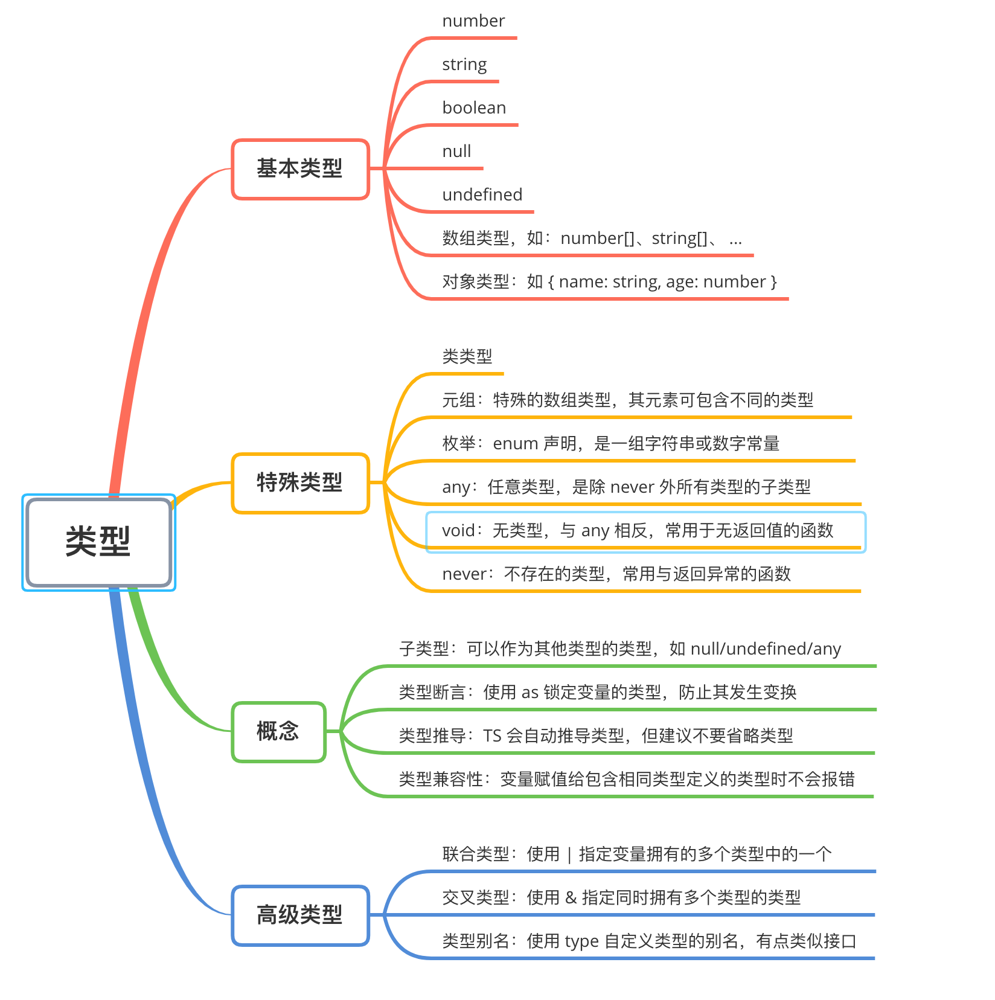

## 简介

+ [TypeScript](https://typescript.bootcss.com/)
+ 参考：
  + [TS in JS 实践指北](https://juejin.cn/post/6844904030221631501)
  + [一文读懂 TypeScript 泛型及应用（ 7.8K字）](https://juejin.cn/post/6844904184894980104)
+ 官方提供了详尽的文档，但我们应全面地理解一些内容
  1. 为什么使用
  2. 怎样在项目中使用


### 为什么使用


## 强类型

+ 参考图：




### 基本类型

+ 很多人对 TS 的第一印象都是强类型，毫无疑问，它是 TS 最吸引人的一个特点
+ 基本数据类型，都是 JS 支持的
```ts
let num: number = 100             // 支持 2/8/10/16 进制的浮点数
let str: string = 'hello'         // 支持单引号、双引号、模板字符串
let bool: boolean = true          // true | false
let nill: null = null             // 仅 null
let unde: undefined = undefined   // 仅 undefined
let arr: number[] = [1, 2, 3]     // 数组元素必须唯一，否则可以使用元组
let obj: { a: string } = { a: 'hello' }   // 对象类型(不是类类型)，需要为每个属性指定类型，建议使用接口
```

::: tip 子类型：
+ 指该类型可以赋值给它的父类型变量，如 `null`/`undefined` 默认是所有类型的子类型
+ 当指定了 `--strictNullChecks` 标记，`null`/`undefined` 便只能赋值给 `void` 和它们自身；鼓励尽可能使用 `--strictNullChecks`
```ts
let a: string = 'hello'
a = null      // 允许
a = undefined // 允许

let b: null = null
b = 'hello'   // 报错

// 开启 --strictNullChecks
let c: string = 'world'
c = null      // 报错
```
:::


### 类类型

+ 使用 `Object`/`object` 关键字都是允许的

::: tip 备注：
+ 注意区分包装类类型(`String`/`Number`/`Boolean`)和基础类型(`string`/`number`/`boolean`)的区别
```js
// 可以将 string 类型赋值给 String 类型
let s1: String = new String('hello')
s1 = 'world'  // 正常

// 不能将 String 类型赋值给 string 类型
let s2: string = 'hello'
s2 = new String('world')  // 报错

// 结论：可以理解 string 等基础类型是其包装类类型的子类型
```
:::


### 元组

+ 元组(turple)允许一个数组有不同类型的数据(数组只能为同一类型)：
```ts
// 在 ts 中，数组类型内的元素都是同一种类型，若要在数组中保存不同类型的数据，必须将其定义为元组类型
let tur: [number, string] = [12, '12']

// 元组会将它的元素约束为指定的类型，并且前几个元素的类型必须匹配，而其他的元素则兼容声明的所有类型
let t1: [number, string] = [12, '12']
t1.push(1)
t1.push('1')
t1.push(true) // 报错，没有指定包含 boolean 类型

let t2: [number, string] = [12, 12] // 报错，第二个元素必须为 string 类型
```

### 枚举

+ 枚举是使用 `enum` 关键字声明的一组常量(支持数组常量或字符串常量)：
```ts
enum server {
  TEST = '/api/',
  SERVE = '/example.com/'
}
server.TEST   // '/api/'

// 枚举值有默认的初始值(0)和自增值(1)
enum e { a, b, c = 10, d }

e.a   // 0
e.b   // 1
e.c   // 10
e.d   // 11
```


### any & void & never

+ `any` 表示任意类型，它是除了 `never` 外的所有类型的子类型(注意不要滥用 `any`)
```ts
// 当不想使用元组的时候，使用 any 是一个简单的方法
let arr: any[] = [1, '2', true]
```

+ `void` 表示没有任何类型(与 `any` 相反)，常用于无返回值的函数
```ts
function logger(str: string): void {
  console.log(str)
}

// 声明一个 void 类型的变量只能它赋值为 undefined 和 null
let a: void
a = null
a = undefined
a = 12  // 报错
```

+ `never` 表示永不存在的值的类型，常用于总是会抛出异常或根本就不会有返回值的函数
```ts
// 异常函数
function error(message: string): never {
  throw new Error(message)
}

// never 类型是任何类型(包括它自己)的子类型，可以赋值给任何类型
let n: string = 'hello'
n = error('error')
```


### 交叉类型

+ 可以拥有多种类型的类型，使用 `&` 连接，语法为 `T & U & P`
```ts
function extend<T, U>(first: T, second: U): T & U {
  let result = <T & U>{}
  for (let id in first) {
    (<any>result)[id] = (<any>first)[id];
  }
  for (let id in second) {
    if (!result.hasOwnProperty(id)) {
      (<any>result)[id] = (<any>second)[id]
    }
  }
  return result
}

class Person {
  constructor(public name: string) { }
}
interface Loggable {
  log(): void
}
class ConsoleLogger implements Loggable {
  log() {
    console.log('Hello World!')
  }
}

const jim = extend(new Person('Jim'), new ConsoleLogger())

console.log(jim.name)
jim.log()
```


::: tip 提示
+ 这种特性常用于创建 `mixins`
:::


### 联合类型

+ 一个值可以是几种类型之一，用 `|` 分隔每个类型，语法为 `string | number | boolean`
```ts
function padLeft(value: string, padding: string | number) {
  if (typeof padding === 'number') {
    return Array(padding + 1).join(' ') + value
  }
  if (typeof padding === 'string') {
    return padding + value
  }
  throw new Error(`Expected string or number, got '${padding}'.`)
}
```

::: tip 说明：
+ 可用于规定函数参数的类型或返回值类型，比 `any` 更细粒度
:::


### 类型别名

+ 使用 `type` 关键字定义类型别名
```ts
type Name = string
type Container<T> = { value: T }
type LinkedList<T> = T & { next: LinkedList<T> }
```

::: tip 说明：
+ 类型别名与接口有类似的功能，都能用于规定类型，但是它没有 `extends` 和 `implements` 的特性（**建议尽量使用接口代替类型别名，除非无法通过接口来描述一个类型并且需要使用联合类型或元组类型**）
+ 类型别名不能出现在声明右侧的任何地方:
```ts
type Yikes = Array<Yikes> // error
```
+ 交叉类型一起使用，可以创建出一些稀奇古怪的类型:
```ts
type LinkedList<T> = T & { next: LinkedList<T> }

interface Person {
    name: string
}

var people: LinkedList<Person>
var s = people.name
var s = people.next.name
var s = people.next.next.name
var s = people.next.next.next.name
```
+ 创建特定的枚举类型：
```ts
type Easing = 'ease-in' | 'ease-out' | 'ease-in-out'
```
:::


### 其他

+ **类型断言**：在对 `any` 类型的变量进行操作时，常常需要确保一个变量的类型，才能使操作更安全
```ts
// 两种方式使用类型断言
// 1.尖括号
let str: any = 'this is a string'
let len: number = (<string>str).length

// 2.as(建议使用，因为 JSX 只支持该方式，为了保证统一性)
let str: any = 'this is a string'
let len: number = (str as string).length
```

+ **类型兼容性**：如果 x 要兼容 y，那么 y 至少具有与 x 相同的属性
```ts
interface Named {
  name: string
}

class Person {
  name: string
}

let p: Named
p = new Person()  // 允许，因为 Person 实例拥有和 Named 接口相同的属性
```


## 接口

+ [接口](https://typescript.bootcss.com/interfaces.html)的作用是对值所具有的结构进行类型检查，可以类比为一个对象的类型检查
```ts
interface Person {
  name: string
  age: number
}

const p1: Person = { name: 'Alice', age: 24 }   // 正常
const p2: Person = { name: 'Alice', age: '22' } // 报错，age 不是 number
```

+ 还可以用来描述函数的参数类型和返回值
```ts
interface SearchFunc {
  (source: string, subString: string): Boolean
}

let mySearch: SearchFunc = (source, subString) => source.indexOf(subString) > -1
console.log(mySearch('hello', 'llo')) // true
```

+ 避免传入可选属性时的警告，可以在传入参数时使用 `as` 断言作属性检测
```ts
interface SquareConfig {
  color?: string
  width?: number
}

function createSquare(config: SquareConfig): { color: string, width: number } {
  const color = config.color || 'white'
  const width = config.width || 100
  return { color, width }
}

// 使用 as 断言检测属性，避免传入不符合的属性时出现警告
createSquare({ color: 'black', width: 200, other: '' } as SquareConfig)
```

::: tip 其他特性：
+ **可选属性**：语法为 `name?: string`
+ **只读属性**：语法为 `readonly name: string`，还可以使用 `ReadonlyArray<T>` 指定只读的数组
+ 对于 `readonly` 和 `const`，建议作为常量声明时使用 `const`，作为属性时使用 `readonly`
:::


### 类实现接口

+ 一个类可以通过实现(`implements`)接口去扩充自身的功能(有点类似 `mixin`)
```ts
interface ClockInterface {
  currentTime: Date
  setTime(d: Date)
}

class Clock implements ClockInterface {
  currentTime: Date
  setTime(d: Date) {
    this.currentTime = d
  }
  constructor(h: number, m: number) { }
}
```


### 接口继承接口

+ 接口之间的继承只是成员的简单复制，一个接口可以继承多个接口
```ts
interface Shape {
  color: string
}
interface PenStroke {
  penWidth: number
}
interface Square extends Shape, PenStroke {
  sideLength: number
}

let square = <Square>{}
square.color = 'blue'
square.sideLength = 10
square.penWidth = 5.0
```


### 接口继承类

+ 若接口从类中继承了私有属性，则只有该类的子类才能实现该接口
```ts
class Control {
  private state: any
}

interface SelectableControl extends Control {
  select(): void
}

class Button extends Control implements SelectableControl {
  select() { }
}

// Error: Property 'state' is missing in type 'Image'.
class Image implements SelectableControl {
  select() { }
}
```


### 混合多种类型

+ 可同时作为一个对象或一个函数
```ts
interface Counter {
  (start: number): string
  interval: number
  reset(): void
}

function getCounter(): Counter {
  let counter = <Counter>function (start: number) { }
  counter.interval = 123
  counter.reset = function () { }
  return counter
}

let c = getCounter()
c(10)
c.reset()
c.interval = 5.0
```


## 泛型

+ [泛型](https://typescript.bootcss.com/generics.html)可以用来创建可重用的组件，一个组件可以支持多种类型的数据
```ts
function identity<T>(arg: T): T {
  return arg
}

// 1.显式指定类型
let output = identity<string>('myString')
// 2.自动推断类型
let output = identity('myString')
```

::: tip 说明：
+ 泛型具有强类型和动态语言的灵活性，使一个组件能应用于不同的数据类型
+ 使用泛型时可以不指定类型，编译器会自动推导类型
:::


### 泛型接口

+ 可以使用泛型接口来锁定函数调用时的参数类型
```ts
interface GenericIdentityFn<T> {
  (arg: T): T
}

function identity<T>(arg: T): T {
  return arg
}

// 现在 myIdentity 是一个接收 number 类型参数的函数
let myIdentity: GenericIdentityFn<number> = identity
console.log(myIdentity(100))  // 100
```


### 泛型类

```ts
class GenericNumber<T> {
  zeroValue: T
  add: (x: T, y: T) => T
}

let myGenericNumber = new GenericNumber<number>()
myGenericNumber.zeroValue = 0
myGenericNumber.add = function(x, y) { return x + y }
```

::: danger 注意：
+ 泛型类指的是实例部分的类型，所以**类的静态属性不能使用这个泛型类型**
:::


### 泛型约束

+ 接口约束：通过将泛型实现接口来对泛型进行约束
```ts
interface Lengthwise {
  length: number
}

// 泛型必须实现 Lengthwise 接口，因此始终能访问 arg.length 属性
function loggingIdentity<T extends Lengthwise>(arg: T): T {
  console.log(arg.length)
  return arg
}
```

+ 泛型类型参数约束：使用 `keyof` 引用泛型类型的所有键
```ts
function getProperty<T, K extends keyof T>(obj: T, key: K) {
  return obj[key]
}

let x = { a: 1, b: 2, c: 3, d: 4 }
getProperty(x, 'a') // okay
getProperty(x, 'm') // error
```

+ 类类型约束：引用构造函数的类类型约束构造函数与类实例的关系
```ts
function create<T>(c: { new(): T }): T {
  return new c()
}
```


### 什么时候使用

+ 当函数、接口、类将处理多种数据类型时
+ 当函数、接口、类在多个地方使用该数据类型时


## 函数

+ [函数](https://typescript.bootcss.com/functions.html)支持 ES6 的所有语法，而且扩展了强类型、函数参数控制、函数重载等特性
+ 显式指定参数类型和返回值类型：
```ts
let myAdd = (x: number, y: number): number => x + y
```

+ 不返回任何值的函数的返回值类型为 `void`：
```ts
function sayHi(name: string): void {
  console.log(`Hello ${name}!`)
}
```

+ 不指定返回值类型时，会按照上下文类型推断出返回值类型：
```ts
// 根据参数推断返回值类型为 number
let myAdd: (baseValue: number, increment: number) => number =
    function(x, y) { return x + y }
```

+ 除了支持 ES6 的默认参数和剩余参数外，还支持可选参数：
```ts
function sayHi(name?: string) {
  if (name) {
    console.log(`Hello ${name}!`)
  } else {
    console.log('Hello World!')
  }
}
sayHi()         // Hello World!
sayHi('Alice')  // Hello Alice!


function buildName(prefix = 'Hello ', firstName: string, ...restOfName: string[]) {
  return prefix + firstName + ' ' + restOfName.join(' ')
}
let employeeName = buildName(undefined, 'Joseph', 'Samuel', 'Lucas', 'MacKinzie')
console.log(employeeName)   // Hello Joseph Samuel Lucas MacKinzie
```

+ 另一个强大的功能是可以模拟函数重载：为同一个函数提供多个函数类型定义来进行函数重载，**但必须在返回值类型为 `any` 的函数进行处理并返回结果**
```ts
function pickCard(x: { suit: string; card: number; }[]): number // 函数重载
function pickCard(x: number): { suit: string; card: number }    // 函数重载
// 实际上处理结果的函数，组织函数调用逻辑
function pickCard(x): any {
  if (typeof x == 'object') {
    let pickedCard = Math.floor(Math.random() * x.length)
    return pickedCard
  } else if (typeof x == 'number') {
    let pickedSuit = Math.floor(x / 13)
    return { suit: suits[pickedSuit], card: x % 13 }
  }
}

const suits = ['hearts', 'spades', 'clubs', 'diamonds']
const myDeck = [
  { suit: 'diamonds', card: 2 }, 
  { suit: 'spades', card: 10 }, 
  { suit: 'hearts', card: 4 }
]

let pickedCard1 = myDeck[pickCard(myDeck)]
console.log('card: ' + pickedCard1.card + ' of ' + pickedCard1.suit) // card: 4 of hearts
let pickedCard2 = pickCard(15)
console.log('card: ' + pickedCard2.card + ' of ' + pickedCard2.suit) // card: 2 of spades
```


## 类

+ [类](https://typescript.bootcss.com/classes.html)支持 ES6 `Class`，但扩展了强类型、成员修饰符、抽象类等特性
+ 属性修饰符

|访问范围|本类|派生类|备注|
|-|-|-|-|
|`public`|☑️|☑️|公有属性，默认，可缺省|
|`protected`|☑️|☑️|受保护属性|
|`private`|☑️|✖️|私有属性|
|`readonly`|-|-|只读属性，必须在声明时或构造函数里被初始化|


::: tip 说明：
+ 构造函数也能被声明为 `protected`，意味着这个类不能在类外部实例化，但能被继承，可用于创建一个不能实例化的基类
+ 在构造函数中使用参数界限，会同时初始化一个同名成员（虽然简便，但觉得很容易被忽略）：
```ts
class Animal {
  constructor(private name: string) { } // 默认初始化了一个名为 name 的成员变量
  move(distanceInMeters: number) {
    console.log(`${this.name} moved ${distanceInMeters}m.`)
  }
}
```
:::


+ 抽象类包含了成员的实现细节，通常作为其他类的基类使用，使用 `abstract` 定义一个抽象类，而且：
  + 可以创建抽象类的引用，但**不能实例化抽象类**
  + 继承抽象类的子类必须**实现抽象类的所有抽象方法**
  + 继承抽象类的子类必须**在构造函数中调用 `super()`**

```ts
abstract class Department {
  constructor(public name: string) {}
  printName(): void {
    console.log('Department name: ' + this.name)
  }
  abstract printMeeting(): void
}

class AccountingDepartment extends Department {
  constructor() {
    // 必须调用 super()
    super('')
  }
  // 必须实现所有抽象方法
  printMeeting(): void {
    console.log('The Accounting Department meets each Monday at 10am.')
  }
  // 可选：扩展自身的方法
  generateReports(): void {
    console.log('Generating accounting reports...')
  }
}
```


## 装饰器

+ 装饰器是一个表达式，其执行后返回一个函数
+ 该函数的参数分别为 `target`, `name`, `descriptor`
+ 执行该函数后，可能返回 `descriptor` 对象，用于配置 `target` 对象


### 类装饰器
### 属性装饰器
### 方法装饰器
### 参数装饰器


## 其他

### 模块

### 命名空间


### 声明合并


### 混入


### JSX


## 在项目中使用

### 安装

+ 全局安装 `typescript`，然后可以使用 `tsc` 命令
```sh
$ npm install -g typescript
$ tsc -v  # Version 3.9.7
```

+ 命令行编译
```sh
# 编译单个文件
$ tsc test.ts

# 监听修改并实时编译
$ tsc test.ts -w
```


### 配置 tsconfig.json

+ 用于指示编译选项和需要编译的文件列表，一般作为配置文件放置于项目根目录
+ 字段说明：
  + `extends`：指定需要继承的配置文件
  + `compileOnSave`：告知 IDE 在保存文件时重新编译
  + `compilerOptions`：[编译选项列表](https://typescript.bootcss.com/compiler-options.html)，缺省时会使用默认的编译选项
  + `files`：需要编译的 ts 文件列表
  + `include`：匹配文件列表
  + `exclude`：排除文件列表

::: tip include/exclude 支持的 glob 通配符
+ `*`：匹配任意个字符（不包括目录分隔符）
+ `?`：匹配一个字符（不包括目录分隔符）
+ `**/`：递归匹配任意子目录
:::

::: warning 注意
+ `files` 和 `include` 同时使用时，会合并两者
+ `files` 的优先级高于 `exclude`，即 `files` 内的文件不能被排除
+ `exclude` 默认会排除一些目录：`node_module`, `bower_components`, `jspm_packages`, `<outDir>`
+ 命令行上指定的编译选项优先级高于 tsconfig.json 设置相应选项
:::


+ 使用 `files` 指定需要编译的文件列表
```json
{
  "compileOnSave": true,    // 保存时重新编译
  "compilerOptions": {
    "module": "commonjs",
    "noImplicitAny": true,
    "removeComments": true,
    "preserveConstEnums": true,
    "sourceMap": true
  },
  "files": [
    "core.ts",
    "sys.ts",
    "types.ts",
    "scanner.ts",
    "parser.ts",
    "utilities.ts",
    "binder.ts",
    "checker.ts",
    "emitter.ts",
    "program.ts",
    "commandLineParser.ts",
    "tsc.ts",
    "diagnosticInformationMap.generated.ts"
  ]
}
```

+ 使用 `include`/`exclude` 匹配/排除文件
```json
{
  "compileOnSave": true,    // 保存时重新编译
  "compilerOptions": {
    "module": "system",
    "noImplicitAny": true,
    "removeComments": true,
    "preserveConstEnums": true,
    "outFile": "../../built/local/tsc.js",
    "sourceMap": true
  },
  "include": [
    "src/**/*"
  ],
  "exclude": [
    "node_modules",
    "**/*.spec.ts"
  ]
}
```


### VS Code 配置

+ 直接运行 `.ts` 脚本
```sh
# 1. 搜索并安装 Code Runner 插件
# 2. 全局安装 ts-node
$ npm i ts-node -g
# 3. 在目标 ts 文件中，右键选择运行即可
```


### .d.ts

+ `.d.ts` 


