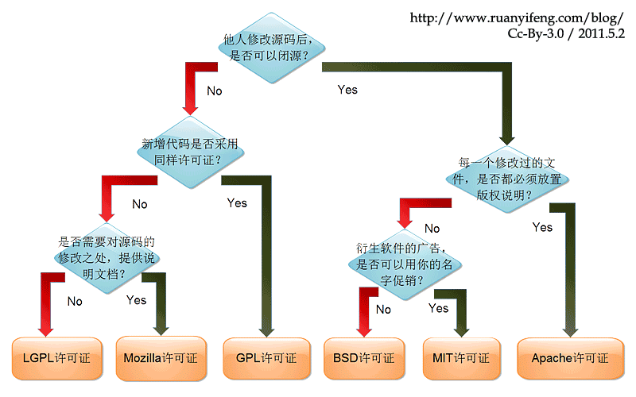

## npm

### 设置

```sh
# 初始化 package.json 文件
npm init

# 查看 npm 配置，包括 npm 源等信息
npm config list

# 设置镜像源
npm set registry https://registry.npm.taobao.org/
npm config set registry https://registry.npmjs.org
# 若不想更改配置，可以在安装依赖的时候指定源
npm install cnpm -g --registry=https://registry.npm.taobao.org

# 获取配置信息
npm config get registry # 获取 registry 字段设置的值

# 查看已安装的包
npm list
npm list -g # 查看全局安装的包
npm ls --depth 0 # 不显示嵌套，0 指示依赖层级

# 查看列表中指定包的版本号
npm list sass
npm list sass -g # 查看全局安装的包的版本号
```

::: tip 
+ 在国内使用 npm 官方源的下载速度很慢，可以使用淘宝的 npm 镜像源，其是一个完整 npmjs.org 镜像，可以用此代替官方版本(只读)
:::


### 安装依赖

```sh
# 根据 package.json 的配置安装依赖包
npm install
npm i # 缩写

# 安装指定包
npm install jquery

# 安装指定版本，默认为 @latest 安装最新版本
npm install jquery@latest # 最新版本
npm install jquery@1.7.1 # 指定版本
npm install jquery@1.7 # 1.7 版本下的最后一个版本

# 全局安装，默认为局部安装
npm install jquery -g

# 安装至 devDependencies
npm install jquery --save-dev
npm install jquery -D # 缩写

# 安装至 dependencies
npm install jquery --save
npm install jquery -S # 缩写
```


### 其他

```sh
# 卸载包
npm uninstall sass

# 更新包
npm update sass

# 搜索包
npm search sass
```


### 发布包

+ 使用 npm 可以很方便地发布自己的包，第一步是添加自己的 npm 账号(已有账号则登录即可)
+ 若是新注册账户，需要登录 [npm](https://www.npmjs.com/) 并验证授权才可以发布
```sh
# 注册 npm 用户(并依次设置用户名、密码和邮箱)
npm adduser

# 登录已有用户(依次输入用户名、密码和已邮箱)
npm login

# 发布(需要配置好 package.json)
npm publish
```


### cnpm

+ 可以使用淘宝定制的 cnpm (支持 gzip 压缩) 命令行工具代替默认的 npm
```sh
# 安装 cnpm
npm install -g cnpm
# 网速慢时使用淘宝源安装
npm install -g cnpm --registry=https://registry.npm.taobao.org

# 安装依赖
cnpm install sass
```


## yarn

### 为什么使用

+ 由 Facebook、Google、Exponent 和 Tilde 联合推出了一个新的 JS 包管理工具
+ 弥补 npm 的一些缺陷：
  + npm 安装依赖速度慢(npm5.0 作了优化，且国内可以使用 cnpm 解决)
  + 包版本有时无法保持一致性("1.0.1", "~1.0.1", "^1.0.1" 三者的区别)，npm5.0 使用了类似 yarn.lock 的 package-lock.json 来保证版本一致性
  + 错误难以追踪，npm 安装依赖时，即使出现错误，也会继续安装，最后将错误日志输出到终端
+ yarn 的优点：
  + 并行安装：npm 按照队列指定安装，yarn 是同步执行，提高了性能
  + 离线缓存：再次安装一个包时，yarn 会从缓存中获取
  + 安装版本统一：使用 yarn.lock 保证版本的一致性
  + 多注册来源处理：不管包被不同的库间接关联引用多少次，安装时只会从一个注册来源去装，要么是 npm 要么是 bower, 防止出现混乱不一致
  + 简介的日志输出
  + 更好的语义命令
+ 总的来说，npm 已经足够了，但是 yarn 也很值得使用


### 命令

```sh
# 初始化项目
yarn init

# 根据 package.json 安装项目依赖
yarn install
yarn  # 缩写

# 添加包
yarn add [package]
yarn add [package]@[version]
yarn add [package]@[tag]
yarn add [package] --dev      # 添加到 devDependencies
yarn add [package] --peer     # 添加到 peerDependencies
yarn add [package] --optional # 添加到 optionalDependencies

# 升级包
yarn upgrade [package]
yarn upgrade [package]@[version]
yarn upgrade [package]@[tag]

# 删除包
yarn remove [package]
```


## 对比

+ 命令对比


## package.json

+ 必填字段：`name`
+ 依赖分类：
  + **dependencies**：**业务依赖**，是应用发布后正常执行时所需要的，但不包含测试时或本地打包时所使用的包
  + **devDependencies**：**开发依赖**，只用于开发环境，不用于生产环境，这些包通常是单元测试或者打包工具等
  + **peerDependencies**：**同等依赖**，用于指定当前包兼容的宿主版本
  + **optionalDependencies**：**可选依赖**，当一些依赖包即使安装失败，项目仍然能够运行或者希望 npm 继续运行；optionalDependencies 会覆盖dependencies 中的同名依赖包，不要在两个地方都写
  + **bundleDependencies**：**打包依赖**，是一个数组，在发布时会将这个对象中的包打包到最终的发布包里
+ 版本说明
  + "1.2.12"：指定使用的准确版本号
  + "~1.2.12"：至少为 1.2.12 的 1.2.x 中最新的版本(再次安装时有可能为 1.2.13 等)
  + "^1.2.12"：至少为 1.2.12 的 1.x.x 中最新的版本(再次安装时有可能为 1.3.0 等)
  + "latest"：最新版本
+ scripts：可以设置 shell 命令的别名，可以使用 `npm run start`(或 `yarn start`) 的方式执行长命令
+ license：开源协议

```json
{
  "name": "my-new-project",
  "version": "1.0.0",
  "description": "My New Project description.",
  "main": "index.js",
  "license": "MIT",
  "author": {
    "name": "TJ Holowaychuk",
    "email": "tj@vision-media.ca"
  },
  "contributors": [
    {
      "name": "Aaron Heckmann",
      "email": "aaron.heckmann+github@gmail.com"
    }
  ]
  "repository": {
    "url": "https://example.com/your-username/my-new-project",
    "type": "git"
  },
  "homepage": "http://expressjs.com/",
  "keywords": [
    "express",
  ],
  "dependencies": {
    "accepts": "~1.2.12",
  },
  "devDependencies": {
    "after": "0.8.1",
  },
  "engines": {
    "node": ">= 0.10.0"
  },
  "files": [
    "LICENSE",
    "History.md",
    "Readme.md",
    "index.js",
    "lib/"
  ],
  "scripts": {
    "test": "mocha --require test/support/env --reporter spec --bail --check-leaks test/ test/acceptance/"
  },
  "gitHead": "ef7ad681b245fba023843ce94f6bcb8e275bbb8e",
  "bugs": {
    "url": "https://github.com/strongloop/express/issues"
  }
}
```


## node_modules

+ 包含所有已安装的包，以及某些包提供的 cli，保存在 `.bin` 下
+ 引入一个模块时，会先在本地的 node_modules 中查找相关模块，找不到则会从外层目录继续查找，直至到全局安装的 node_modules