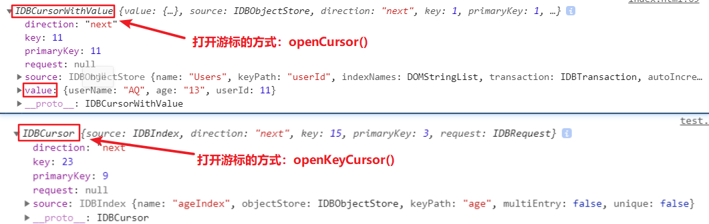

## 介绍

### [IndexedDB](https://developer.mozilla.org/zh-CN/docs/Web/API/IndexedDB_API)

+ 是一种低级 API，用于客户端存储大量结构化数据(包括文件/blobs)，使用索引来实现对该数据的高性能搜索
+ 是一个基于事务操作的 `key-value` 型数数据库，类似于基于 `SQL` 的 `RDBMS`
+ 是一个基于 `JavaScript` 的面向对象的数据库

::: tip 说明：
+ `Web Storage` 只用于存储较少量的数据，`IndexedDB` 用于存储更大量的结构化数据
+ `IndexedDB` 在 `Web Worker` 中可用
+ `IndexedDB` 遵守同源策略
+ `IndexedDB` 是异步执行的，不会阻塞应用程序
:::


### ACID

数据库事务保证了数据操作的 `ACID` 特性：

+ 原子性(Atomicity)：事务作为一个整体被执行，包含在其中的对数据库的操作要么全部被执行，要么都不执行
+ 一致性(Consistency)：事务应确保数据库的状态从一个一致状态转变为另一个一致状态
+ 隔离性(Isolation)：多个事务并发执行时，一个事务的执行不应影响其他事务的执行
+ 持久性(Durability)：已被提交的事务对数据库的修改应该永久保存在数据库中

::: tip 说明：
+ 简单来说，事务保证数据库操作要么全部成功，要么全部失败。
:::

## 使用

&emsp;&emsp;`API` 参考自 [MDN IndexedDB](https://developer.mozilla.org/zh-CN/docs/Web/API/IndexedDB_API)，或者本网站整理的 [API 列表](/appendix/indexeddb-api)。

### 使用方式

**对数据库的操作一般有以下几种：**


**操作的步骤可以概括为：**

1. 创建和连接数据库
2. 在 `upgradeneeded` 事件中管理对象仓库，根据需求管理索引
3. 在 `success` 事件中发起事务
4. 获取对象仓库
5. 可以直接在对象仓库上操作数据，或者结合游标、索引等筛选遍历数据

### 连接数据库

&emsp;&emsp;使用 `window.indexDB` 对象的 `open()` 方法连接一个数据库(当数据库不存在时会创建)，会返回一个 `IDBOpenDBRequest` 对象：

```js
const request = indexDB.open('dbName')

request.addEventListener('success', e => {
  console.log('Connect indexedDB success!')
})

request.addEventListener('error', e => {
  console.log('Failed to connect indexedDB!')
})
```

### 创建对象仓库

&emsp;&emsp;对象仓库相当于其他数据库的数据表，用于保存一系列对象数据；但创建对象仓库必须在 `upgradeneeded` 事件中(因为 `indexDB` 不允许数据库中的对象仓库在同一版本发生变换)，而 `upgradeneeded` 事件只会在数据库版本更新时。
&emsp;&emsp;使用 `IDBDatabase.createObjectStore()` 方法创建一个对象仓库：

```js
const request = indexedDB.open('dbName')

request.addEventListener('upgradeneeded', e => {
  const db = e.target.result
  // 当对象仓库不存在时，创建一个对象仓库并指定主键为 userId
  if (![...db.objectStoreNames].includes('Users')) {
    const store = db.createObjectStore('Users', { keyPath: 'userId', autoIncrement: true })
  }
})
```


### 创建事务

&emsp;&emsp;创建事务是操作数据前必须的一步，使用 `IDBDatabase.transaction()` 方法创建一个事务：

```js
const request = indexedDB.open('dbName')

request.addEventListener('success', e => {
  const db = e.target.result
  // 在对象仓库 Users 上以 readwrite 模式发起事务
  const tx = db.transaction('Users', 'readwrite')
})
```


### 在对象仓库上操作数据

&emsp;&emsp;创建事务后，可以使用事务对象(`IDBTransaction`)的 `objectStore()` 方法获取对象仓库，然后在对象仓库上进行操作，一些操作方法：

+ `add()`: 添加数据，数据存在时会报错
+ `put()`: 更改数据，数据不存在时等同于 `add()`
+ `get()`: 获取数据
+ `delete()`: 删除数据

**示例：**

```js
const request = indexedDB.open('dbName', 2)

request.addEventListener('success', e => {
  console.log('Connect indexedDB success!')
  const db = e.target.result
  const tx = db.transaction('Users', 'readwrite')
  // 获取对象仓库
  const store = tx.objectStore('Users')

  // 数据库操作
  const req = store.add({ 'userId': 1, 'userName': 'Alice', 'age': 24 })
  // const req = store.put({ 'userId': 1, 'userName': 'Alice', 'age': 26 })
  // const req = store.get(1)
  // const req = store.delete(1)

  // 监听数据库操作
  req.addEventListener('success', e => {
    console.log(e.target.result) // { 'userId': 1, 'userName': 'Alice', 'age': 24 }
  })
})
```


### 使用游标操作数据

&emsp;&emsp;使用游标能够同时获取和操作多条数据，可以将游标看作是一种遍历的方式。

创建游标的方式有：

+ `IDBObjectStore` 实例的 `openCursor()` 方法
+ `IDBIndex` 实例的 `openCursor()`/`openKeyCursor()` 方法

这些方法都需要接收一个范围作为参数，创建范围的方法(都是静态方法)有：

+ `IDBKeyRange.bound()`
+ `IDBKeyRange.only()`
+ `IDBKeyRange.lowerBound()`
+ `IDBKeyRange.upperBound()`


```js
const request = indexedDB.open('testDB', 12)

request.addEventListener('success', e => {
  const db = e.target.result
  const tx = db.transaction('Users', 'readonly') // 创建一个事务，模式为只读
  const store = tx.objectStore('Users') // 获取对象仓库
  const range = IDBKeyRange.lowerBound(1) // 创建一个范围
  const req = store.openCursor(range, 'next') // 创建一个游标
  let html = ''

  req.addEventListener('success', e => {
    const cursor = e.target.result
    if (cursor) {
      html += `<li>${cursor.value.userName} - ${cursor.value.age}</li>`
      cursor.continue() // 控制游标移动，读取下一条数据
    } else {
      console.log('Read all done!')
      document.getElementById('box').innerHTML = html
    }
  })
})
```

### 使用索引操作数据

&emsp;&emsp;使用索引能进行条件性的查找。需要注意的是，索引必须先在创建对象仓库的时候创建，然后才能在操作数据的时候获取：

```js
const request = indexedDB.open('dbName')

request.addEventListener('upgradeneeded', e => {
  const db = e.target.result
  // 当数据库不存在指定对象仓库时
  if (![...db.objectStoreNames].includes('Users')) {
    // 创建对象仓库
    const store = db.createObjectStore('Users', { keyPath: 'userId', autoIncrement: false })
    // 在对象仓库上创建索引
    store.createIndex('ageIndex', 'age', { unique: false })
  }
})

request.addEventListener('success', e => {
  const db = e.target.result
  const tx = db.transaction('Users', 'readwrite') // 发起事务
  const store = tx.objectStore('Users') // 获取对象仓库

  // 添加几条数据
  store.put({ age: 18, userName: 'Zed' })
  store.put({ age: 19, userName: 'Anna' })
  store.put({ age: 15, userName: 'Bod' })
  store.put({ age: 23, userName: 'Li' })
  store.put({ age: 32, userName: 'Noc' })

  const index = store.index('ageIndex') // 获取索引对象
  const req = index.openCursor(IDBKeyRange.lowerBound(18), 'next') // 在索引上打开游标

  // 遍历游标
  req.addEventListener('success', e => {
    const cursor = e.target.result
    if (cursor) {
      console.log(cursor.value)
      cursor.continue()
    } else {
      console.log('Read all done!')
    }
  })
})
```


## 一个完整的例子

**阅览：**


**代码：**

```html
<!DOCTYPE html>
<html lang="en">
<head>
  <meta charset="UTF-8">
  <meta name="viewport" content="width=device-width, initial-scale=1.0">
  <meta http-equiv="X-UA-Compatible" content="ie=edge">
  <title>Document</title>
</head>
<body>
  <button id="generate">生成随机数据</button>
  <button id="lower">未满18岁</button>
  <button id="upper">18岁以上</button>
  <div id="box"></div>
  <script>
    const generate = document.getElementById('generate')
    const lower = document.getElementById('lower')
    const upper = document.getElementById('upper')
    const box = document.getElementById('box')

    // 生成随机数据
    generate.addEventListener('click', e => {
      const request = indexedDB.open('myDB', 12)

      request.addEventListener('upgradeneeded', e => {
        console.log('upgradeneeded')
        const db = e.target.result
        // 当数据库不存在指定对象仓库时
        if (![...db.objectStoreNames].includes('Users')) {
          // 创建对象仓库
          const store = db.createObjectStore('Users', { keyPath: 'userId', autoIncrement: false })
          // 在对象仓库上创建索引
          store.createIndex('ageIndex', 'age', { unique: false })
        }
      })

      request.addEventListener('success', e => {
        console.log('success')
        const db = e.target.result
        const tx = db.transaction('Users', 'readwrite')
        const store = tx.objectStore('Users')

        // 添加 30 条随机数据
        for (let i = 1; i <= 30; i++) {
          store.put({ userId: i, age: randomAge(), username: randomUsername() })
        }
      })

      // 渲染数据
      const keyRange = IDBKeyRange.lowerBound(0)
      toDOM(request, keyRange, box)
    })

    // 显示 age < 18 的结果
    lower.addEventListener('click', e => {
      const request = indexedDB.open('myDB', 12)
      const keyRange = IDBKeyRange.upperBound(18, false)
      toDOM(request, keyRange, box)
    })

    // 显示 age >= 18 的结果
    upper.addEventListener('click', e => {
      const request = indexedDB.open('myDB', 12)
      const keyRange = IDBKeyRange.lowerBound(18)
      toDOM(request, keyRange, box)
    })

    // 渲染数据
    function toDOM(request, keyRange, dom) {
      request.addEventListener('success', e => {
        console.log('success')
        const db = e.target.result
        const tx = db.transaction('Users', 'readwrite')
        const store = tx.objectStore('Users')
        const index = store.index('ageIndex')
        let html = ''

        index.openCursor(keyRange).addEventListener('success', e => {
          const cursor = e.target.result
          if (cursor) {
            html += `<li>${cursor.value.username} - ${cursor.value.age}</li>`
            cursor.continue()
          } else {
            dom.innerHTML = html
          }
        })
      })
    }

    // 生成随机年龄
    function randomAge() {
      return Math.ceil(Math.random()*40)
    }

    // 生成随机用户名
    function randomUsername() {
      const first = String.fromCharCode(Math.floor(Math.random()*26)+65)
      const sub = new Array(Math.floor(Math.random()*5)+2).fill(null).map(v => {
        return String.fromCharCode(Math.floor(Math.random()*26)+97)
      })
      return first + sub.join('')
    }
  </script>
</body>
</html>
```


## API

### 概述

记录各个相关接口的 `API` 及其返回值类型：

+ **IDBEnvironment**: 描述 `IndexDB` 环境(`window` 或 `Worker`)，无其他使用方法
+ **IDBVersionChangeEvent**: 描述数据库版本的改变
+ **IDBRequest**: 管理数据库请求结果，所有异步方法都会返回一个该对象
+ **IDBOpenDBRequest**: 继承自 **IDBRequest**，只有连接和删除数据库时会返回该对象
+ **IDBFactory**: 数据库顶层接口，`window` 实现了该接口，用于连接或删除数据库
  + `open(): IDBOpenDBRequest`
  + `deleteDatabase(): IDBOpenDBRequest`
  + `cmp(): Enum`
+ **IDBDatabase**: 管理数据库，能够创建/删除对象仓库、发起事务、关闭数据库连接
  + `close(): void`
  + `createObjectStore(): IDBObjectStore`
  + `deleteObjectStore(): void`
  + `transaction(): IDBTransaction`
+ **IDBTransaction**: 管理事务，能够撤销事务、返回当前事务的对象仓库
  + `abort(): void`
  + `objectStore(): IDBObjectStore`
+ **IDBObjectStore**: 管理对象仓库，能够进行 `CRUD`、管理索引、打开游标
  + `add(): IDBRequest`
  + `put(): IDBRequest`
  + `get(): IDBRequest`
  + `delete(): IDBRequest`
  + `clear(): IDBRequest`
  + `count(): IDBRequest`
  + `openCursor(): IDBRequest`
  + `index(): IDBIndex`
  + `createIndex(): IDBIndex`
  + `deleteIndex(): void`
+ **IDBIndex**: 管理索引，能够获取数据/键、打开游标
  + `count(): IDBRequest`
  + `get(): IDBRequest`
  + `getAll(): IDBRequest`
  + `getKey(): IDBRequest`
  + `getAllKeys(): IDBRequest`
  + `openCursor(): IDBRequest`
  + `openKeyCursor(): IDBRequest`
+ **IDBCursor**: 管理游标，能够控制游标移动、更新/删除数据
  + `continue(): void`
  + `advance(): void`
  + `update(): IDBRequest`
  + `delete(): IDBRequest`
+ **IDBCursorWithValue**: 继承自 **IDBCursor**，扩展了一个 `value` 属性
+ **IDBKeyRange**: 范围对象，能够创建范围(创建范围的都是静态方法)
  + `static bound(): IDBKeyRange`
  + `static only(): IDBKeyRange`
  + `static lowerBound(): IDBKeyRange`
  + `static upperBound(): IDBKeyRange`
  + `includes(): Boolean`
+ **IDBLocaleAwareKeyRange**: 继承自 **IDBKeyRange**，`Firefox` 的某些版本特有


### [IDBEnvironment](https://developer.mozilla.org/zh-CN/docs/Web/API/IDBEnvironment)

**介绍：**

+ 可以理解为一个由 `window` 或 `Worker` 实现的挂载 `indexedDB` 属性的环境，如 `window.indexedDB`

### [IDBVersionChangeEvent](https://developer.mozilla.org/zh-CN/docs/Web/API/IDBVersionChangeEvent)

**介绍：**

+ 能够访问当数据库的版本已经改变时的一些属性


**属性：**

+ `oldVersion: readonly String`: 数据库的旧版本号 
+ `newVersion: readonly String`: 数据库的新版本号

**事件：**

+ `onupgradeneeded`: 当一个数据库的版本比已经存在的版本高时


### [IDBFactory](https://developer.mozilla.org/zh-CN/docs/Web/API/IDBFactory)

**介绍：**

+ 让程序可以异步存取 `indexedDB` 数据库，`window.indexedDB` 对象实现了这个接口
+ 在事件中可以使用 `e.target` 访问这个 `IDBRequest` 对象

**方法：**

+ `open(name: String, (version = 1)?: Number): IDBOpenDBRequest`：连接数据库(不存在时会新建)
  + `name`: 数据库名称
  + `version`: 数据库版本
+ `deleteDatabase(name: String): IDBOpenDBRequest`：删除数据库
+ `cmp(a: String, b: String): Enum`：将两个值键进行比较，返回哪个键更大(-1, 0, 1)


### [IDBRequest](https://developer.mozilla.org/zh-CN/docs/Web/API/IDBRequest)

**介绍：**

+ 对数据库的读写操作都是通过请求的方式来实现，而且所有的异步方法都返回一个 `IDBRequest` 对象

**属性：**

+ `result: readonly Any`: 请求的结果，请求失败并且结果不可用时抛出 `InvalidStateError` 异常
+ `error: readonly DOMError`: 错误信息
+ `source: readonly Object`: 请求的源对象(`IDBIndex`/`IDBObjectStore`)，不存在时(如 `indexedDB.open()`)返回 `null`
+ `transaction: readonly IDBTransaction`: 请求的事务(`indexedDB.open()` 返回 `null`)
+ `readyState: readonly Enum`: 请求的状态(每个请求都从 `pending` 开始，当请求成功完成或发生错误时变为 `done`)

**事件：**

+ `onsuccess`: 操作成功时
+ `onerror`: 操作失败时

::: tip 不同情况下的 result：
+ 如果操作中有错误发生，`error` 事件会触发，并且会通过 `result` 属性抛出一个异常
+ 如果请求对象成功执行，结果可以通过 `result` 属性访问到，并且该请求对象上会触发 `success` 事件
+ `result` 属性的值是不一定的，有时候是某些对象，有时候是值，与请求事件有关：
```js
// 打开数据库时，是一个 IDBDatabase 对象
const request = indexedDB.open('testDB', 2)
request.addEventListener('success', e => {
  console.log(e.target.result) // IDBDatabase {}
})

// 添加数据时，是一个主键值
const req = store.add({ userName: username.value, age: age.value })
req.addEventListener('success', e => {
  console.log(e.target.result) // 11
})

// 打开游标时，是一个 IDBCursorWithValue 对象
const req = store.openCursor(range, 'next')
req.addEventListener('success', e => {
  console.log(e.target.result) // IDBCursorWithValue {}
})
```
:::


### [IDBOpenDBRequest](https://developer.mozilla.org/zh-CN/docs/Web/API/IDBOpenDBRequest)

**介绍：**

+ 继承自 `IDBRequest` 对象，并扩展了两个事件
+ 可以访问打开或删除数据库的请求的结果，以下方式会返回一个  `IDBOpenDBRequest`
  + `IDBFactory.open()`
  + `IDBFactory.deleteDatabase()`

**事件：**

+ `onupgradeneeded`: 当一个数据库的版本比已经存在的版本高时
+ `onblocked`: `upgradeneeded` 事件触发后，仍在某个地方使用数据库时

::: tip 说明：
+ 以下操作必须在 `upgradeneeded` 事件中进行：
  + 创建/删除对象仓库：`createObjectStore()`/`deleteObjectStore()`
  + 创建/删除索引：`createIndex()`/`deleteIndex()`
+ 以下操作不能在 `upgradeneeded` 事件中进行：
  + 发起事务：`transaction()`
:::


### [IDBDatabase](https://developer.mozilla.org/zh-CN/docs/Web/API/IDBDatabase)

**介绍：**
+ `IDBDatabase` 是唯一一个能够访问和管理数据库版本的接口
+ 提供一个到数据库的连接，可以使用 `IDBDatabase` 对象在数据库中打开一个 `transaction`，然后进行操作或者删除数据库中的对象


**属性：**

+ `name: readonly String`: 当前连接数据库名
+ `version: Number`: 当前连接数据库的版本
+ `objectStoreNames: String[]`: 当前连接连接数据库中所有的 `ObjectStore` 的名字列表

**方法：**

+ `close(): void`: 关闭数据库连接
+ `createObjectStore(name: String, options?: Object): IDBObjectStore`: 创建一个 `IDBObjectStore` 对象，可选的 `options` 的属性：
  + `keyPath: String | String[]`: 用在 `IDBObjectStore` 对象上的键
  + `autoIncrement: Boolean`: `true` 时指定主键自增
+ `deleteObjectStore(name: String): void`: 删除指定的 `IDBObjectStore` 对象
+ `transaction(storeNames: String | String[], (mode = readonly)?: String): IDBTransaction`: 创建一个事务，`mode` 的取值有
  + `readonly`: 只读模式
  + `readwrite`: 读写模式

**事件：**

+ `onabort`: 中断数据库访问时
+ `onerror`: 访问数据库失败时
+ `onversionchange`: 数据库结构发生更改时

::: danger 注意：
+ `createObjectStore()`/`deleteObjectStore()` 方法只能在版本更改事件(`upgradeneeded`)中使用
+ 不能创建同名的对象仓库(`ObjectStore`)，否则会报错
:::


### [IDBTransaction](https://developer.mozilla.org/zh-CN/docs/Web/API/IDBTransaction)

**介绍：**

+ 提供异步事务操作，能够使用数据库中的事件对象属性，所有的读取和写入数据均在事务中完成(必须创建事务才能操作数据库)
+ 事务由 `IDBDatabase` 发起，创建事务后可以使用 `IDBObjectStore` 来发起请求
+ 事务在被创建的时候就已经开始，并非在发起第一个请求(`IDBRequest`)的时候

**属性：**

+ `db: readonly String`: 当前事务所属的数据库
+ `error: readonly String`: 事务失败时发生的错误类型
+ `mode: readonly String`: 访问事务的模式
+ `objectStoreNames: readonly String[]`: 所有 `IDBObjectStore` 对象名称的列表

**方法：**

+ `abort(): void`: 放弃本次事务的更改
+ `objectStore(name: String): IDBObjectStore`: 返回一个已添加到此事务范围内的 `IDBObjectStore` 对象

**事件：**

+ `onabort`: 事务中止时
+ `oncomplete`: 事务完成时
+ `onerror`: 事务未能完成时

::: tip 所有的数据操作都是从事务开始的，一个完整的步骤为：
```js
const request = indexedDB.open('testDB', 2) // 1.连接数据库

request.addEventListener('success', e => {
  const db = e.target.result
  const tx = db.transaction('Users', 'readwrite') // 2.创建事务
  const store = tx.objectStore('Users') // 3.获取 IDBObjectStore 对象
  const req = store.add({ userName: username.value, age: age.value }) // 4.发起请求

  req.addEventListener('success', e => {
    console.log('Add user success!')
  })
})
```
:::


### [IDBObjectStore](https://developer.mozilla.org/zh-CN/docs/Web/API/IDBObjectStore)

**介绍：**

+ 表示数据库中的一个对象仓库(`ObjectStore`)，可以把对象仓库理解为关系数据库的表结构
+ 对象库中的记录根据其键值进行排序，可以实现快速插入，查找和有序检索


**属性：**

+ `indexNames: readonly String[]`: 表中对象的索引名列表
+ `keyPath: readonly String`: 表中的键路径，若该属性为 `null`，每次操作表时必须提供一个键名
+ `name: readonly String`: 表名
+ `transaction: readonly IDBTransaction`: 事务的名称，该表属于此事务
+ `autoIncrement: readonly Boolean`: 表中自增字段的值

**方法：**

+ `add(value: Object, key = null): IDBRequest`: 增加数据
+ `put(value: Object, key = null): IDBRequest`: 增加或更新数据
+ `get(range: String | IDBKeyRange): IDBRequest`: 获取数据
+ `delete(range: String | IDBKeyRange): IDBRequest`: 删除数据
+ `clear(): IDBRequest`: 清空数据
+ `count(range: String | IDBKeyRange): IDBRequest`: 返回记录数
+ `index(name: String): IDBIndex`: 打开指定索引
+ `createIndex(name: String, keyPath: string | string[], optional?: Object): IDBIndex`: 创建一个索引
  + `name`: 索引名
  + `keyPath`: 要建立索引的键名或多个键名的数组
  + `optional`: 可选参数列表
    + `unique`: 为 `true` 时指定索引值不能相同，默认 `false`
    + `multiEntry`: 仅当 `keyPath` 为一个数组时有效。该值为 `true` 时，会以数组的每个元素建立一条索引，否则以整个数组添加一条索引
+ `deleteIndex(indexName: String): void`: 删除一条索引
+ `openCursor(range: IDBKeyRange, direction: String): IDBRequest`: 打开一个游标
  + `range`: `IDBKeyRange` 对象
  + `direction`: 游标的方向，有以下取值：
      + `next`: 按主键值升序排列
      + `nextunique`: 按主键值升序排列，主键值相等时只读取第一条数据
      + `prev`: 按主键值降序排列
      + `prevunique`: 按主键值降序排列，主键值相等时只读取第一条数据

::: danger 注意：
+ `createIndex()`/`deleteIndex()` 方法只能在版本更改事件(`upgradeneeded`)中使用
:::

### [IDBIndex](https://developer.mozilla.org/zh-CN/docs/Web/API/IDBIndex)

**介绍：**

+ `IDBIndex` 可以看作是一个包含引用(`index`)的 `ObjectStore`
+ `IDBIndex` 实例上还能继续打开游标

**属性：**

+ `name: readonly String`: 索引的名称
+ `keyPath: readonly String`: 创建索引时的 `keyPath`
+ `multiEntry: readonly Boolean`: 创建索引时指定的 `multiEntry`
+ `unique: readonly Boolean`: 创建索引时指定的 `unique`
+ `objectStore: readonly IDBObjectStore`: 索引引用的对象仓库

**方法：**

+ `count(query?: Any | IDBKeyRange): IDBRequest`: 返回符合查询条件的结果数
+ `get(query: Any | IDBKeyRange): IDBRequest`: 返回符合查询条件的第一条结果
+ `getKey(query?: Any | IDBKeyRange): IDBRequest`: 返回符合查询条件的第一条结果的主键
+ `getAll(query?: Any | IDBKeyRange, count?: Number): IDBRequest`: 返回符合查询条件的所有数据(`count` 指定条目数)
+ `getAllKeys(query?: Any | IDBKeyRange, count?: Number): IDBRequest`: 返回符合查询条件的所有主键(`count` 指定条目数)
+ `openCursor(range: String | IDBKeyRange, direction: String): IDBRequest`: 打开一个游标
+ `openKeyCursor(range: String | IDBKeyRange, direction: String): IDBRequest`: 打开一个游标

::: tip 说明：
+ `query` 参数可以是 `keyPath` 对应的值或一个范围，而且 `get()`/`getKey()` 只会返回查找结果的第一个，而 `getAll()`/`getAllKeys()` 会返回一个结果数组：
```js
// 1.query 参数是 keyPath 对应的值
const req = index.get(18) // 返回 age = 20 的第一条数据

// 2.query 参数是一个范围
const req = index.getAll(IDBKeyRange.lowerBound(20)) // 返回 age >= 20 所有数据的数组
```
+ `getAll()`/`getAllKeys()` 不带参数时会返回所有数据，而且第二个参数 `count` 不能独立使用
+ `openCursor()` 和 `openKeyCursor()` 的区别：
  + 他们都返回一个 `IDBRequest` 对象，因此都有 `result` 属性
  + `openKeyCursor()` 的 `result` 属性是一个 `IDBCursor` 对象，而 `openCursor()` 的 `result` 属性是一个 `IDBCursorWithValue` 对象(它继承自 `openKeyCursor()` 并扩展了一个 `value` 属性)：

:::

### [IDBCursor](https://developer.mozilla.org/zh-CN/docs/Web/API/IDBCursor)

**介绍：**

+ 游标其实是一个指针，指向一个区间的数据记录，最后一个指向为 `null`
+ 游标用于在数据库中遍历多个记录
+ 游标能迭代 `IDBObjectStore` 和 `IDBIndex` 对象
+ 实际使用的游标大多数是 `IDBCursorWithValue` 的实例，它继承了 `IDBCursor` 的属性和方法并扩展了 `value` 属性

**属性：**

+ `direction: readonly Enum`: 返回游标的方向(`next`/`nextunique`/`prev`/`prevunique`)
+ `key: readonly String`: 返回当前游标的键
+ `primaryKey: readonly String`: 返回当前游标的有效主键
+ `source: readonly Enum`: 返回游标当前迭代的对象(`IDBObjectStore`/`IDBIndex`)

**方法：**

+ `continue([key]): void`: 将游标向前移动一位
+ `advance(count: number): void`: 将游标向前移动指定位数(`continue()` 只能移动一位)
+ `delete(): IDBRequest`: 在另一个单独的线程中删除游标所在的数据(需要 `readwrite` 模式)，但不影响游标位置
+ `update(value: Object): IDBRequest`: 在另一个单独的线程中更新游标所在的数据

::: tip 注意：
+ 使用 `update()` 时，需要先获取原数据对象的引用，修改后再使用该引用作为参数：
```js
const data = cursor.value // 获取当前游标的数据
if (data.userName === 'Alice' ) {
  data.userName = 'Bob' // 修改对应的值
  cursor.update(data) // 将修改后的对象引用传入 update()
}
```
:::

### [IDBCursorWithValue](https://developer.mozilla.org/zh-CN/docs/Web/API/IDBCursorWithValue)

**介绍：**

+ 继承自 `IDBCursor` 接口，并且拥有额外的 `value` 属性

**属性：**

+ `value: readonly Object`: 返回当前游标指向的数据对象


### [IDBKeyRange](https://developer.mozilla.org/zh-CN/docs/Web/API/IDBKeyRange)

**介绍：**

+ 一个范围对象，用于创建范围，然后作为某些方法的参数

**属性：**

+ `lower: readonly Number`: 键范围下限
+ `upper: readonly Number`: 键范围上限
+ `lowerOpen: readonly Boolean`: 判断下限值是否包含在键范围内
+ `upperOpen: readonly Boolean`: 判断上限值是否包含在键范围内

**方法：**

+ `static bound(lower: Number, upper: Number, (openLower = false): Boolean, (openUpper = false): Boolean): IDBKeyRange`: 创建一个具有上限和下限的新键
+ `static only(value: Number): IDBKeyRange`: 创建一个包含单个值的新键范围
+ `static lowerBound(lower: Number, (open = false): Boolean): IDBKeyRange`: 创建一个只有下限的新键范围
+ `static upperBound(upper: Number, (open = false): Boolean): IDBKeyRange`: 创建一个只有上限的新键范围
+ `includes(key: String): Boolean`: 实例方法，判断指定的键是否在键范围内

::: tip 说明：
+ `IDBKeyRange.bound(1, 10)` 创建的范围区间为 `[1, 10]`；`IDBKeyRange.bound(1, 10, true, true)` 创建的范围区间为 `(1, 10)`
+ `IDBKeyRange.lowerBound(1)` 创建的范围区间为 `[1, max]`
+ `IDBKeyRange.upperBound(10)` 创建的范围区间为 `[min, 10]`
:::

### [IDBLocaleAwareKeyRange](https://developer.mozilla.org/zh-CN/docs/Web/API/IDBLocaleAwareKeyRange)

**介绍：**

+ 继承自 `IDBKeyRange` 接口，`Firefox` 特定版本的实现