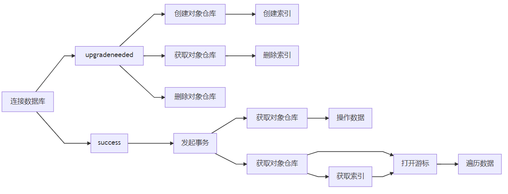

## 使用

+ `API` 参考自 [MDN IndexedDB](https://developer.mozilla.org/zh-CN/docs/Web/API/IndexedDB_API)，或者本网站整理的 [API 列表](/appendix/indexeddb-api)。


## 使用方式

**对数据库的操作一般有以下几种：**




**操作的步骤可以概括为：**

1. 创建和连接数据库
2. 在 `upgradeneeded` 事件中管理对象仓库，根据需求管理索引
3. 在 `success` 事件中发起事务
4. 获取对象仓库
5. 可以直接在对象仓库上操作数据，或者结合游标、索引等筛选遍历数据


## 连接数据库

+ 使用 `open()` 连接一个数据库(当数据库不存在时会创建)，会返回一个 `IDBOpenDBRequest` 对象：
```js
const request = indexDB.open('dbName')

request.addEventListener('success', e => {
  console.log('Connect indexedDB success!')
})

request.addEventListener('error', e => {
  console.log('Failed to connect indexedDB!')
})
```


## 创建对象仓库

+ 对象仓库相当于其他数据库的数据表，用于保存一系列对象数据
+ 但创建对象仓库必须在 `upgradeneeded` 事件中(因为 `indexDB` 不允许数据库中的对象仓库在同一版本发生变换)，而 `upgradeneeded` 事件只会在数据库版本更新时
+ 使用 `IDBDatabase.createObjectStore()` 创建一个对象仓库：
```js
const request = indexedDB.open('dbName')

request.addEventListener('upgradeneeded', e => {
  const db = e.target.result
  // 当对象仓库不存在时，创建一个对象仓库并指定主键为 userId
  if (![...db.objectStoreNames].includes('Users')) {
    const store = db.createObjectStore('Users', { keyPath: 'userId', autoIncrement: true })
  }
})
```


## 创建事务

+ 创建事务是操作数据前必须的一步，使用 `IDBDatabase.transaction()` 创建一个事务：
```js
const request = indexedDB.open('dbName')

request.addEventListener('success', e => {
  const db = e.target.result
  // 在对象仓库 Users 上以 readwrite 模式发起事务
  const tx = db.transaction('Users', 'readwrite')
})
```


## 在对象仓库上操作数据

+ 创建事务后，可以使用事务对象(`IDBTransaction`)的 `objectStore()` 方法获取对象仓库，然后在对象仓库上进行操作，一些操作方法：
  + `add()`: 添加数据，数据存在时会报错
  + `put()`: 更改数据，数据不存在时等同于 `add()`
  + `get()`: 获取数据
  + `delete()`: 删除数据
```js
const request = indexedDB.open('dbName', 2)

request.addEventListener('success', e => {
  console.log('Connect indexedDB success!')
  const db = e.target.result
  const tx = db.transaction('Users', 'readwrite')
  // 获取对象仓库
  const store = tx.objectStore('Users')

  // 数据库操作
  const req = store.add({ 'userId': 1, 'userName': 'Alice', 'age': 24 })
  // const req = store.put({ 'userId': 1, 'userName': 'Alice', 'age': 26 })
  // const req = store.get(1)
  // const req = store.delete(1)

  // 监听数据库操作
  req.addEventListener('success', e => {
    console.log(e.target.result) // { 'userId': 1, 'userName': 'Alice', 'age': 24 }
  })
})
```


## 使用游标操作数据

+ 使用游标能够同时获取和操作多条数据，可以将游标看作是一种遍历的方式
+ 创建游标的方式有：
  + `IDBObjectStore` 实例的 `openCursor()` 方法
  + `IDBIndex` 实例的 `openCursor()`/`openKeyCursor()` 方法
+ 这些方法都需要接收一个范围作为参数，创建范围的方法(都是静态方法)有：
  + `IDBKeyRange.bound()`
  + `IDBKeyRange.only()`
  + `IDBKeyRange.lowerBound()`
  + `IDBKeyRange.upperBound()`
```js
const request = indexedDB.open('testDB', 12)

request.addEventListener('success', e => {
  const db = e.target.result
  const tx = db.transaction('Users', 'readonly')  // 创建一个事务，模式为只读
  const store = tx.objectStore('Users')           // 获取对象仓库
  const range = IDBKeyRange.lowerBound(1)         // 创建一个范围
  const req = store.openCursor(range, 'next')     // 创建一个游标
  let html = ''

  req.addEventListener('success', e => {
    const cursor = e.target.result
    if (cursor) {
      html += `<li>${cursor.value.userName} - ${cursor.value.age}</li>`
      cursor.continue() // 控制游标移动，读取下一条数据
    } else {
      console.log('Read all done!')
      document.getElementById('box').innerHTML = html
    }
  })
})
```


## 使用索引操作数据

+ 使用索引能进行条件性的查找，但索引必须先在创建对象仓库的时候创建，然后才能在操作数据的时候获取：
```js
const request = indexedDB.open('dbName')

request.addEventListener('upgradeneeded', e => {
  const db = e.target.result
  // 当数据库不存在指定对象仓库时
  if (![...db.objectStoreNames].includes('Users')) {
    // 创建对象仓库
    const store = db.createObjectStore('Users', { keyPath: 'userId', autoIncrement: false })
    // 在对象仓库上创建索引
    store.createIndex('ageIndex', 'age', { unique: false })
  }
})

request.addEventListener('success', e => {
  const db = e.target.result
  const tx = db.transaction('Users', 'readwrite') // 发起事务
  const store = tx.objectStore('Users') // 获取对象仓库

  // 添加几条数据
  store.put({ age: 18, userName: 'Zed' })
  store.put({ age: 19, userName: 'Anna' })
  store.put({ age: 15, userName: 'Bod' })
  store.put({ age: 23, userName: 'Li' })
  store.put({ age: 32, userName: 'Noc' })

  const index = store.index('ageIndex') // 获取索引对象
  const req = index.openCursor(IDBKeyRange.lowerBound(18), 'next') // 在索引上打开游标

  // 遍历游标
  req.addEventListener('success', e => {
    const cursor = e.target.result
    if (cursor) {
      console.log(cursor.value)
      cursor.continue()
    } else {
      console.log('Read all done!')
    }
  })
})
```
