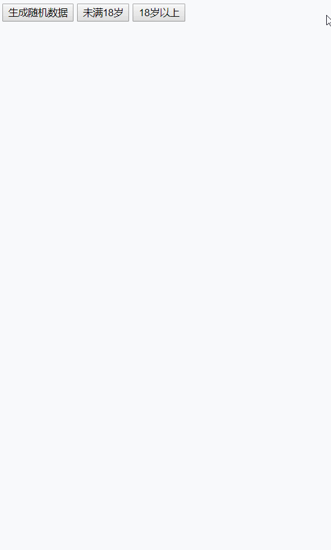

## 一个完整的例子

+ **阅览：**



+ **代码：**
```html
<!DOCTYPE html>
<html lang="en">
<head>
  <meta charset="UTF-8">
  <meta name="viewport" content="width=device-width, initial-scale=1.0">
  <meta http-equiv="X-UA-Compatible" content="ie=edge">
  <title>Document</title>
</head>
<body>
  <button id="generate">生成随机数据</button>
  <button id="lower">未满18岁</button>
  <button id="upper">18岁以上</button>
  <div id="box"></div>
  <script>
    const generate = document.getElementById('generate')
    const lower = document.getElementById('lower')
    const upper = document.getElementById('upper')
    const box = document.getElementById('box')

    // 生成随机数据
    generate.addEventListener('click', e => {
      const request = indexedDB.open('myDB', 12)

      request.addEventListener('upgradeneeded', e => {
        console.log('upgradeneeded')
        const db = e.target.result
        // 当数据库不存在指定对象仓库时
        if (![...db.objectStoreNames].includes('Users')) {
          // 创建对象仓库
          const store = db.createObjectStore('Users', { keyPath: 'userId', autoIncrement: false })
          // 在对象仓库上创建索引
          store.createIndex('ageIndex', 'age', { unique: false })
        }
      })

      request.addEventListener('success', e => {
        console.log('success')
        const db = e.target.result
        const tx = db.transaction('Users', 'readwrite')
        const store = tx.objectStore('Users')

        // 添加 30 条随机数据
        for (let i = 1; i <= 30; i++) {
          store.put({ userId: i, age: randomAge(), username: randomUsername() })
        }
      })

      // 渲染数据
      const keyRange = IDBKeyRange.lowerBound(0)
      toDOM(request, keyRange, box)
    })

    // 显示 age < 18 的结果
    lower.addEventListener('click', e => {
      const request = indexedDB.open('myDB', 12)
      const keyRange = IDBKeyRange.upperBound(18, false)
      toDOM(request, keyRange, box)
    })

    // 显示 age >= 18 的结果
    upper.addEventListener('click', e => {
      const request = indexedDB.open('myDB', 12)
      const keyRange = IDBKeyRange.lowerBound(18)
      toDOM(request, keyRange, box)
    })

    // 渲染数据
    function toDOM(request, keyRange, dom) {
      request.addEventListener('success', e => {
        console.log('success')
        const db = e.target.result
        const tx = db.transaction('Users', 'readwrite')
        const store = tx.objectStore('Users')
        const index = store.index('ageIndex')
        let html = ''

        index.openCursor(keyRange).addEventListener('success', e => {
          const cursor = e.target.result
          if (cursor) {
            html += `<li>${cursor.value.username} - ${cursor.value.age}</li>`
            cursor.continue()
          } else {
            dom.innerHTML = html
          }
        })
      })
    }

    // 生成随机年龄
    function randomAge() {
      return Math.ceil(Math.random()*40)
    }

    // 生成随机用户名
    function randomUsername() {
      const first = String.fromCharCode(Math.floor(Math.random()*26)+65)
      const sub = new Array(Math.floor(Math.random()*5)+2).fill(null).map(v => {
        return String.fromCharCode(Math.floor(Math.random()*26)+97)
      })
      return first + sub.join('')
    }
  </script>
</body>
</html>
```
