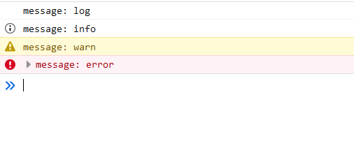
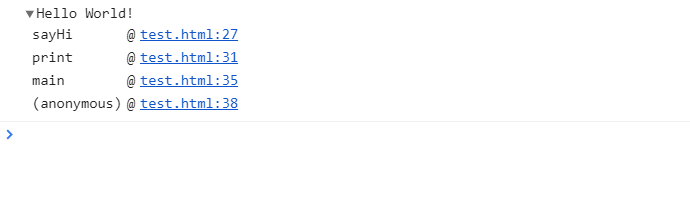
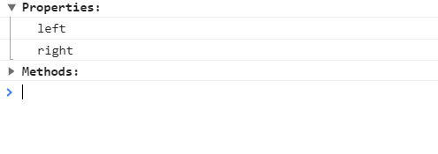
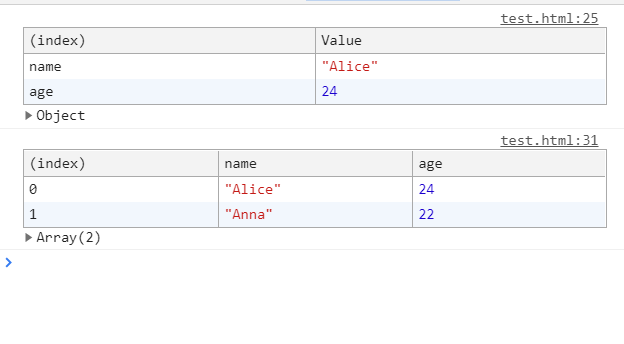

## 简介

[MDN console](https://developer.mozilla.org/zh-CN/docs/Web/API/Console)：

+ 可以接入浏览器控制台，常用于调试或输出提示信息

## 常规打印

+ `log()`: 打印一条信息（无特殊样式）
+ `info()`: 打印一条通知信息（Firefox 下信息开头有一个 info 标志）
+ `warn()`: 打印一条警告信息（信息开头有一个黄色的感叹号标志）
+ `error()`: 打印一条错误信息（信息开头有一个红色的错误标志）
+ `assert()`: 断言打印，当第一个参数返回 `false` 时打印一条错误信息
+ `dir()`: 打印对象，视图是折叠的
+ `dirxml()`: 打印对象，视图是折叠的，但是在后面包含一些详细信息
+ `trace()`: 打印一个栈跟踪

::: tip 说明：
+ `log()`/`info()`/`warn()`/`error()` 几个方法基本类似，只是描述的信息不一样；在 Chrome 下 `log()`/`info()` 的效果相同，以下为 Firefox 打印的结果：
```js
console.log('message: log')
console.info('message: info')
console.warn('message: warn')
console.error('message: error')
```

+ `dir()`/`dirxml()` 的行为类似 `console.log()`
+ `assert()` 相当于包含条件判断的 `console.error()`
+ `trace()` 的打印结果会包含一个调用栈跟踪：
```js
function sayHi() {
  console.trace('Hello World!')
}
function print() {
  sayHi()
}
function main() {
  print()
}

main()
```

:::


## 分组打印

+ `group()`: 创建一个新的分组（默认是展开的）
+ `groupCollapsed()`: 创建一个新的分组（默认是折叠的）
+ `groupEnd()`: 结束分组

::: tip 说明：
+ `group()`/`groupCollapsed()` 的使用方式一样，行为稍有不同:
```js
console.group('Properties:')
console.log('left')
console.log('right')
console.groupEnd()

console.groupCollapsed('Methods:')
console.log('append()')
console.log('insert()')
console.groupEnd()
```

:::


## 打印表格

+ `table()`: 将列表型的数据打印成表格

::: tip 说明：
+ 用于打印对象或数组：
```js
console.table({ name: 'Alice', age: 24 })

const users = [
  { name: 'Alice', age: 24 },
  { name: 'Anna', age: 22 },
]
console.table(users)
```

:::


## 计时器

+ `time(label: string)`: 启动计时器（页面中最多能同时运行 10000 个计时器）
+ `timeLog(label: string)`: 打印计时器的值（不会中断计时器）
+ `timeEnd(label: string)`: 停止并打印计时器的值
+ `timeStamp(label: string)`: 向浏览器的 Performance 或者 Waterfall 工具添加一个标记

::: tip 说明：
+ `time()`/`timeLog()`/`timeEnd()` 常用于作基准测试，用于监测代码用时：
```js
console.time('Timer')

const id = setInterval(() => {
  console.timeLog('Timer')
}, 1000)

setTimeout(() => {
  console.log('Done!')
  clearInterval(id)
  console.timeEnd('Timer')
}, 3000)

// Timer: 1013.046142578125ms
// Timer: 2000.202880859375ms
// Timer: 3002.63818359375ms
// Done!
// Timer: 3003.130126953125ms
```
:::


## 计数

+ `count(label=default?: string)`: 打印调用的次数
+ `countReset(label=default?: string)`: 重置计数器值

::: tip 说明：
+ 使用
```js
console.count('Alice')
console.count('Alice')
console.countReset('Alice')
console.count('Alice')

// Alice: 1
// Alice: 2
// Alice: 1
```
:::


## 记录性能

+ `profile()`: 开始记录性能描述信息
+ `profileEnd()`: 停止记录性能描述信息

::: tip 说明：
+ 用于记录一些信息
```js
const id = setInterval(() => {
  console.profile('Timer')
}, 1000)

setTimeout(() => {
  console.log('Done!')
  clearInterval(id)
  console.profileEnd('Timer')
}, 3000)

// Profile 'Timer' started.
// Profile 'Timer' started.
// Done!
// Profile 'Timer' finished.
```
:::


## 其他

+ `clear()`: 清空控制台
+ `debug()`: 在控制台打印一条 `debug` 级别的消息