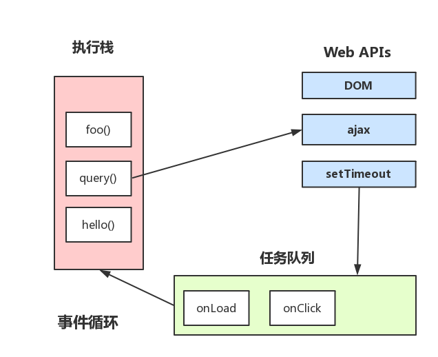

## 概念

参考：
+ [从浏览器多进程到JS单线程，JS运行机制最全面的一次梳理](https://segmentfault.com/a/1190000012925872)
+ [深入浅出Javascript事件循环机制(上)](https://zhuanlan.zhihu.com/p/26229293)
+ [【 js 基础 】 setTimeout(fn, 0) 的作用](https://juejin.im/post/6844903496764915719)


### 进程和线程

+ **进程**：CPU 资源分配的最小单位
+ **线程**：CPU 调度的最小单位

::: tip 备注：
+ 一个应用程序通常可以开启多个进程，win 下可以在任务管理器中查看进程列表和 CPU 占用等信息
+ 一个进程中可以有多个线程，这些线程共享该进程的一些资源
+ 平时所说的多线程开发是因为线程间可以通信，而进程间也可以通信但代价大
:::


### 浏览器进程

浏览器作为一个应用程序，也有开启多个进程的权限，简单来说：
+ **Browser 进程**：浏览器的主进程（负责协调、主控），只有一个
+ **第三方插件进程**：每种类型的插件对应一个进程，仅当使用该插件时才创建
+ **GPU 进程**：最多一个，用于3D绘制等
+ **浏览器渲染进程**(浏览器内核的 Renderer 进程，内部是多线程的)：默认每个 Tab 页面一个进程，互不影响

::: tip 备注：
+ 打开 chrome 浏览器，查看窗口 -> 任务管理器，可以看到浏览器启动的进程
+ 每打开一个 Tab 页面会新建一个进程，但浏览器有响应的优化策略，如会多个空 Tab 只会创建一个进程
:::


### 浏览器内核

浏览器的渲染进程是多线程的，它包含了一系列线程，列举主要的常驻线程：
+ **GUI 渲染线程**：
  + 负责渲染浏览器界面，解析 HTML，CSS，构建 DOM树 和 RenderObject 树，布局和绘制等
  + 当界面需要重绘(Repaint)或由于某种操作引发回流(reflow)时，该线程就会执行
  + 注意，GUI 渲染线程与 JS 引擎线程是互斥的，当JS引擎执行时GUI线程会被挂起，GUI 更新会被保存在任务队列中等到 JS 引擎空闲时立即被执行
+ **JS 引擎线程**：
  + 也称为 JS 内核，负责处理 JS 脚本程序(如 V8 引擎)，解析 JS 脚本，运行代码
  + JS 引擎一直等待着任务队列中任务的到来，然后加以处理，一个 Tab 页(renderer 进程)中无论什么时候都只有一个 JS 线程(单线程)
  + 注意，GUI 渲染线程与 JS 引擎线程是互斥的，如果 JS 执行的时间过长，这样就会造成页面的渲染不连贯，导致页面渲染加载阻塞
+ **事件触发线程**：
  + 归属于浏览器而不是 JS 引擎，用来控制事件循环(可以理解 JS 引擎自己都忙不过来，需要浏览器另开线程协助)
  + 当 JS 引擎执行代码块如 setTimeOut 时(或浏览器内核的其他线程，如鼠标点击、AJAX 异步请求等)，会将对应任务添加到事件线程中
  + 当对应的事件符合触发条件被触发时，该线程会把事件添加到待处理队列的队尾，等待 JS 引擎的处理
  + 注意，由于 JS 是单线程的，这些待处理队列中的事件都得排队等待 JS 引擎处理(当JS引擎空闲时才会去执行)
+ **定时触发器线程**：
  + setInterval 和 setTimeout 所在的线程
  + 浏览器定时计数器不是由 JS 引擎计数的，(JS 引擎是单线程的, 如果处于阻塞线程状态就会影响记计时的准确)
  + 因此通过单独线程来计时并触发定时(计时完毕后，添加到事件队列中，等待 JS 引擎空闲后执行)
  + 注意，W3C 在 HTML 标准中规定，规定要求 setTimeout 中低于 4ms 的时间间隔算为 4ms
+ **异步http请求线程**：
  + XMLHttpRequest 连接后通过浏览器新开一个线程请求
  + 检测到状态变更时，若设有回调函数，异步线程就产生状态变更事件，将回调再放入事件队列中，由 JS 引擎执行


::: tip 备注：
+ GUI 渲染线程与 JS 引擎线程互斥：JS 也能操作 DOM，为了防止 GUI 渲染时 DOM 被操作产生不良后果
+ JS 为什么是单线程的：可能是由于多线程的复杂性(如多线程操作一般要加锁)，因此最初设计时选择单线程
+ JS 阻塞页面加载：当 JS 引擎进行巨量计算时需要消耗很长时间，后来 HTML5 引入了 Web Worker：
  + [WebWorker](https://developer.mozilla.org/zh-CN/docs/Web/API/Web_Workers_API/Using_web_workers)：JS 引擎向浏览器申请开一个子线程(子线程是浏览器开的，完全受主线程控制，而且不能操作 DOM)，JS 引擎线程与 worker 线程间通过特定的方式通信(postMessage API，需要通过序列化对象来与线程交互特定的数据)
  + [SharedWorker](https://developer.mozilla.org/zh-CN/docs/Web/API/SharedWorker)：WebWorker 只属于某个页面，而 SharedWorker 是浏览器所有页面共享的，因此 Chrome 浏览器为 SharedWorker 单独创建一个进程来运行 JavaScript 程序，并且在浏览器中每个相同的 JavaScript 只存在一个 SharedWorker 进程
:::


### 浏览器渲染流程

1. 解析 html 建立 dom 树
2. 解析 css 构建 render 树(将CSS代码解析成树形的数据结构，然后结合 DOM 合并成 render 树)
3. 布局 render 树(Layout/reflow)，负责各元素尺寸、位置的计算
4. 绘制 render 树(paint)，绘制页面像素信息
5. 浏览器会将各层的信息发送给 GPU，GPU 会将各层合成（composite），显示在屏幕上


::: tip 备注：
+ `DOMContentLoaded` 事件：当 DOM 加载完成(不包括样式表，图片)时触发
+ `load` 事件：页面上所有的 DOM，样式表，脚本，图片都已经加载完成时触发(渲染完毕)
+ dom 树解析和 render 树构建是同步的，所需的 html、css 文件由异步的线程下载
:::


## 事件循环

### 基础概念

+ **执行栈**：JS 的所有同步任务都在主线程上执行，形成一个执行栈
+ **任务队列**：由事件触发线程管理，只要异步任务有了运行结果，就在任务队列中放置一个事件
+ 执行栈中的所有同步任务执行完毕时(此时 JS 引擎空闲)，系统会读取任务队列，将可运行的异步任务添加到可执行栈中，开始执行


### 宏任务和微任务

**简介：**
+ **宏任务**(macro task)：又称 task，理解是每次执行栈执行的代码就是一个宏任务
+ **微任务**(micro task)：又称 jobs，理解是在当前 task 执行结束后立即执行的任务
+ 宏任务和微任务都单独维护一个队列，宏任务队列就是 JS 引擎的任务队列

**常见微任务：**
+ `Promise.then/catch/finally`
+ `process.nextTick`(Node.js)
+ `Object.observe()`(已废弃；Proxy 对象替代)
+ `MutationObserve`

**常见宏任务：**
+ 顶层 script
+ `setTimeout/setInterval`
+ `setImmediate`/`I/O`(Node.js)
+ `postMessage`/`MessageChannel`
+ `requestAnimationFrame`
+ UI 渲染/UI 事件


::: tip 备注：
+ Node 环境下，process.nextTick 的优先级高于 Promise
+ 浏览器为了使 JS 内部 task 与 DOM 任务能够有序的执行，会在一个 task 执行结束后下一个 task 执行前，对页面进行重新渲染：
```
task -> 渲染 -> task -> ...
```
+ 在一个 task 执行完后，就会将在它执行期间产生的 jobs 都执行完毕(在渲染前)：
```
task -> jobs -> 渲染 -> task -> ...
```
:::


### EventLoop

+ 事件循环图示：



::: tip 解释：
+ 主线程运行时会产生执行栈
+ 栈中的代码调用某些 api 时，它们会在事件队列中添加各种事件
+ 栈中的代码执行完毕，就会读取事件队列中的事件，去执行那些回调
+ 如此循环，直至代码执行完毕，主线程结束
:::


::: tip 结合宏任务和微任务解释的 Event Loop：
1. 从宏任务的头部取出一个任务执行
2. 执行过程中若遇到微任务则将其添加到微任务的队列中
3. 宏任务执行完毕后，若微任务的队列中存在任务，则逐个执行至全部完成
4. GUI 渲染
5. 回到步骤 1，直到宏任务执行完毕
:::

+ 案例1：
```js
console.log('1')

setTimeout(() => {
  console.log('6')
}, 0)

const p1 = new Promise(resolve => {
  console.log('2')
  resolve()
})

const p2 = new Promise(resolve => {
  console.log('3')
  setTimeout(() => {
    resolve()
  }, 1000)
})

p1.then(res => {
  console.log('5')
})

p2.then(res => {
  console.log('7')
})

console.log('4')

// 1234567
```

::: tip 解析：
1. 主线程开始，**打印 1**
2. 遇到 setTimeout，将其交由事件线程处理(倒计时结束时会加入到任务队列末尾)
3. p1 执行，**打印 2**
4. p2 执行，**打印 3**，遇到 setTimeout，将其交由事件线程处理(倒计时结束时会加入到任务队列末尾)
5. p1.then 被添加到微任务队列末尾
6. p2.then 被添加到微任务队列末尾
7. 执行最后一行同步代码，**打印 4**
8. 同步代码执行完毕，准备清空本轮事件循环添加的微任务队列：
    1. p1 被 resolve，**打印 5**
    2. p2 需要到等待 resolve，不执行
9. 微任务清空完毕，从任务队列头部取出一个任务，**打印 6**，无其他代码，结束本轮事件循环
10. 继续从任务队列头部取出一个任务，此时 p2 被 resolve，**打印 7**，无其他代码，结束本轮事件循环
11. 所有代码执行完毕，主线程结束
:::

+ 案例2：
```js
(function test() {
    setTimeout(function() { console.log(4) }, 0)
    new Promise(function executor(resolve) {
        console.log(1)
        for( var i=0 ; i<10000 ; i++ ) {
            i == 9999 && resolve()
        }
        console.log(2)
    }).then(function() {
        console.log(5)
    })
    console.log(3)
})()

// 输出依次为 12354
```

+ 案例3：事件线程的计时器是同步计时的
```js
const p1 = new Promise((resolve, reject) => {
  setTimeout(() => {
    reject(new Error('fail'))
  }, 3000)
})

const p2 = new Promise((resolve, reject) => {
  setTimeout(() => {
    resolve(p1)
  }, 1000)
})

p2.then(res => {
  console.log(res)
}).catch(err => {
  console.log(err)
})

// 3s 后打印结果
```


## 实现异步编程

|方式|优点|缺点|
|-|-|-|
|Callback|简单、容易理解和部署|容易出现 “回调地狱”|
|Thunk|让回调链式执行||
|Promise|更优雅的 Thunk||
|Generator|生成一切||
|async/await|终极杀器||
|Async + Promise|最佳方式||


## 问题

### 分析复杂的异步嵌套逻辑

1. 复杂的异步写法转换为简单写法(`async/await`) 
2. 按照事件的循环机制进行分析


### 处理循环中的异步操作

+ 使用闭包
+ 使用 `Promise`
+ 使用 `async/await`