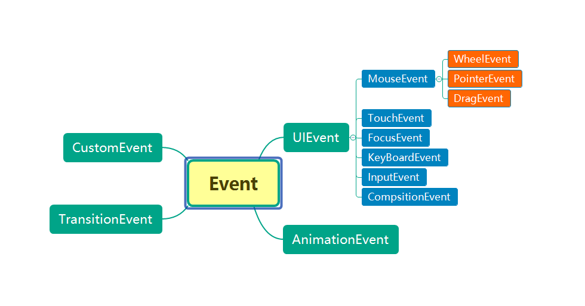
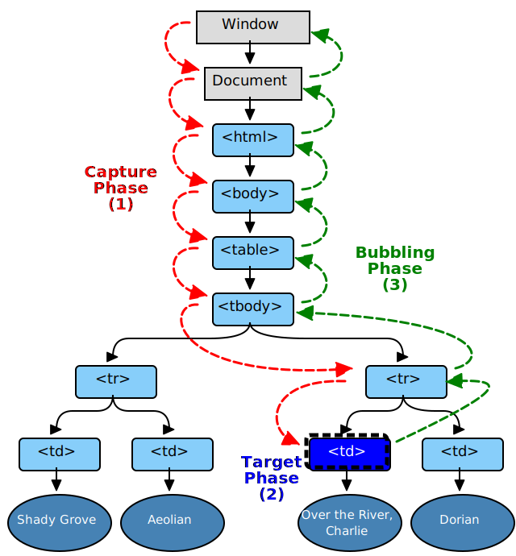

## 介绍

[Event](https://developer.mozilla.org/zh-CN/docs/Web/API/Event)：

+ 表示在 `DOM` 中发生的任何事件
+ `DOM` 所有事件都继承自该接口
+ 事件对象关系图：



## 属性

|属性|类型|描述|
|-|-|-|
|`type`|`readonly String`|事件的类型(不区分大小写)|
|`bubbles`|`readonly Boolean`|指示事件是否是冒泡模式|
|`cancelable`|`readonly Boolean`|指示事件是否可以被取消|
|`composed`|`readonly Boolean`|指示事件是否可以从 Shadow DOM 传递到一般的 DOM|
|`defaultPrevented`|`readonly Boolean`|指示当前事件是否调用了 `preventDefault()`|
|`isTrusted`|`readonly Boolean`|指示事件是否由用户行为触发|
|`target`|`readonly Element`|触发事件的元素|
|`currentTarget`|`readonly Element`|绑定事件的元素|
|`timestamp`|`readonly String`|事件发生时的时间戳|
|`eventPhase`|`readonly Number`|表示事件流当前处于哪一个阶段|

::: tip 兼容老版本 IE 的几个属性：
+ `srcElement: readonly Element`: 触发事件的元素(相当于 `target`)
+ `returnValue: Boolean`: 获取/设置是否应该事件的默认行为，效果相当于 `preventDefault()`
+ `cancelBubble: Boolean`: 获取/设置是否允许事件冒泡，效果相当于 `stopPropagation()`
:::


## 方法

+ `preventDefault(): void`: 取消事件默认行为
+ `stopPropagation(): void`: 取消事件冒泡
+ `stopImmediatePropagation(): void`: 阻止事件冒泡并且阻止相同事件的其他侦听器被调用

::: tip 说明：
+ 为了兼容老版本 IE，通常会书写以下的兼容性代码：
```js
// 取消事件默认行为
if (e.preventDefault) {
  e.preventDefault()
} else {
  e.returnValue = false
}

// 取消事件冒泡
if (e.stopPropagation) {
  e.stopPropagation()
} else {
  e.cancelBubble = true
}
```
+ 一种同时取消事件冒泡和取消时间默认行为的方式为直接在事件处理函数中返回 `false`：
```js
list.addEventListener('click', function() {
  return false // 在 return 语句之后的代码都不会执行，只适用于某些特定情况
})
```
:::


## 事件绑定的方式

**事件绑定的方式有两种：**

+ 事件冒泡: 事件对象从事件目标开始，触发了自身的事件监听后开始向外冒泡，每到达一个父元素都会触发同种类型(时间名和事件绑定方式相同)的事件监听，直至到达 `window`
+ 事件捕获: 与事件冒泡相反，事件对象从 `window` 开始，触发了自身的事件监听后开始向内捕获，每到达一个子元素都会触发同种类型(时间名和事件绑定方式相同)的事件监听，直至到达事件目标


::: tip 说明：
+ 使用事件冒泡的方式可以实现事件委托(将事件监听器添加到一些元素的公共父元素，由该父元素进行事件处理，避免添加过多的事件监听影响性能)：
```html
<ul id="list">
  <li>one</li>
  <li>two</li>
  <li>three</li>
</ul>
```
```js
const list = document.getElementById('list')

list.addEventListener('click', e => {
  e.preventDefault()
  console.log(e.target.textContent) // 点击每个列表都会打印它们包含的文本
})
```
:::

## 事件进行的阶段

**一些列常量用于指示事件当前执行的阶段：**

|常量|值|描述|
|-|-|-|
|NONE|0|没有事件正在被处理|
|CAPTURE_PHASE|1|处于捕获阶段|
|AT-TARGET|2|处于事件目标(`target`)|
|BUBBLING_PHASE|3|处于冒泡阶段|

**事件流的三个阶段：**[W3C](https://www.w3.org/TR/DOM-Level-3-Events/#dom-event-architecture)

