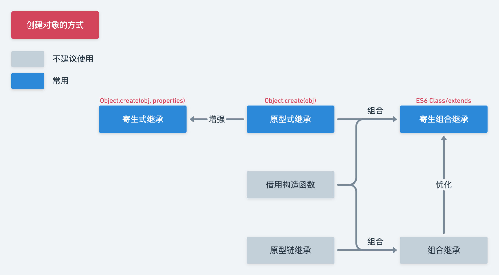
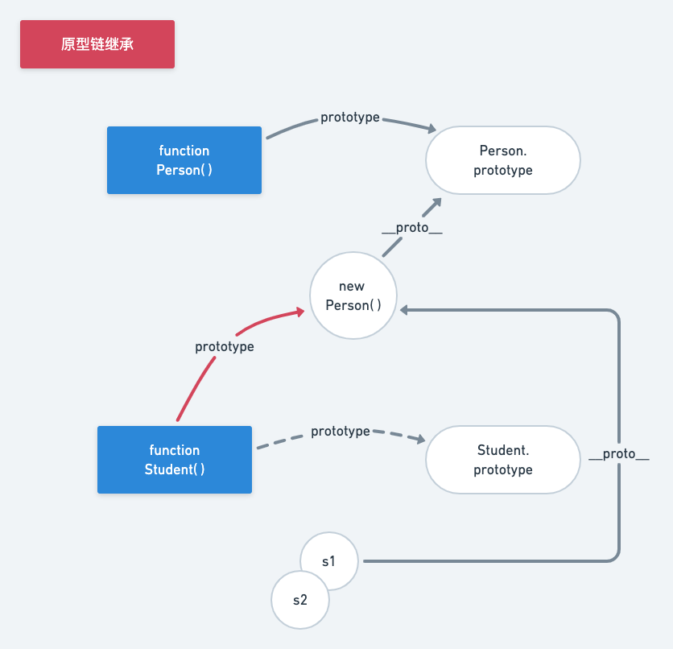
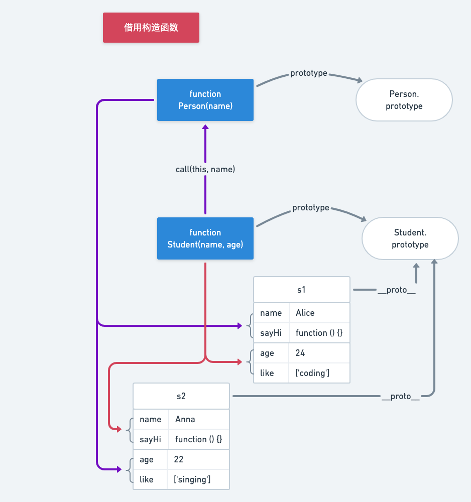
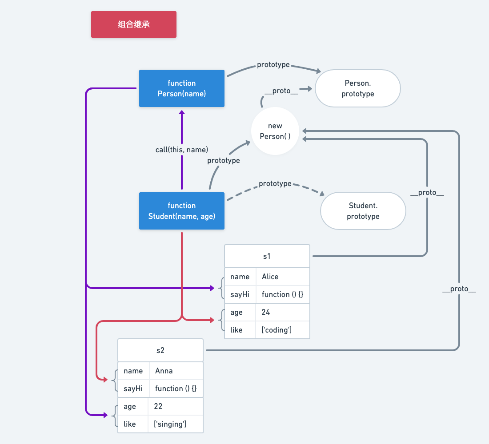
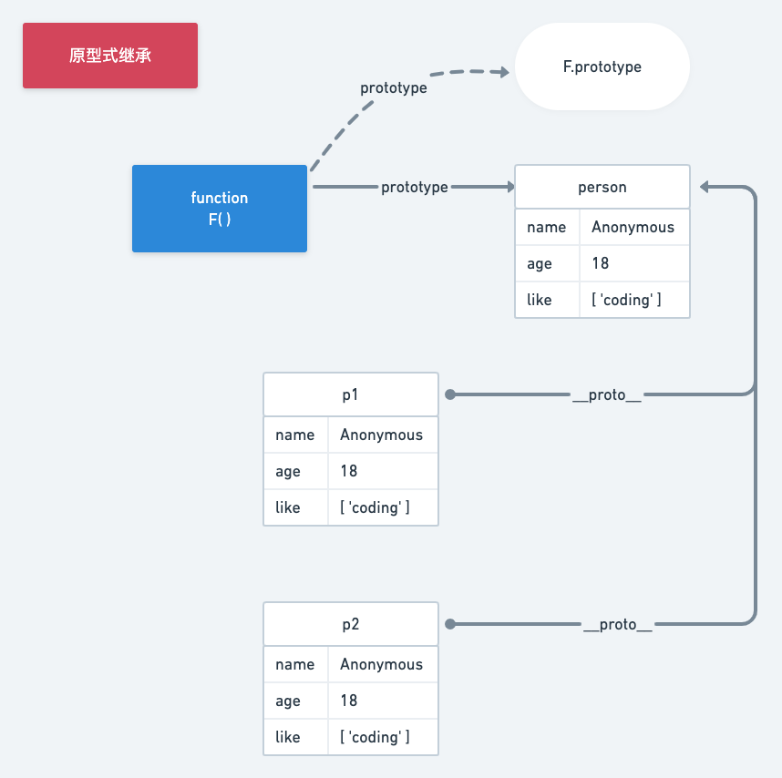
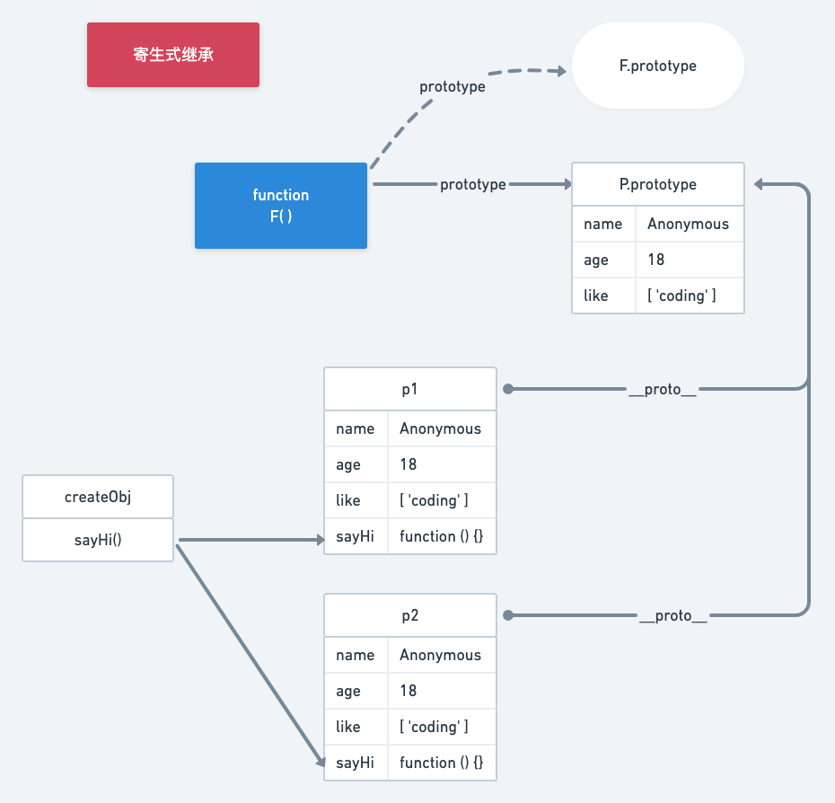
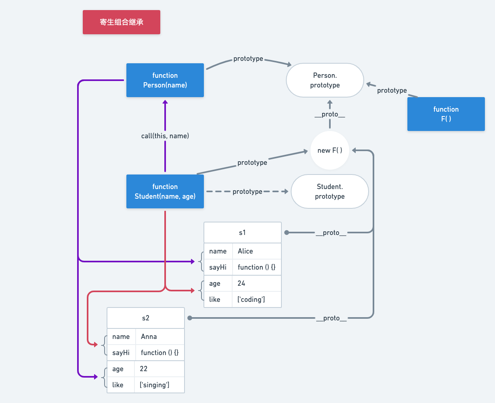

## 概览

+ 借用构造函数本不属于继承(没有修改原型)，但是它是实现继承的一个关键操作
+ 寄生组合继承中用到的是原型式继承和借用构造函数，我觉得更应该叫组合原型继承



+ 适用场景：
  + `原型链继承`和`借用构造函数继承`一般不会单独使用
  + `组合继承`已经比较完美了，但是`寄生组合继承`是更加通用的方法
  + `原型式继承`或`寄生式继承`用于快速从现有对象实现继承


## 原型链继承

+ **原理**：将一个类的原型对象设置为另一个类的实例
+ **优点**：子类实例能够通过原型链共享超类的属性
+ **不足**：创建多个子类实例时，不能向超类的构造函数中传递不同的参数，导致他们会共享引用类型的属性
```js
function Person() {
  this.name = 'Alice'
  this.like = ['coding', 'singing']
}
Person.prototype.sayName = function() {
  console.log(this.name)
}

function Student() {}

Student.prototype = new Person()

const s1 = new Student()
console.log(s1.name)  // Alice
s1.sayName()          // Alice
console.log(s1 instanceof Student)  // true
console.log(s1 instanceof Person)   // true

const s2 = new Student()
s2.like.push('travel')
console.log(s1.like)    // [ 'coding', 'singing', 'travel' ]
console.log(s2.like)    // [ 'coding', 'singing', 'travel' ]
```




## 借用构造函数

+ **原理**：通过 `call()` 或 `apply()` 在一个类的构造函数中调用另一个类的构造函数
+ **优点**：子类能够向超类传递参数；子类继承的引用类型的属性不会共享，因为调用构造函数生成的是不同的实例
+ **缺点**：
  + 严格来说，这不能算继承，因为不涉及原型，所以 `instanceof` 不能识别实例和超类的继承关系
  + 调用“超类”的构造函数通过 `call` 修改 `this` 的指向，可以获取“超类”的实例属性，但是超类的原型中的属性不可见(不能使用)
```js
function Person(name) {
  this.name = name
  this.sayHi = function () {
    console.log('Hi', this.name)
  }
}

function Student(name, age, like) {
  // 调用父类的构造函数，去继承一些属性
  Person.call(this, name)
  // 以下为子类特有的属性，应该在调用父类构造函数之后定义
  this.age = age
  this.like = like
}

const s1 = new Student('Alice', 24, ['coding'])
const s2 = new Student('Anna', 22, ['singing'])
console.log(s1 instanceof Student, s2 instanceof Student) // true true
console.log(s1 instanceof Person, s2 instanceof Person)   // false false
console.log(s1.name)          // Alice
console.log(s2.name)          // Anna
s1.sayHi()        // Hi Alice
s2.sayHi()        // Hi Anna
s1.like.push('basketball')
console.log(s1.like)          // [ 'coding' ]
console.log(s2.like)          // [ 'singing' ]
```




## 组合继承

+ **原理**：使用原型链实现对原型属性的继承，再借用构造函数获取超类的实例属性
+ **优点**：
  + 既能使用超类的原型属性，也能根据参数生成不同的实例
  + 由于操作了原型，所以 `instanceof` 能识别实例和超类的继承关系
+ **不足：** 调用两次超类的构造函数，生成多余的属性，造成性能浪费
```js
function Person(name) {
  this.name = name
  this.sayHi = function () {
    console.log('Hi', this.name)
  }
}
Person.prototype.sayName = function() {
  return this.name
}

function Student(name, age, like) {
  Person.call(this, name)               // 第 2 次调用超类构造函数
  this.age = age
  this.like = like
}

Student.prototype = new Person()        // 第 1 次调用超类构造函数
Student.prototype.constructor = Student // 使 constructor 指向至父类，而不是超类
// 对父类原型进行扩充
Student.prototype.sayAge = function() {
  return this.age
}

const s1 = new Student('Alice', 24, ['coding'])
const s2 = new Student('Anna', 22, ['singing'])
s1.sayHi()    // Hi Alice
s2.sayHi()    // Hi Anna
console.log(s1.sayName(), s1.sayAge())    // Alice, 24
console.log(s2.sayName(), s2.sayAge())    // Anna, 22
s1.like.push('reading')
console.log(s1.like)    // [ 'coding', 'reading' ]
console.log(s2.like)    // [ 'singing' ]
console.log(s1 instanceof Student, s1 instanceof Person)  // true true
console.log(s2 instanceof Student, s2 instanceof Person)  // true true
```




## 原型式继承

+ **原理**：借助原型的特点，由已有的对象创建新对象；ES5 新增的 `Object.create()` 方法与之类似
+ **优点**：是轻量的原型链继承，很多时候我们不需要继承超类，只是想共享一个对象的属性，这会是一种很便捷的方法
+ **缺点**：实例共享引用数据类型，`instanceof` 不能判断继承关系，因为 `person` 不是一个构造函数
```js
function object(o) {
  function F() {}
  F.prototype = o
  return new F()
}

const person = {
  name: 'Anonymous',
  age: 18,
  like: ['coding'],
}

const p1 = object(person)
const p2 = object(person)
p1.name = 'Alice'
p1.age = 24
p2.name = 'Anna'
p2.age = 22
console.log(p1.name, p1.age)  // Alice 24
console.log(p2.name, p2.age)  // Anna 22
p1.like.push('reading')
console.log(p1.like)          // [ 'coding', 'reading' ]
console.log(p2.like)          // [ 'coding', 'reading' ]
console.log(person.like)      // [ 'coding', 'reading' ]
```



+ **传入原型对象**：如果传入 `object()` 的对象是一个构造函数的原型，`instanceof` 就能判断继承关系了；但是这十分多余，因为一个 `new` 就能创建实例了，没必要再添加一层工厂函数 `object`；因此这种场景很少出现
```js
function object(o) {
  function F() {}
  F.prototype = o
  return new F()
}

function P() {}
P.prototype = {
  name: 'Anonymous',
  age: 18,
  like: ['coding'],
}

const p1 = object(P.prototype)
const p2 = object(P.prototype)
p1.name = 'Alice'
p1.age = 24
p2.name = 'Anna'
p2.age = 22
console.log(p1.name, p1.age)  // Alice 24
console.log(p2.name, p2.age)  // Anna 22
p1.like.push('reading')
console.log(p1.like)          // [ 'coding', 'reading' ]
console.log(p2.like)          // [ 'coding', 'reading' ]
console.log(P.prototype.like) // [ 'coding', 'reading' ]
console.log(p1 instanceof P, p2 instanceof P)   // true true
```


## 寄生式继承

+ **原理**：封装一个函数，在内部使用原型式继承生成实例，增强实例后再将其返回
+ **优点**：增强了原型式继承，可用性大大增强，和 `Object.create()` 一样(`Object.create()` 能利用第二个参数增强对象)
+ **缺点**：最适用于快速扩充对象的情景，若是为了实现继承，使用寄生组合继承更好
```js
function object(o) {
  function F() {}
  F.prototype = o
  return new F()
}

function createObj(obj) {
  const clone = object(obj)
  // 增强实例的属性或方法
  clone.sayHi = function() {
    console.log('Hi')
  };
  return clone
}

const person = {
  name: 'Alice',
  age: 24,
  sayName: function() {
    console.log(this.name)
  }
}

const p = createObj(person)
console.log(p.age)  // 24
p.sayName()         // Alice
p.sayHi()           // Hi
```




## 寄生组合继承

+ 原理：依然通过借用构造函数来获取实例属性，但是超类的原型共享通过原型式继承实现(我觉得更应该叫做组合原型继承)
+ 优点：增强了组合继承，不用再调用两次超类的构造函数，但是仍有一个小的内存开销(`new F()` 不会释放)；`ES6` 中 `extends` 语法就是使用这种继承
+ 缺点：最适用于需要继承的场景，若是为了快速扩充对象，使用寄生式继承更好
```js
// 原型式继承核心函数
function object(o) {
  function F() {}
  F.prototype = o
  return new F()
}

function inheritPrototype(subType, superType) {
  // 没有 object() 的时候，这个 prototype 是用 new Person() 生成的
  const prototype = object(superType.prototype)
  prototype.constructor = subType
  subType.prototype = prototype
}

function Person(name) {
  this.name = name
  this.sayHi = function () {
    console.log('Hi', this.name)
  }
}
Person.prototype.sayName = function() {
  console.log(this.name)
}
function Student(name, age, like) {
  Person.call(this, name)
  this.age = age
  this.like = like
}

inheritPrototype(Student, Person)

const s1 = new Student('Alice', 24, ['coding'])
console.log(s1 instanceof Student, s1 instanceof Person)  // true true
console.log(s1.age)   // 24
s1.sayName()          // Alice
s1.sayHi()            // Hi Alice

const s2 = new Student('Anna', 24, ['singing'])
s1.like.push('reading')
console.log(s1.like)  // [ 'coding', 'reading' ]
console.log(s2.like)  // [ 'singing' ]
```

