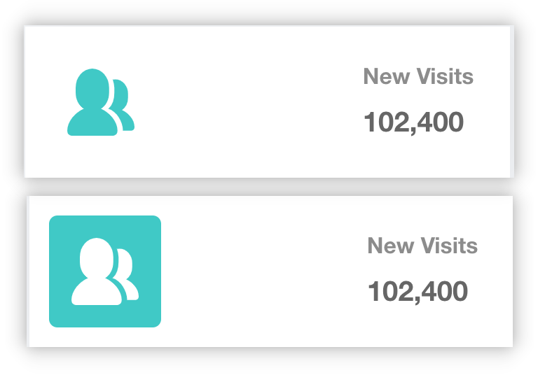

## 文档及教程

+ [svg-sprite-loader](https://github.com/JetBrains/svg-sprite-loader)
+ [svg-sprite-loader 使用教程](https://www.jianshu.com/p/70f9c9268c83)


## 解析

+ 通过 `svg-sprite-loader` 将 svg 文件合并为一个 svg 标签(全局雪碧图)，放在 `<body>` 标签的开头
+ 在需要使用 `svg-icon` 时，通过 `<use>` 并结合 `id` 属性复用
+ 复用格式通过 `svg-sprite-loader` 指定


## 配置

### 目录

```
|-- src\
  |-- components\       # 组件目录
    |-- SvgIcon\        # svg 组件文件夹
      |-- index.vue
  |-- icons\            # 图表目录
    |-- svg\            # 保存所有 svg 文件
      |-- people.svg
      |-- message.svg
      |-- ...
    |-- index.js        # 组织导入所有 svg 文件
  |-- main.js           # 入口文件
|-- vue.config.js       # vue 配置文件
```

### 配置 loader

```js
// vue.config.js
module.exports = {
  chainWebpack (config) {
    config.module
      .rule('svg') // 当使用其他 svg-loader 时，排除 src/icons 下的文件
      .exclude.add(resolve('src/icons'))
      .end()
    config.module
      .rule('icons')
      .test(/\.svg$/)
      .include.add(resolve('src/icons'))
      .end()
      .use('svg-sprite-loader')
      .loader('svg-sprite-loader')
      .options({
        symbolId: 'icon-[name]' // 配置 svg 图标的 id 格式
      })
      .end()
  }
}
```

### 单文件组件

```vue
<template>
  <div>
    <svg :class="svgClass" aria-hidden="true" v-on="$listeners">
      <use :xlink:href="iconName" />
    </svg>
  </div>
</template>

<script>
export default {
  name: 'SvgIcon',
  props: {
    iconClass: {
      type: String,
      required: true
    },
    className: {
      type: String,
      default: ''
    }
  },
  computed: {
    iconName () {
      return `#icon-${this.iconClass}`
    },
    svgClass () {
      return this.className ? `svg-icon ${this.className}` : 'svg-icon'
    }
  }
}
</script>

<style lang="scss" scoped>
.svg-icon {
  width: 1em;
  height: 1em;
  vertical-align: -0.15em;
  fill: currentColor;
  overflow: hidden;
}
</style>
```

::: tip 备注
+ `<use>` 标签用于复用 svg，`xlink:href` 属性指定其要复用的 svg 的 `id` 属性
+ 该组件有一个必选属性 `iconClass`，它用于构造 svg 的 `id` 属性
+ 样式表设置：
  + `fill: currentColor;`：svg 将会使用父元素的 `color` 属性作为填充色
  + `width/height: 1em;`：svg 的宽高相对于父元素的 `font-size` 属性，这里比例为 1:1
:::

### 导入 svg

+ src/icons/index.js
```js
import Vue from 'vue'
import SvgIcon from '@/components/SvgIcon'
// 全局注册组件
Vue.component('svg-icon', SvgIcon)
// 导入所有 svg 文件
const requireAll = requireContext => requireContext.keys().map(requireContext)
const req = require.context('./svg', false, /\.svg$/)
requireAll(req)
```

+ src/main.js
```js
// 添加一行
import '@/icons'
```

::: tip 备注
+ svg 图表可以从[阿里云图标库](https://www.iconfont.cn/)下载，点击下载按钮可以选择 “下载 SVG”，注意下载时直接下载默认就可以，不要改变颜色，因为 svg 的颜色可以通过代码改变（我之前配置不成功，就是因为下载了自定义颜色的图标）
+ [require.context()](https://www.webpackjs.com/api/module-methods/#require-context) 是 Webpack 的一个函数
:::

### 使用

```vue
<template>
  <div class="svg-wrapper">
    <svg-icon icon-class="message" />
  </div>
</template>

<style lang="scss" scoped>
.svg-wrapper {
  color: red;
  font-size: 30px;
}
</style>
```


## 更多场景

### hover 反色效果

**场景：** 制作一个以下的 CSS 效果，当鼠标悬停至图标/图标所在容器时，图标的颜色变为容器背景色(白色)，且图标被它原来的颜色 “包围”：



```vue
<template>
  <div>
    <div class="panel-icon panel-icon--peoples">
      <svg-icon icon-class="peoples"></svg-icon>
    </div>
    <div class="panel-icon panel-icon--message">
      <svg-icon icon-class="message"></svg-icon>
    </div>
  </div>
</template>

<script>
import SvgIcon from '@/components/SvgIcon'

export default {
  components: {
    SvgIcon
  }
}
</script>

<style lang="scss" scoped>
.panel-icon {
  float: left;
  width: 100px;
  height: 100px;
  line-height: 100px;
  text-align: center;
  font-size: 48px;
  border-radius: 5px;
  transition: all .3s;
  background: #fff;
  &:hover {
    color: #fff;
  }

  &--peoples {
    color: #065fe0;
    &:hover {
      background: #065fe0;
    }
  }

  &--message {
    color: #1ddae8;
    &:hover {
      background: #1ddae8;
    }
  }
}
</style>
```
