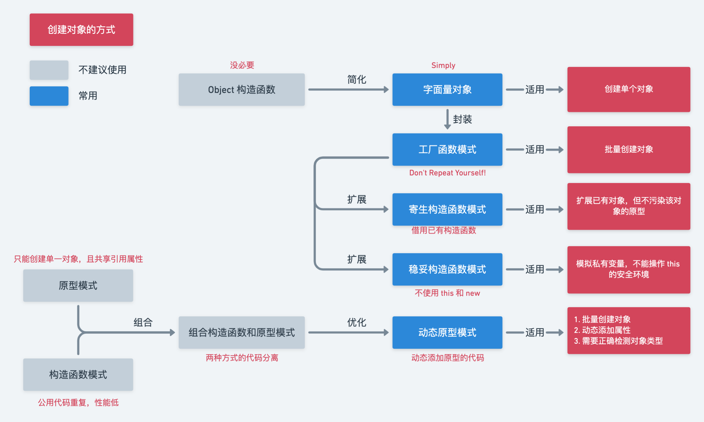

## 简介

+ 有很多方式能够用于创建对象，每种方式的使用因场景而异




## Object 构造函数

```js
const obj = new Object()
obj.name = name
obj.age = age
obj.sayName = function() {
  return this.name
}
```


## 字面量对象

+ 我们完全可以抛弃用 Object 构造函数创建对象
```js
const obj = {
  name: '',
  age: '',
  sayName: function() {
    return this.name
  }
}
```


## 工厂模式

+ 使用一个工厂函数封装创建对象的细节，当你出现重复性工作的时候，就会知道这种方式的好处
+ **缺点**：不能使用 `instanceof` 确定对象的类型(没有涉及原型)
```js
function createPerson(name, age) {
  const obj = new Object()
  obj.name = name
  obj.age = age
  obj.sayName = function() {
    return this.name
  }

  return obj
}

const person = createPerson('Alice', 24)
console.log(person.name, person.age)    // Alice 24
console.log(person.sayName())           // Alice
```


## 构造函数模式

+ 使用自定义的构造函数创建对象，能够用 `instanceof` 检测对象的类型
+ **缺点**：若多个对象有相同的属性/方法时，每个实例都保存相同的属性/方法，会造成性能浪费
```js
function Person(name, age) {
  this.name = name;
  this.age = age;
  this.sayName = function () {
    return this.name;
  }
}

const person = new Person('Alice', 24)
console.log(person.name, person.age)  // Alice 24
console.log(person.sayName())         // Alice
```


## 原型模式

+ 原型就是用来让实例共享属性/方法的，而且能够用 `instanceof` 检测对象的类型
+ **缺点**：当共享的属性是引用类型时，任何实例的修改都会影响彼此
```js
function Person() {}
Person.prototype.name = 'Alice'
Person.prototype.age = 24
Person.prototype.age = ['coding', 'reading']
Person.prototype.sayName = function() {
  return this.name
}

const person1 = new Person()
const person2 = new Person()
person1.like.push('singing')
console.log(person2.like)     // [ 'coding', 'reading', 'singing' ]
```

::: tip 补充
1. 可以快捷设置对象的原型对象，但会导致实例的 `constructor` 属性指向 `Object`，解决方法是显式地声明原型对象的 `constructor` 属性：
```js
function Person() {}
Person.prototype = {
  constructor: Person,    // 不设置这行会打印 [Function: Object]
  name: 'Alice',
  age: 24,
  sayName: function () {
    return this.name
  },
}

const person = new Person()
console.log(person.constructor)       // [Function: Person]
```
2. 方式1还会出现一个问题，它会导致 `constructor` 的 `[[enumerable]]` 属性变为 `true`，即可以被 `for...in` 枚举，解决方法是使用 `Object.defineProperty()` 禁止 `constructor` 被枚举：
```js
function Person() {}
Person.prototype = {
  name: 'Alice',
  age: 24,
  sayName: function () {
    return this.name
  },
}

Object.defineProperty(Person.prototype, 'constructor', {
  enumerable: false,  // 也可以省略，该方法 enumerable 选项的默认值是 false
  value: Person,
})

const person = new Person()
for (const key in person) {
  console.log(key)    // name age sayName
}
```
3. 依然是法1出现的问题，虽然在原型对象上添加属性和方法是动态的，但是若通过赋值修改原型对象的指向时，这些影响不会发生至在这之前创建的对象实例，它们仍保持之前的原型的引用：
```js
function Person() {}

const person1 = new Person()   // 该实例始终保持之前的原型的引用

Person.prototype = {
  name: 'Alice',
  age: 24,
  sayName: function () {
    return this.name
  },
}

Object.defineProperty(Person.prototype, 'constructor', {
  enumerable: false,
  value: Person,
})

const person2 = new Person()  // 该实例会的原型引用为新的原型
console.log(person1.name)     // undefined
console.log(person2.name)     // Alice
```
:::


## 组合构造函数和原型模式

+ 构造函数内定义不共享的属性/方法，原型内定义需要共享的属性/方法
+ **缺点**：构造函数和原型属性的定义分开，代码分离
```js
function Person(name, age, like) {
  this.name = name
  this.age = age
  this.like = like
}

Person.prototype.sayName = function () {
  return this.name
}

const person1 = new Person('Alice', 24, ['coding'])
const person2 = new Person('Anna', 22, ['singing'])
person1.like.push('reading')
person2.like.push('writing')
console.log(person1.like)     // [ 'coding', 'reading' ]
console.log(person2.like)     // [ 'singing', 'writing' ]
```


## 动态原型模式

+ 优化了组合构造函数和原型模式，使用动态检测来添加原型属性/方法，把所有代码封装在构造函数内
+ **缺点**：无
```js
function Person(name, age, like) {
  this.name = name
  this.age = age
  this.like = like
  if (typeof this.sayName !== 'function') {
    Person.prototype.sayName = function () {
      return this.name
    }
  }
}
```


## 寄生构造函数模式

+ 使用了 `new` 的工厂函数，用于在现有对象的基础上创建有特定功能的对象，而不用总是在对象的原型上添加属性和方法(这样容易发生命名冲突或修改对象的行为)
+ **缺点**：仅适用于特定场景，且不能使用 `instanceof` 确定对象的类型(构造函数内使用 `return` 打破了 `new` 的返回值)
```js
function MyArray() {
  const arr = new Array()
  arr.push.apply(arr, arguments)
  arr.toPipedString = function () {
    return this.join('|')
  }

  return arr
}

const categories = new MyArray('国语', '欧美', '韩国')
console.log(categories.toPipedString())     // 国语|欧美|韩国
console.log(categories instanceof MyArray)  // false
```


## 稳妥构造函数模式

+ 禁止使用 `this` 的工厂函数，而且不使用 `new` 创建实例；常用于模拟私有变量，即只能通过暴露的接口访问变量，来实现变量私有化(仅提供特定访问数据的接口，能有效防止数据被其他程序改动)
+ **缺点**：仅适用于特定场景，且不能使用 `instanceof` 确定对象的类型(没有涉及原型)
```js
function Person(name, age) {
  const obj = new Object()
  const name = name
  const age = age
  obj.getName = function () {
    return name
  }
  obj.getAge = function () {
    return age
  }
  
  return obj
}

const person = Person('Alice', 24)
console.log(person.getName(), person.getAge())  // Alice 24
console.log(person.name, person.age)            // undefined undefined
```