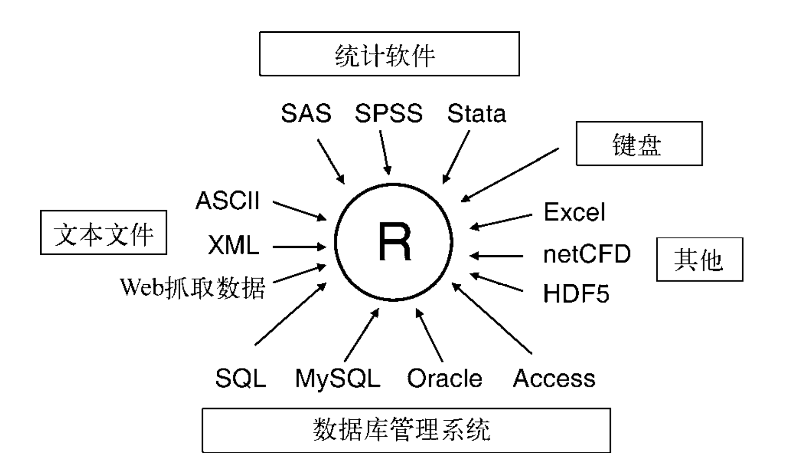

## 简介

+ R 可以有多种数据输入源



+ 其中大多数数据导入依赖于第三方包


## 输入方式

### 从键盘输入

+ 方式一：通过 `read.table()` 函数解析字符串
```r
mtxt <- "
age gender weight
25 m 166
30 f 115
18 f 120
"
mdata <- read.table(header=TRUE, text=mtxt)
#   age gender weight
# 1  25      m    166
# 2  30      f    115
# 3  18      f    120
```
+ 方式二：通过 `edit()` 函数调用内置的文本编辑器填写数据
```r
mydata <- data.frame(age=numeric(0), gender=character(0), weight=numeric(0))
mydata <- edit(mydata)
```


### 导入文本文件的数据

+ `read.table()` 能够读入一个表格格式的文件，并返回一个数据框：
```r
read.table(
  file,
  header = FALSE，
  sep = ""，
  quote = "\"'",
  dec = ".",
  row.names，
  col.names，
  na.strings，
  colClasses,
  skip,
  stringAsFactors,
  text
)
```


### 导入 Excel 数据

+ 方式一：在 Excel 将数据导出为 csv 文件，然后在用 read.table() 函数导入
+ 方法二：使用第三方包
  + xlsx
  + xlsxjars
  + rJava
  + XLConnect
  + openxlsx


### 导入 XML 数据

+ 

### 导入网页抓取的数据

+ 导入调用 API 返回的数据
+ 社交媒体专用包：twitterR, Rfackbook, Rflickr


### 导入 SPSS 数据

+ 内置包：foreign
+ 第三方包：Hmisc


### 导入 SAS 数据

+ 内置包：foreign
+ 第三方包：Hmisc


### 导入 Stata 数据

+ 内置包：foreign


### 导入 NetCDF 数据

+ ncdf
+ ncdf4


### 导入 HDF 数据

+ rhdf5


### 导入数据库数据

+ 第三方包：RODBC


### 通过 Stat/Transfer 导入

+ 商业软件 [Stat/Transfer](www.stattransfer.com) 是一款可以在 34 种数据格式之间做转换的独立应用程序，有 Windows、Mac 和 Unix 版本