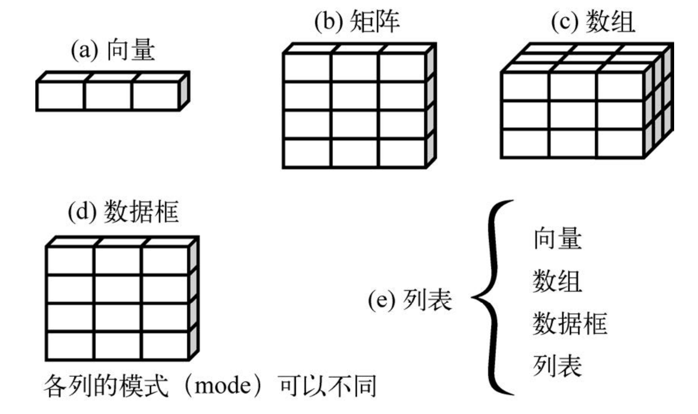

## 数据集

+ **数据集(dataset)**：通常是由数据构成的一个矩形数组
+ **观测(observation)**：数据集中的行，相当于数据库中的记录(record)
+ **变量(variable)**：数据集中的列，相当于数据库中的字段(field)
+ **实例标识符**：又叫行名(rownames)
+ **因子(factor)**：包括名义型和有序型变量(它们统称为类别型变量)

::: tip 案例分析:
|病人编号<br>(PatientID)|入院时间<br>(AdmDate)|年龄<br>(Age)|糖尿病类型<br>(Diabetes)|病情<br>(Status)|
|-|-|-|-|-|
|1|10/15/2009|25|Type 1|Poor|
|2|11/01/2009|25|Type 2|Improved|
|3|10/21/2009|25|Type 1|Excellent|
|4|10/28/2009|25|Type 1|Poor|

+ PatientID 是行/实例标识符
+ AdmDate 是日期型变量
+ Age 是连续型变量
+ Diabetes 是名义型变量
+ Status 是有序性变量
:::


## 数据结构

数据结构是用来存储数据的，R 语言拥有以下数据结构：
+ **标量**：
+ **向量**：
+ **矩阵**：
+ **数组**：
+ **数据框**：
+ **列表**：





::: tip 备注
+ 从上图看，标量、向量、矩阵和数组可以类比为数学中的点、线、面、体
+ 数据结构可以用来存储数据，而数据又可分为不同的数据类型，R 支持的数据类型有：
  + 数值型：
  + 原生型：字节
  + 字符型：
  + 逻辑型：true, false
  + 复数型：虚数
:::


### 标量

+ 标量是只有一个元素的向量，可以看作为组成向量的个体
+ 常用于保存常量
+ 直接声明即可：
```r
a <- 3
b <- 'CN'
c <- TRUE
```


### 向量

+ 向量是用于存储数值型、字符型、逻辑型数据的一维数组
+ 使用 `c()` 函数创建：
```r
a <- c(1, 2, 3)
b <- c('one', 'two', 'three')
c <- c(TRUE, FALSE)

# 生成数值序列的快捷语法
a <- c(1:3)   # 相当于 a <- c(1, 2, 3)
```
+ 使用方括号访问向量元素：
```r
a <- c(1, 2, 3, 4, 5)

# 访问单个元素
a[1]          # 1

# 访问多个元素：序列
a[c(1:3)]     # 1 2 3

# 访问多个元素：非序列
a[c(1, 3, 5)] # 1 3 5
```


::: danger 注意
+ 向量的元素下标是从 1 开始的，而大多数编程语言中数组的下标是从 0 开始的
+ 一个向量只能保存一种类型的数据，以下操作是非法的：
```r
a <- c(1, 2, 'three')
```
+ 为向量添加数据，当超出其最大下标时，它们之间的数据会被 `NA` 填充
```r
a <- c(1, 2, 3)
a[5] = 5
# [1] 1 2 3 NA 5
```
:::


### 矩阵

+ 矩阵是一个二维数组，并且一个矩阵也是只能存储一种类型的数据(数值、字符或逻辑型数据)
+ 通过 `matrix()` 函数创建矩阵：
```r
matrix(data = NA,       # 向量，表示用于创建矩阵的元素
       nrow = 1,        # 数值，指定矩阵的行数、列数
       ncol = 1,        # 数值，指定矩阵的行数、列数
       byrow = FALSE,   # 布尔值，用于指示是否按行填充
       dimname = NULL   # 缺省或列表，用于指示行名和列名
)
```
+ 示例：
```r
# 将 1-20 按列填充为 5x4 的矩阵，其中 1:20 也可以使用 c(1:20)
a <- matrix(1:20, nrow = 5, ncol = 4)
#      [,1] [,2] [,3] [,4]
# [1,]    1    6   11   16
# [2,]    2    7   12   17
# [3,]    3    8   13   18
# [4,]    4    9   14   19
# [5,]    5   10   15   20

# 按行填充 2x2 的矩阵，并指定行名和列名，list() 行数用于声明一个列表
cells <- c(10, 1, 5, 6)
rnames <- c('R1', 'R2')
cnames <- c('C1', 'C2')
a <- matrix(cells, nrow=2, ncol=2, byrow=TRUE, dimname = list(rnames, cnames))
#    C1 C2
# R1 10  5
# R2  1  6
```
+ 访问矩阵元素：
```r
a <- matrix(1:20, nrow = 5, ncol = 4, byrow=TRUE)

# 访问一行元素
a[2,]         # [1] 5 6 7 8

# 访问一列元素
a[,2]         # [1]  2  6 10 14 18

# 访问单个元素
a[2, 2]       # [1] 6

# 访问多个元素：序列
a[1, c(2:4)]  # [1] 2 3 4
a[c(2:4), 1]  # [1] 5 9 13

# 访问多个元素：非序列
a[1, c(2, 4)] # [1] 2 4
a[c(2, 4), 1] # [1] 5 13
```

::: tip matrix() 内部对一些边界进行了处理：
+ 使用 `matrix(1:20, nrow = 4, ncol = 4)` 生成 4x4 的矩阵，它只会用到 1-16，并不会使程序奔溃
+ 使用 `matrix(1:20, nrow = 5, ncol = 5)` 生成 5x5 的矩阵，当用完 1-20 后，它会从新使用 1-20，相当于循环使用
:::


### 数组

+ 数组与矩阵类似，但是维度可以大于 2，并且数组中数据也是只能是同一种类型
+ 通过 `array()` 函数创建数组：
```r
array(data,                     # 向量，数组中的数据
      dimensions = length(data), # 缺省或数值型向量，指出各个维度的最大下标
      dimname = NULL             # 缺省或列表，用于指示各维度的名字
)
```
+ 示例：
```r
# 一维数组
a1 <- array(1:5)
# [1] 1 2 3 4 5

# 二维数组
a2 <- array(1:4, c(2, 2))
#      [,1] [,2]
# [1,]    1    3
# [2,]    2    4

# 三维数组
dim1 <- c('R1', 'R2')
dim2 <- c('C1', 'C2')
dim3 <- c('A1', 'A2', 'A3')
a3 <- array(1:12, c(2, 2, 3), dimnames = list(dim1, dim2, dim3))
# , , A1
#   C1 C2
# R1  1  3
# R2  2  4

# , , A2
#    C1 C2
# R1  5  7
# R2  6  8

# , , A3
#    C1 C2
# R1  9 11
# R2 10 12
```
+ 访问数组元素：与矩阵相似
```r
a3[1, 2, 2]       # [1] 7
a3[1, 2, c(1:3)]  # [1] 3 7 11
```


### 数据框

+ 数据框可以允许不同类型的数据，因此是 R 语言中最常处理的数据
+ 通过 `data.frame()` 函数创建：
```r
data.frame(col1, col2, col3, ...,   # 
           row.names = NULL,        # 
           check.rows = FALSE,      # 
           check.names = TRUE,      #
           fix.empty.names = TRUE,  # 
           stringsAsFactors = default.stringsAsFactors()  # 
)
```
+ 示例：
```r
id <- c(1:3)
age <- c(25, 18, 33)
city <- c('广州', '深圳', '北京')
f <- data.frame(id, age, city)
#   id age city
# 1  1  25 广州
# 2  2  18 深圳
# 3  3  33 北京
```

::: danger 注意
+ 虽然数据框允许不同类型的数据名，但是每一列的数据必须是同一类型的
:::

+ 访问数据框：
```r
# 通过下标：返回 frame
f[1:2]
#   id age
# 1  1  25
# 2  2  18
# 3  3  33

# 通过列名：返回 frame
f[c('id', 'age')] # 输出同上
f['age']
#  age
# 1  25
# 2  18
# 3  33

# 使用 $ 引用变量：返回向量
f$age             # [1] 25 18 33
```


### 列表

+ 列表是最复杂的一种数据结构，用于组合向量、矩阵、数据框，甚至是其他列表
+ 列表是一种重要的数据结构，因为它是很多 R 函数的返回值类型
+ 使用 `list()` 函数创建列表：
```r
# obj1, obj2, ...：向量、矩阵、数据框或列表
l <- list(obj1, obj2, ...)

# 为对象命名，方便使用变量访问，如使用 l$ages 可以访问 obj2
l <- list(title = obj1, ages = obj2)
```
+ 示例：
```r
t <- 'create a list'
a <- c(22, 18, 33)
h <- matrix(1:4, nrow = 2)

l <- list(title = t, ages = a, h)
# $title
# [1] "create a list"

# $ages
# [1] 22 18 33

# [[3]]
#     [,1] [,2]
# [1,]    1    3
# [2,]    2    4
```

::: tip 说明
+ 可以看到，每组数据前面都有一个标识(`$age`, `$title`, `[[3]]`)，不指定标识时，默认为数字序列
:::

+ 访问列表：
```r
# 使用下标或命名：一个方括号，返回包含对象标识的数据
l[1]        # 相当于 l['ages']
# $title
# [1] "create a list"

# 使用下标或命名：两个方括号，返回没有对象标识的数据
l[[1]]      # 相当于 l[['ages']]
# [1] "create a list"

# 使用变量
l$ages      # [1] 22 18 33
```


## 因子

### 概念

+ **名义型变量**：没有顺序之分的类别变量
+ **有序型变量**：表示一种顺序关系，而非数量关系
+ **连续型变量**：可以呈现为某个范围内的任意值，并同时表示了顺序和数量
+ **因子**：名义型变量和有序型变量的统称


::: tip 说明：
+ 因子在 R 中非常重要，它决定了**数据的分析方式**以及**如何进行视觉呈现**
:::


### factor

+ 函数 `factor()` 以一个整数向量的形式存储类别值，整数的取值范围是 `[1....k]`，同时由一个字符串(原始值)组成的内部向量将映射到这些整数上

```r
diabetes <- c('Type1', 'Type2', 'Type1', 'Type1')
diabetes <- factor(diabetes)
# 将向量存储为 (1, 2, 1, 1)，并在内部将其关联 1=Type1, 2=Type2
# 针对此向量进行的任何分析都会将其作为名义型变量对待，并自动选择适合这一测量尺度的统计方法
```

+ 表示有序型变量：指定参数 `order=TRUE`
```r
status <- c('Poor', 'Improved', 'Excellent', 'Poor')
status <- factor(status, order=TRUE)
# 将向量编码为 (3, 2, 1, 3)，并在内部关联 1=Excellent, 2=Improved, 3=Poor
# 针对此向量进行的任何分析都会将其作为有序型变量对待，并自动选择合适的统计方法
```

+ 覆盖默认值：对于字符型向量，因子的水平默认按字母顺序创建，但可以指定 `levels()` 选项修改
```r
status <- c('Poor', 'Improved', 'Excellent', 'Poor')
status <- factor(status, order=TRUE,
                 levels = c('Poor', 'Improved', 'Excellent'))
# 将关联 1=Poor, 2=Improved, 3=Excellent，向量编码为 (1, 2, 3, 1)
```