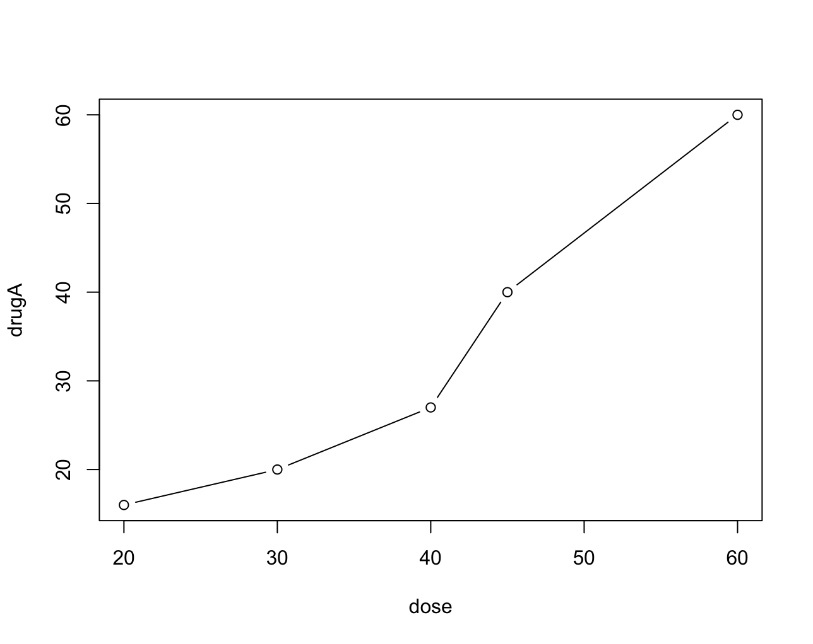
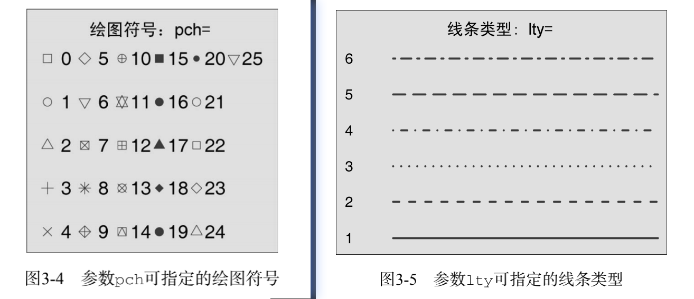

## 简介


### 第一个图形

```r
dose <- c(20, 30, 40, 45, 60)
drugA <- c(16, 20, 27, 40, 60)
plot(dose, drugA, type = 'b')
```



::: tip 说明：
+ `plot()` 是一个泛型函数，它的输出将根据所绘制对象类型的不同而变化
+ 将 dose 置于横轴，将 durgA 置于纵轴，`type = 'b'` 表示同时绘制点和线
:::


### 导出图片

+ 方式一：直接使用 IDE 附加的选项导出
+ 方式二：使用内置函数：
```r{1,5}
png("myplot.png")
dose <- c(20, 30, 40, 45, 60)
drugA <- c(16, 20, 27, 40, 60)
plot(dose, drugA, type = "b")
dev.off()
```

::: tip 说明：
+ 在绘图前调用 `png()`，绘图后调用 `dev.off()`
+ 此外，还支持很多文本格式：`pdf()`, `jpeg()`, `bmp()`, `tiff()`, `xfig()` 等
+ 文件会保存在程序运行的目录，可以使用 `getwd()` 查看当前目录或使用 `setwd()` 修改当前目录
:::


## 图形参数

可以通过修改图形参数的选项来指定图形的特征(字体、颜色、坐标轴、标签等)：
+ `par()`：设定的参数会在当前会话结束前一直有效
```r
# 不传入参数：返回当前图形参数配置的列表
a <- par()

# 可传入多个参数
par(lty = 2)
par(lty = 2, pch = 17)

# 也可以合并在 plot() 函数中，但只会作用于该图形
plot(dose, drugA, type = 'b', lty = 2, pch = 17)
```


### 符号和线条

+ 指定符号和线条的参数

|参数|描述|
|-|-|
|pch|指定绘图时使用的符号|
|cex|指定符号的大小，相对于默认值(默认为 1)|
|lty|指定线条的类型|
|lwd|指定线条宽度，相对于默认值(默认为 1)|

+ 符号和线条示例



### 颜色

+ R 支持通过颜色下标、颜色名称、HEX、RGB、HSV 的方式指定颜色
+ `colors()` 返回所有可用颜色的名称
+ 指定颜色的参数：

|参数|描述|
|-|-|
|col|绘图颜色。可用字符串向量指定，会被一些函数(`lines()`, `pie()`)循环使用所有颜色|
|col.axis|坐标轴刻度文本颜色|
|col.lab|坐标轴标签颜色|
|col.main|标题颜色|
|col.sub|副标题颜色|
|fg|图形的前景色|
|bg|图形的背景色|


### 文本属性

+ 指定文本大小、字体族、字号、字样的参数：

|参数|描述|
|-|-|
|cex|相对于默认大小(1)的的缩放倍数的数值|
|cex.axis|坐标轴刻度文本的缩放倍数|
|cex.lab|坐标轴标签的缩放倍数|
|cex.main|标题的缩放倍数|
|cex.sub|副标题的缩放倍数|
|font|整数(1-5)用于指定绘图的字体样式，分别表示：常规、粗体、斜体、粗斜体、符号字体|
|font.axis|坐标轴刻度文本的字体样式|
|font.lab|坐标轴标签的字体样式|
|font.main|标题的字体样式|
|font.sub|副标题的字体样式|
|ps|字体的磅值，文本最终大小为 ps * cex|
|family|文本字体族，标准取值为：serif,sans,mono|


::: tip 备注
+ 由于 window 系统的字体名称不同，在设置字体族的时候，需要进行字体的映射
+ 以 PDF/PostScript 格式输出图形时：
```r
# 找出系统的可用字体
names(pdfFonts)
# 再输出图形
pdf(file = 'my.pdf', family = 'fontname')

# 找出系统的可用字体
names(postscriptFonts)
# 再输出图形
postscript(file = 'my.ps', family = 'fontname')
```
:::


### 图形尺寸和边界尺寸

+ 控制图形尺寸和边界尺寸的参数：

|参数|描述|
|-|-|
|pin|以英寸为单位表示图形的宽高|
|mai|以英寸为单位的数值向量表示边界的大小，顺序为 c(bottom, left, top, right)|
|mar|以英分为单位的数值向量表示边界的大小，默认值 c(5, 4, 4, 2) + 0.1|


## 更多自定义

+ `title()`：添加标题和坐标轴标签
+ `axis()`：创建自定义坐标轴
+ `abline()`：添加参考线
+ `legend()`：添加图例
+ `text()`/`mtext()`：添加文本
+ `plotmath()`：添加数学标注


## 图形结合

+ 有两种方式可以用于组合多幅图形为一幅总括图形：
  1. `par()` 的参数：`mfcol = c(nrows, ncols)`
  2. `layout()` 函数
+ 添加箱线图：`par()` 的 `fig` 参数