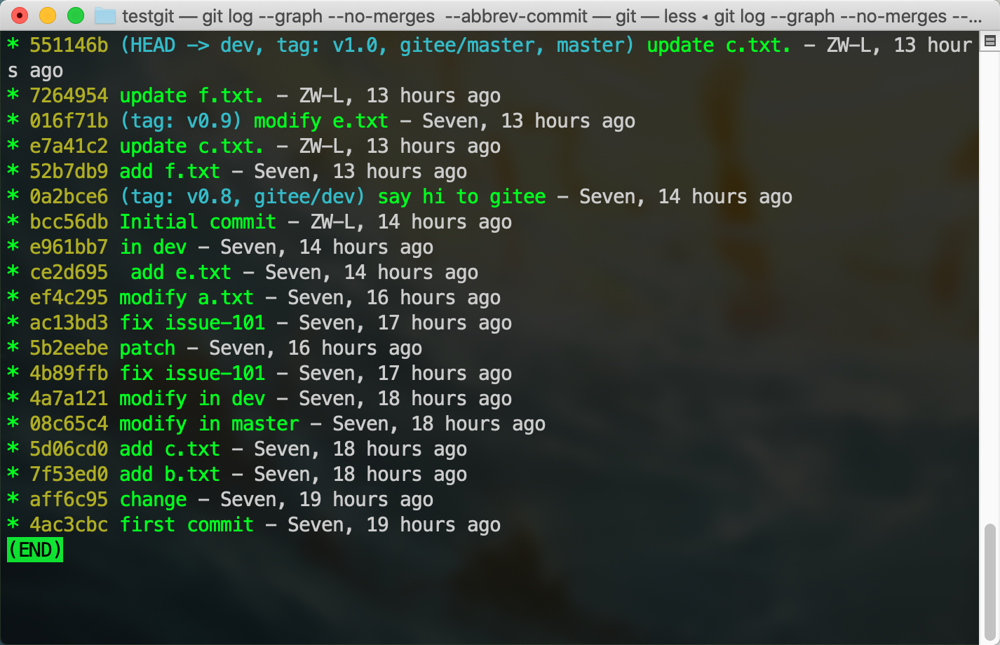
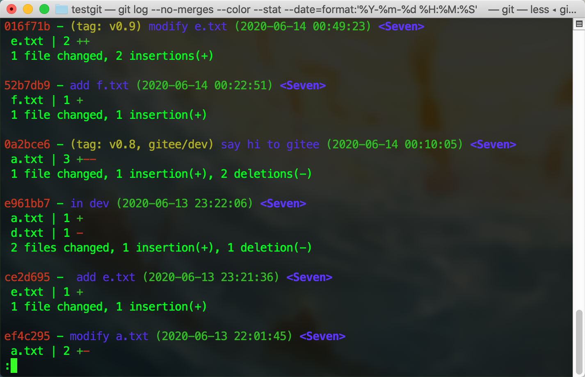

## 查看历史

+ `git log`：查看提交历史，但不会显示 `git reset` 回退的所有版本
```sh
git log         # 查看所有提交历史
git log stat    # 显示每次提交修改的内容的简略信息
git log -p -2   # 显示每次提交的差异，并且只显示最后两次的提交
```


+ `git reflog`：记录所有提交记录和 `git reset` 的记录，并且它们的开头会有标记该记录是 commit 还是 reset
```sh
git reflog
# 打印：
aff6c95 (HEAD -> master) HEAD@{0}: reset: moving to HEAD^^
520e255 HEAD@{1}: commit: b
83137a9 HEAD@{2}: commit: a
aff6c95 (HEAD -> master) HEAD@{3}: reset: moving to aff6c95
4ac3cbc HEAD@{4}: reset: moving to HEAD^
aff6c95 (HEAD -> master) HEAD@{5}: commit: change
4ac3cbc HEAD@{6}: commit (initial): first commit
```

::: tip 备注：
+ `git log` 主要用来打印提交树，以及查看提交信息(提交人信息、提交说明等)
+ `git reflog` 在版本回退中很有用，因为它会记录 `git reset` 的操作，在频繁的版本回滚中，该命令非常重要
:::


## log 美化

**参考**：
+ [git log 命令解析](https://www.cnblogs.com/bellkosmos/p/5923439.html)


### 模板

+ 以图的方式显示所有提交记录
```sh
git config --global alias.lg "log --graph --all --pretty=format:'%C(yellow)%h%C(cyan)%d%Creset %s %C(white)- %an, %ar%Creset' --abbrev-commit"
```


+ 以图的方式显示除 merge 外的提交记录
```sh
git config --global alias.lgnm "log --graph --no-merges --pretty=format:'%C(yellow)%h%C(cyan)%d%Creset %s %C(white)- %an, %ar%Creset' --abbrev-commit"
```



+ 线性显示，且不显示 merges，附加日期格式化、提交人名字
```sh
git config --global alias.lnm  "log --no-merges --color --date=format:'%Y-%m-%d %H:%M:%S' --author='Seven' --pretty=format:'%Cred%h%Creset -%C(yellow)%d%Cblue %s %Cgreen(%cd) %C(bold blue)<%an>%Creset' --abbrev-commit"
```


+ 线性显示，且不显示 merges，显示文件修改的简介，附加日期格式化、提交人名字
```sh
git config --global alias.lsnm  "log --no-merges --color --stat --date=format:'%Y-%m-%d %H:%M:%S' --author='Seven' --pretty=format:'%Cred%h%Creset -%C(yellow)%d%Cblue %s %Cgreen(%cd) %C(bold blue)<%an>%Creset' --abbrev-commit"
```

