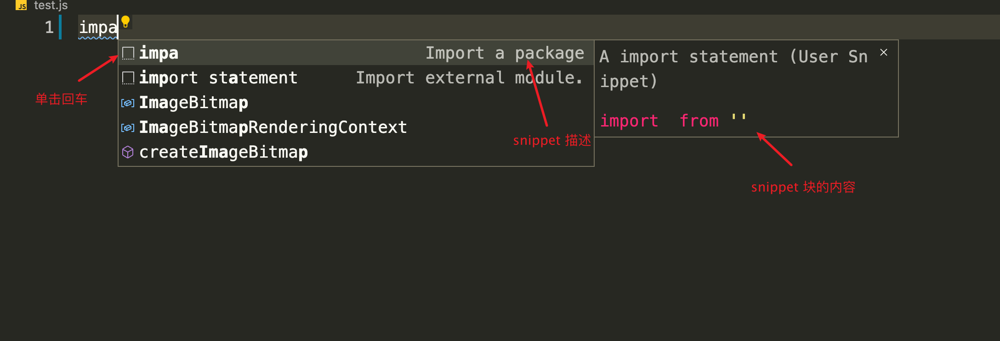
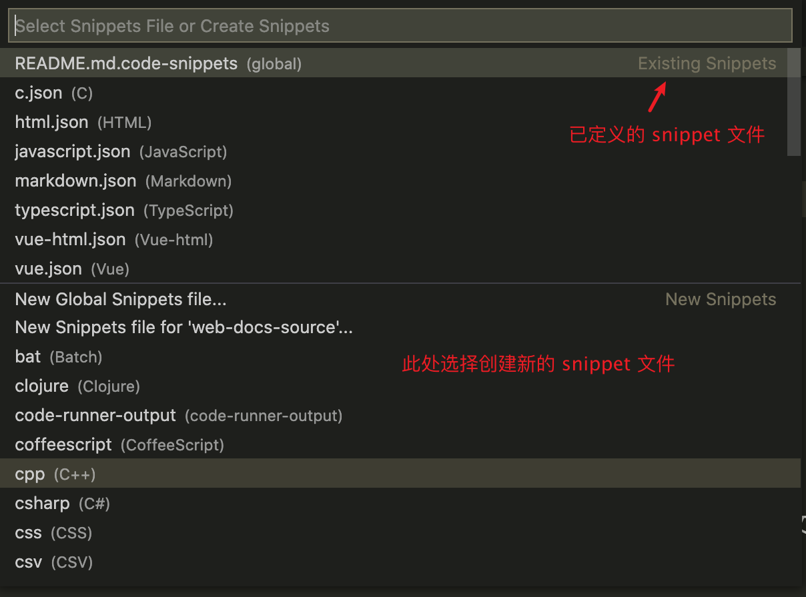

## 快捷键

### 概述

+ 预览所有快捷键：在命令框输入 shortcuts 模糊搜索，选择 `Help: Keyboard Shortcuts Reference`
+ 修改快捷键：（快捷键 `Command K Command S`）或在命令框输入 shortcuts 模糊搜索，选择 `Preferences: Open Keyboard Shortcuts`；找到需要修改的选项，双击修改
+ 自定义新快捷键：在命令框输入 shortcuts 模糊搜索，选择 `Preferences: Open Keyboard Shortcuts(JSON)`
```json
[
  {
    "key": "ctrl+shift+u",
    "command": "editor.action.transformToUppercase"
  },
  {
    "key": "ctrl+shift+l",
    "command": "editor.action.transformToLowercase"
  }
]
// 自定义的快捷键在 Preferences: Open Keyboard Shortcuts 中查看时，Source 列显示为 User
```


### 文本编辑

+ 注释
  + 单行注释：`Command /`
  + 多行注释：`Command Shift A`
  + doc：
+ 行操作：
  + 删除当前行：`Command K`
  + 选中当前行：`Command L`
  + 复制当前行到剪切板：`Command C`
  + 在上一行/下一行复制当前行：`Option Shift ⬆️`/`Option Shift ⬇️`
  + 往上/下移动当前行：`Option ⬆️`/`Option 下`
  + 在上/下创建空行：`Command Enter`/`Command Shift Enter`
+ 添加/删除一个缩进（Tab）：`Command ]`/`Command [`
+ 折叠/展开块：`Command Option [`/`Command Option ]`


### 光标

+ 多光标允许同时操作多行、多个单词
+ 选中多个相同单词：
  + 选中一个单词后，`Command D` 会选中下一个相同的单词，也可使用 `Command K` 跳过一个相同的单词
  + 选中一个单词后，` ` 会选中当前文件中的所有该单词
+ 多行光标；
  + 按住 `Option`，使用鼠标点击任一位置，会在该位置添加一个光标
  + 鼠标选中多行后，`Option Shift I` 会在选中的行后面都添加一个光标
+ 移动光标：
  + 到达第一行结尾：`Command ⬆️`/`Home`
  + 到达最后一行结尾：`Command ⬇️`/`End`
  + 移动到匹配的括号：`Command Shift \`


### 搜索

+ 全文搜索：`Command F`
+ 全文搜索并替换：`Command Option F`
+ 跳转到下一个/上一个搜索：`Command G`/`Command Shift G`
+ 打开文件内替换：`Command Shift F`


### 页面切换

+ 展开/收起目录侧边栏：`Command B`
+ 切换焦点到目录侧边栏：`Command Shift E`
+ 打开终端：`Control \``
+ 新建终端：`Control Shift \``
+ 打开 Output：`Command Shift U`
+ 阅览 Markdown：`Command Shift V`
+ 打开调试选项：`Command Shift D`
+ 打开插件市场：`Command Shift X`


## Snippets

+ 文本/代码片段：定制一段默认模板，可以键入指定的单词（或缩写）来触发文本/代码补全：


+ `Command + Shift + P` 打开配置搜索框，键入 `snippet`，选择 `Preferences: Configure User Snippets`：


+ Snippet 的配置文件使用 JSON 表示，在不同的文件中显示补全，需要创建该类型的配置文件，如 `javascript.json` 配置 JavaScript 的 Snippet 补全
```json
{
  "Import a package": {
    "prefix": "impa",         // 触发 snippet 的前缀
    "body": [
      "import $1 from '$2'"   // 插入的块，$1, $2 表示单击 Tab 时光标跳转的位置
    ],
    "description": "A import statement"   // 该 snippet 的描述
  },
}
```

+ 使用 `$0` 指定光标最后的位置
+ 使用 `${1:label1}`, `${2:label2}` 等指定占位符（即默认值）
```json
{
  "Import a package": {
    "prefix": "impa",         // 触发 snippet 的前缀
    "body": [
      "import ${1:path} from '${2:path}'"   // 插入的块，$1, $2 表示单击 Tab 时光标跳转的位置
    ],
    "description": "A import statement"   // 该 snippet 的描述
  },
}
// 渲染为
// import path from 'path'
```
